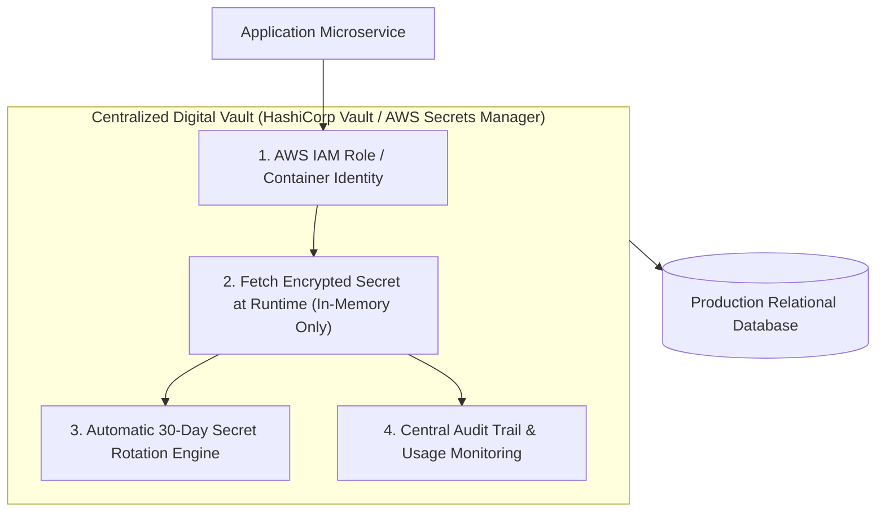

```ppt
# Slide 1: Secret Management in Cloud Systems
- **The Core Discipline:** Centralizing, encrypting, and dynamically managing API keys, database passwords, and TLS tokens across application environments.
- **Executive Security Rule:** Hardcoding secrets in source code is a critical vulnerability — store secrets in centralized digital vaults!
- **Author:** Pankaj Kumar | Associate Architect & Tech Leadership
<!-- slide -->
# Slide 2: The Bank Vault vs Key Under Doormat Analogy
- **Careless Homeowner (Hardcoded Secrets):** Writes their front door security alarm code in marker on a piece of paper and hides it under the front doormat (*Hardcoding secrets in Git*). Anyone who flips the mat steals the house!
- **Master Security Warden (Central Vault):** Stores the security code inside a high-tech biometric bank vault (*HashiCorp Vault / AWS Secrets Manager*), issues temporary 1-hour single-use access codes (*Dynamic Secrets*), and logs every key access!
<!-- slide -->
# Slide 3: The 4 Major Risks of Hardcoded Secrets
- **1. Public Repository Exposure:** GitHub bots scraping public repos in 2 seconds for active AWS/Stripe keys.
- **2. Lack of Secret Rotation:** Stale database passwords remaining un-rotated for 3 years.
- **3. Broad Employee Exposure:** Junior developers having raw plaintext access to production database passwords.
- **4. Compliance Audit Failures:** SOC2 and PCI-DSS violations due to plain-text secrets in environment files.
<!-- slide -->
# Slide 4: Real-World Case Study: Vikram's Stripe API Key Scraped
- **The Incident:** A developer working for Lead Architect **Vikram Patel** pushed a test script containing a live Stripe API secret key to a public GitHub repo.
- **The Exploit:** An automated GitHub scraping bot picked up the key in 3 seconds and charged $15,000 in fraudulent test transactions!
- **The Fix:** Vikram deployed AWS Secrets Manager + automatic key rotation. The compromised key was revoked instantly and secret scanning was enforced.
<!-- slide -->
# Slide 5: The 4 Pillars of Secret Management
- **1. Centralized Secret Vaults:** Storing secrets in dedicated hardware-backed vaults (AWS Secrets Manager, HashiCorp Vault).
- **2. Dynamic Short-Lived Secrets:** Generating 1-hour temporary database credentials on the fly.
- **3. Automatic Secret Rotation:** Rotating database passwords automatically every 30 days without downtime.
- **4. Automated Pre-Commit Secret Scanners:** Blocking hardcoded keys before code leaves local developer machines (`Gitleaks`).
<!-- slide -->
# Slide 6: How Applications Access Vault Secrets
- **Runtime Injection:** Microservices fetch secrets in memory via IAM roles at container startup (Never writing secrets to disk!).
- **Zero-Trust IAM Policy:** Authorizing containers to read only their specific microservice secrets.
<!-- slide -->
# Slide 7: Common Misconception
- **Myth:** "Storing API keys in `.env` files committed to private git repos is 100% safe."
- **Fact:** Private repos get cloned to personal laptops, backed up insecurely, and exposed during developer offboarding!
<!-- slide -->
# Slide 8: Summary for Beginners
- Eliminate hardcoded secrets: centralize credentials in HashiCorp Vault / AWS Secrets Manager, enforce automatic 30-day key rotation, and inject secrets at runtime!
```

# Secret Management: Securing API Keys & Passwords in Code

Every modern software application relies on **Secrets**:
- AWS Cloud Access Keys
- Database Passwords
- Stripe Payment Gateway API Tokens
- OAuth Client Secret Keys

These secrets are the **Master Passkeys** to your entire digital enterprise infrastructure.

However, in many engineering teams, **secret management is dangerously insecure!**
- Developers hardcode database passwords directly into source code files.
- Configuration secrets are checked into Git repositories.
- Team members share raw production credentials over Slack or email.

Cyber criminals run automated bots that scan public and private GitHub repositories 24/7. **When a secret is committed to Git, bots scrape and exploit it in less than 3 seconds!**

How does a CTO secure API keys and passwords across cloud environments?

They deploy **Centralized Secret Management!**

Let's understand Secret Management using **The Bank Vault vs. Key Under Doormat Analogy**!

---

## 🔑 The Bank Vault vs. Key Under Doormat Analogy

Imagine protecting the master keys to a high-security vault:



- **The Careless Homeowner (Hardcoded Secrets in Code):**  
  Writes their alarm security code in permanent marker on a paper note and hides it under the front doormat (**Hardcoding API keys in Git**). The first passerby who flips over the doormat opens the house and loots everything inside!

- **The Master Security Warden (Centralized Digital Secret Vault):**  
  Locks master passkeys inside a biometric bank vault (**HashiCorp Vault / AWS Secrets Manager**), generates temporary 1-hour single-use access codes for workers (**Dynamic Short-Lived Secrets**), and logs every single access attempt!

---

## 📊 Real-World Case Study: Vikram's Stripe API Key Scraped in 3 Seconds

Consider a high-growth e-commerce startup where **Vikram Patel** serves as Lead System Architect.


1. **The Mistake:** A junior developer created a test script containing a live, unencrypted Stripe Secret Key (`sk_live_99482...`) and accidentally pushed the repository to GitHub.
2. **The Exploit:** Within **3 seconds**, an automated botnet monitoring GitHub commits scraped the key and fired $15,000 in fraudulent test transactions before the developer even realized their mistake!
3. **The Secret Management Fix:**  
   - Vikram immediately revoked the compromised key in Stripe.
   - He migrated all credentials to **AWS Secrets Manager** and configured automated runtime secret injection.
   - He implemented `Gitleaks` pre-commit hooks on developer laptops, ensuring that git commits containing key patterns are blocked locally before pushing!

---

## 📊 Hardcoded Secrets vs. Centralized Secret Management

| Security Dimension | Hardcoded / `.env` File Secrets (Vulnerable) | Centralized Secret Management (Resilient) |
| :--- | :--- | :--- |
| **Storage Location** | Source code, `.env` files, git repositories | Centralized Vault (AWS Secrets Manager, HashiCorp Vault) |
| **Exposure Risk** | High (Exposed in git history, developer laptops, Slack) | Zero (Stored encrypted at rest; never committed to git) |
| **Secret Lifetime** | Stale static credentials un-rotated for 3+ years | Short-lived dynamic secrets rotated automatically every 30 days |
| **Access Control** | Anyone with git repo access can read plaintext secrets | Fine-grained IAM policies; in-memory runtime fetch only |
| **Audit Logging** | Zero visibility into who used credentials | Complete audit trail tracking every key access timestamp |

---

## 💡 Summary for Beginners

- **Secret Management** = The practice of storing, managing, and rotating sensitive API keys, tokens, and passwords in dedicated digital vaults.
- **Dynamic Secrets** = Short-lived credentials generated on demand by a vault that expire automatically after a set duration.
- **CTO Golden Rule** = **"Never hardcode API keys or passwords in source code — centralize credentials in AWS Secrets Manager or HashiCorp Vault and enforce automated 30-day rotation!"**

---

*Written by **Pankaj Kumar** | Associate Architect & Tech Leadership.*
