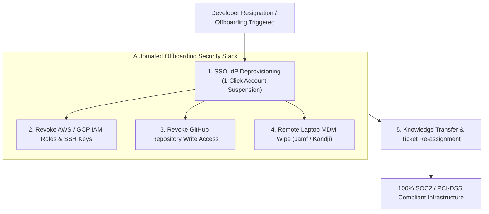

```ppt
# Slide 1: Secure Developer Offboarding Playbook
- **The Core Security Discipline:** Decommissioning developer access, revoking credentials, and executing seamless knowledge handoffs when engineers leave.
- **Executive Rule:** Offboarding security is just as important as onboarding speed — zero lingering credentials!
- **Author:** Pankaj Kumar | Associate Architect & Tech Leadership
<!-- slide -->
# Slide 2: Returning Building Keycards & Blueprints Analogy
- **Careless Hotel Manager (Security Flaw):** Lets a departing employee walk out the front door without collecting their master room keycard or building blueprint maps. Three months later, the ex-employee walks into the vault room late at night!
- **Master Security Warden (CTO Offboarding Playbook):** Deactivates the employee's RFID badge instantly (*SSO Revocation*), collects building keys (*IAM Tokens*), and archives project blueprints (*Knowledge Handoff*) before the departure!
<!-- slide -->
# Slide 3: The 4 Risks of Poor Developer Offboarding
- **1. Lingering SSH Keys & API Tokens:** Ex-employees maintaining backdoor access to live production cloud infrastructure.
- **2. Intellectual Property (IP) Exposure:** Proprietary source code downloaded to personal devices.
- **3. Compliance Violations:** SOC2, PCI-DSS, and ISO-27001 audit failures due to un-revoked user accounts.
- **4. Orphaned Cloud Resources:** Forgotten developer staging servers incurring unexpected AWS monthly costs.
<!-- slide -->
# Slide 4: The Automated Offboarding Checklist
- **Step 1 (Identity SSO Deprovisioning):** Disabling Okta / Google Workspace accounts (instantly revokes Slack, GitHub, Jira).
- **Step 2 (Cloud & Infrastructure Audit):** Revoking AWS / GCP IAM roles, database credentials, and SSH keys.
- **Step 3 (Hardware Decommissioning):** Wiping company laptops remotely via MDM (Jamf / Kandji).
- **Step 4 (Knowledge Transfer):** Reassigning open PRs, documentation, and system ownership in 1-on-1 handoffs.
<!-- slide -->
# Slide 5: Single Sign-On (SSO) as Central Security Anchor
- **Centralized Deprovisioning:** Using Identity Providers (IdP) so 1 click revokes access across 50 SaaS tools simultaneously.
- **Rotated Shared Secrets:** Rotating database passwords or API keys if an engineer had access to raw production credentials.
<!-- slide -->
# Slide 6: Graceful & Empathetic Offboarding
- **Respectful Departure:** Treating departing employees with dignity while enforcing strict security protocols.
- **Alumni Network:** Maintaining positive relationships with departing engineers for future re-hires or referrals.
<!-- slide -->
# Slide 7: Common Misconception
- **Myth:** "Offboarding security is an IT department task that doesn't concern engineering leaders."
- **Fact:** Developers possess raw access to code repositories, cloud keys, and database connections — CTOs must own developer security!
<!-- slide -->
# Slide 8: Summary for Beginners
- Automate developer offboarding via SSO, revoke IAM and GitHub access instantly, wipe remote devices, and execute clean knowledge handoffs!
```

# Secure Developer Offboarding: Access Revocation Playbook

When a software engineer or contractor resigns or gets laid off, what happens to their access credentials?

In many engineering organizations, **offboarding is an uncoordinated, manual mess!**
- The IT team disables the developer's corporate email, but forgets to revoke their personal GitHub account access.
- A lingering AWS IAM access key or production SSH key remains active for months.
- The ex-developer retains access to production database backups, customer data, or internal Slack channels!

According to cybersecurity research, **over 30% of data breaches occur due to lingering credentials from former employees.**

How does a CTO build a bulletproof **Secure Developer Offboarding Playbook**?

Let's understand Developer Offboarding using **The Returning Building Keycards Analogy**!

---

## 🔑 The Returning Building Keycards Analogy

Imagine managing security at a high-security financial vault:



- **The Careless Hotel Manager (Poor Security):**  
  Lets a departing employee walk out the front door without collecting their master electronic room keycard or building blueprint maps. Three months later, the ex-employee uses their lingering keycard to enter the vault room late at night!

- **The Master Security Warden (CTO Offboarding Playbook):**  
  Deactivates the employee's RFID badge instantly in the central computer system (**SSO Account Suspension**), collects all physical keys (**IAM Access Tokens**), wipes remote hardware, and archives project blueprints before the employee leaves the building!

---

## 📊 The CTO Offboarding Checklist

| Security Layer | Offboarding Action Required | Primary Tool / Platform | SLA Timeline |
| :--- | :--- | :--- | :--- |
| **1. Identity & Communications** | Suspend corporate email, Slack, Google Workspace, Zoom access | Okta, Azure AD, OneLogin | **< 15 Minutes** |
| **2. Code Repositories** | Remove user from GitHub / GitLab organization & revoke SSH keys | GitHub, GitLab, Bitbucket | **Instant (< 5 mins)** |
| **3. Cloud Infrastructure** | Delete AWS / GCP / Azure IAM users, rotate shared production secrets | AWS IAM, Vault, GCP Console | **Instant (< 5 mins)** |
| **4. Hardware Security** | Remotely wipe company laptop data & block USB exports | Jamf Pro, Kandji, Intune | **Same Day** |

---

## 💡 Summary for Beginners

- **Offboarding Security** = The systematic revocation of identity, code repository, cloud infrastructure, and hardware access when an employee departs.
- **SSO Deprovisioning** = Disabling a single Identity Provider (IdP) account to lock out all integrated SaaS applications simultaneously.
- **CTO Golden Rule** = **"Offboarding security is just as important as onboarding speed — automate single sign-on deprovisioning to ensure zero lingering credentials!"**

---

*Written by **Pankaj Kumar** | Associate Architect & Tech Leadership.*
