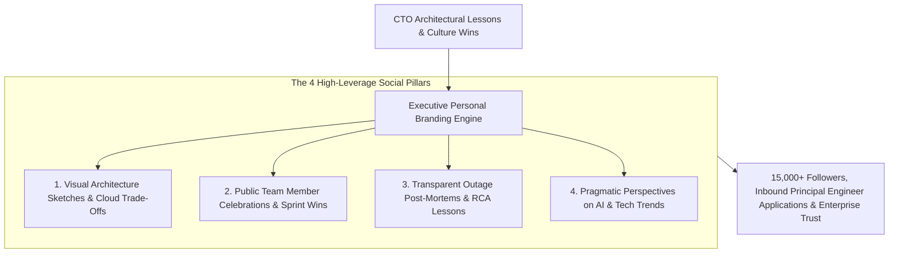
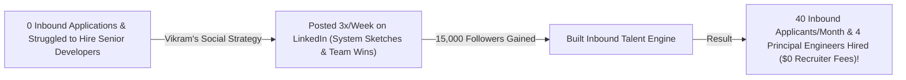

```ppt
# Slide 1: Executive Branding for CTOs on LinkedIn & X
- **The Core Strategy:** Building a powerful personal technical brand on professional platforms to attract top-tier engineering talent, drive business authority, and position your company as an innovation leader.
- **Executive Reality:** People follow leaders, not corporate logos — a CTO with a strong LinkedIn voice builds trust faster than a $100k advertising budget!
- **Author:** Pankaj Kumar | Associate Architect & Tech Leadership
<!-- slide -->
# Slide 2: The Dark Dusty Basement vs. Illuminating Social Spotlight Analogy
- **Silent Basement Executive (Zero Social Presence):** A CTO sitting alone in a dark, dusty office with zero public social presence (**Invisible Tech Leadership**). Competitors steal top talent and market attention simply because nobody knows your technical vision!
- **Illuminating Social Spotlight (Active Professional Branding):** A confident technology leader broadcasting architectural insights, team promotions, and honest post-mortems across a vibrant network (**Executive Thought Leadership**)! Talent, investors, and customers flock to your vision!
<!-- slide -->
# Slide 3: The 4 Pillars of Executive Social Content
- **1. Technical Lessons & Architecture Diagrams:** Sharing visual system designs and engineering trade-offs.
- **2. Team Celebrations & Culture:** Publicly praising team members, promotions, and sprint wins.
- **3. Honest Outage & Failures:** Sharing post-mortems and personal career lessons.
- **4. Industry Perspectives:** Commenting on AI trends, cloud cost optimization, and developer productivity.
<!-- slide -->
# Slide 4: Real-World Case Study: Vikram's LinkedIn Authority Growth
- **The Challenge:** Lead Architect **Vikram Patel** struggled to recruit senior developers for his AI startup against big tech compensation packages.
- **The Social Strategy:** Vikram committed to posting 3 times a week on LinkedIn: shared handwritten system design sketches, celebrated squad promotions, and explained his team's LLM fine-tuning setup.
- **The Result:** Grew LinkedIn followers from 500 to 15,000, received 40+ inbound senior developer applications per month, and hired 4 Principal Engineers with zero recruiter fees!
<!-- slide -->
# Slide 5: The High-Engagement Post Structure
- **Hook (Lines 1–2):** A bold, non-obvious engineering insight (*"We cut our cloud bill by $40k/month by removing Redis caches..."*).
- **Core Story (Lines 3–10):** The exact problem, trade-offs, and architecture diagram.
- **Takeaway (Final Lines):** Actionable advice for fellow engineering leaders + open discussion question.
<!-- slide -->
# Slide 6: What NEVER to Do on Executive Social Media
- **Never Post:** Generic corporate press release reposts with zero personal commentary.
- **Never Post:** Arrogant boastful posts or tearing down competitor engineers.
- **Never Post:** Inconsistent 3-month silences followed by sudden spamming.
<!-- slide -->
# Slide 7: Common Misconception
- **Myth:** "Executive personal branding is self-centered ego vanity."
- **Fact:** Personal branding is strategic corporate stewardship — it turns the CTO into an authentic trust engine for recruitment, PR, and enterprise sales!
<!-- slide -->
# Slide 8: Summary for Beginners
- Build executive authority on LinkedIn: share visual architecture diagrams, celebrate your engineering squad, post honest post-mortems, and maintain a consistent 3x/week publishing cadence!
```

# Social Media Strategy for Tech Executives on LinkedIn & X

In the modern digital economy, **People Follow Leaders, Not Corporate Logos.**

When software engineers choose where to work, or when enterprise buyers select a technology platform, they look at the leadership team behind the company:
- If a CTO's LinkedIn profile is blank or managed by a corporate PR bot posting dull corporate press releases, stakeholders assume the leadership team is out-of-touch.
- If a CTO regularly shares **Visual System Architecture Sketches**, **Honest Incident Post-Mortems**, and **Heartfelt Team Celebrations**, developers, venture capitalists, and enterprise buyers connect with the executive's vision!

**CTO Personal Branding is high-leverage corporate stewardship, recruitment magnet, and brand trust.**

How do technology executives build an authentic personal brand on LinkedIn and X (Twitter) without spending hours every day?

Let's understand Executive Social Strategy using **The Dark Basement vs. Illuminating Social Spotlight Analogy**!

---

## 💡 The Dark Basement vs. Illuminating Social Spotlight Analogy


Imagine shining a light across an international professional network:



- **The Silent Basement Executive (Zero Social Presence):**  
  A CTO sitting alone in a dark, dusty office with zero public social presence (**Invisible Tech Leadership**). Competitors steal top talent, media coverage, and enterprise deals simply because nobody knows your engineering vision!

- **The Illuminating Social Spotlight (Active Professional Branding):**  
  A confident technology leader broadcasting architectural insights, team promotions, and honest post-mortems across a vibrant professional network (**Executive Thought Leadership**)! Talent, investors, and customers flock to your vision.

---

## 📊 Real-World Case Study: Vikram's LinkedIn Authority Growth

Consider an AI engineering startup where **Vikram Patel** serves as Lead Architect.



1. **The Challenge:** Vikram's AI startup struggled to hire Principal Backend Engineers against massive compensation packages offered by big tech corporations. Outbound recruiter cold emails had a dismal 2% response rate.
2. **The Social Branding Strategy:**  
   - Vikram committed to a consistent **3x/Week LinkedIn Publishing Cadence**:
   - **System Design Sketches:** Shared handwritten architecture diagrams explaining how his team optimized GPU cluster memory for LLM inference.
   - **Team Recognition:** Highlighted junior engineers when they shipped their first major microservice to production.
   - **Honest Outage Retrospectives:** Wrote transparent breakdown posts when a database migration failed on a Sunday morning.
3. **The Result:** Vikram's LinkedIn network grew from 500 to **15,000 engaged followers**, receiving **40+ inbound senior developer applications per month** and hiring **4 Principal Engineers with zero recruiter fees**!

---

## 📊 Corporate PR Bot Posts vs. Authentic Executive Thought Leadership

| Dimension | Corporate PR Bot Posts (Ignore) | Authentic Executive Thought Leadership (Engage) |
| :--- | :--- | :--- |
| **Tone of Voice** | Formal, generic corporate PR speak | Conversational, authentic engineer-to-engineer tone |
| **Visual Assets** | Stock photos or corporate marketing banners | Handwritten architecture sketches, team photos, & real code |
| **Content Substance** | Reposting company press releases | Sharing real-world trade-offs, hard technical decisions, & post-mortems |
| **Engagement Model** | Post and abandon (Zero comment replies) | Responding thoughtfully to developer questions in comments |
| **Primary Value** | Low engagement (Zero impact) | High trust, inbound recruitment, & executive authority |

---

## 💡 Summary for Beginners

- **Executive Personal Branding** = Building professional credibility, authority, and trust by sharing technical insights and company culture publicly.
- **Architecture Sketch Post** = A social media post pairing a simple system design diagram with a short breakdown of technical trade-offs.
- **Inbound Talent Pipeline** = Generating direct candidate applications organically because engineers resonate with your executive leadership voice.
- **CTO Golden Rule** = **"Shine an illuminating social spotlight — share visual architecture diagrams, celebrate your engineering squad, post honest post-mortems, and build executive authority!"**

---

*Written by **Pankaj Kumar** | Associate Architect & Tech Leadership.*
