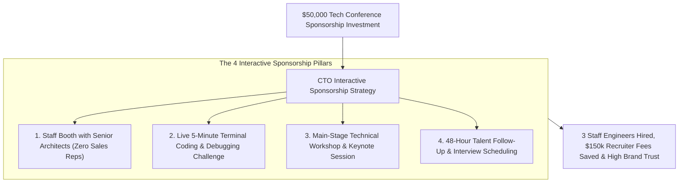
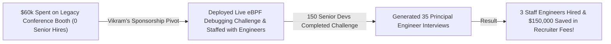

```ppt
# Slide 1: Sponsoring Tech Conferences for High-ROI Talent
- **The Core Strategy:** Transforming expensive tech conference booth sponsorships into high-conversion engineering recruitment engines and strategic developer acquisition channels.
- **Executive Reality:** Paying $50,000 for a conference booth just to hand out cheap plastic pens and corporate brochures is a complete waste of capital — engineers want interactive challenges and real technical conversations!
- **Author:** Pankaj Kumar | Associate Architect & Tech Leadership
<!-- slide -->
# Slide 2: Boring Corporate Booth vs. Interactive Workshop Station Analogy
- **Boring Corporate Booth (Wasted Sponsorship):** Suited salespeople standing behind a table handing out cheap plastic pens and glossy brochures (**Passive Swag Booth**). Developers throw brochures into trash cans and hurry past!
- **Interactive Workshop Station (High-ROI Talent Engine):** Senior architects running live 10-minute terminal coding challenges on glowing screens with a public leaderboard (**Interactive Technical Sponsorship**)! Senior developers queue up to solve challenges, pair-program with your engineers, and schedule job interviews!
<!-- slide -->
# Slide 3: The 4 Rules of High-ROI Tech Sponsorships
- **1. Staff Booths with Senior Engineers:** Replace sales reps with Staff Engineers & Architects who speak authentic developer language.
- **2. Run Live Interactive Challenges:** Replace passive brochures with 5-minute terminal coding competitions.
- **3. Secure Workshop & Speaking Slots:** Combine booth sponsorship with a main-stage technical workshop or keynote.
- **4. Immediate 48-Hour Talent Follow-Up:** Reach out to qualified engineering leads within 48 hours post-conference.
<!-- slide -->
# Slide 4: Real-World Case Study: Vikram's Conference Recruiting Win
- **The Challenge:** A cloud infrastructure scale-up led by Lead Architect **Vikram Patel** spent $60,000 sponsoring a major DevOps summit, but recruited zero senior engineers the previous year.
- **The Sponsorship Pivot:** Vikram overhauled the booth: deployed a live eBPF kernel debugging challenge, staffed the booth with Staff Engineers, and hosted a workshop session.
- **The Result:** 150 senior engineers participated, generated 35 qualified Principal Engineer interviews, and hired 3 Staff Engineers, saving $150k in recruiter fees!
<!-- slide -->
# Slide 5: The Interactive Booth Playbook
- **Interactive Terminal Stations:** Laptops pre-configured with a fun 5-minute debugging challenge.
- **High-Value Technical Swag:** Hardcover engineering books, high-quality mechanical keyboard keycaps, or open-source stickers.
- **Real-Time Leaderboard:** Digital display showing top challenge completion times.
<!-- slide -->
# Slide 6: Measuring Conference Sponsorship ROI
- **Primary Metric:** Cost-per-Qualified-Engineering-Hire vs. 25% recruiter agency placement fee ($50,000 savings per hire).
- **Secondary Metric:** Active API Tokens & GitHub Star growth within 14 days post-conference.
<!-- slide -->
# Slide 7: Common Misconception
- **Myth:** "Tech conference sponsorship is purely a marketing branding expense managed by corporate events."
- **Fact:** High-ROI conference sponsorship is an executive engineering recruiting engine when led directly by CTOs and senior architects!
<!-- slide -->
# Slide 8: Summary for Beginners
- Master conference sponsorship: replace passive sales booths with interactive coding challenges, staff booths with senior engineers, secure speaking slots, and convert developer engagement into high-ROI engineering hires!
```

# Sponsoring Tech Conferences: Getting High-ROI Talent Leads

Every year, technology companies spend tens of millions of dollars sponsoring major developer conferences (such as AWS re:Invent, KubeCon, PyCon, or JavaOne).

Yet, most CTOs and CFOs walk away disappointed with **Zero Measurable Return on Investment (ROI):**
- **The Legacy Sponsorship Mistake:** Companies pay $50,000 for a booth, send non-technical sales representatives in corporate suits, hand out cheap plastic pens and glossy brochures, and scan badge barcodes.
- **The Developer Reality:** Developers hate being sold to. They take the free T-shirt, throw the brochure into a trash can, and ignore cold emails from sales reps post-conference.

**High-ROI Conference Sponsorship is an Interactive Engineering Recruitment & Adoption Engine.**

How do CTOs transform expensive conference booth sponsorships into high-conversion talent acquisition channels and developer adoption multipliers?

Let's understand Conference Sponsorship ROI using **The Boring Corporate Booth vs. Interactive Workshop Station Analogy**!

---

## 🎪 The Boring Corporate Booth vs. Interactive Workshop Station Analogy


Imagine hosting an interactive station at a master craftsmen's convention:



- **The Boring Corporate Booth (Wasted Sponsorship):**  
  Suited salespeople standing behind a folding table handing out cheap plastic pens and glossy brochures (**Passive Swag Booth**). Developers throw brochures into trash cans and hurry past!

- **The Interactive Workshop Station (High-ROI Talent Engine):**  
  Senior architects running live 10-minute terminal coding challenges on glowing screens with a public leaderboard (**Interactive Technical Sponsorship**)! Senior developers queue up to solve challenges, pair-program with your engineers, and schedule job interviews!

---

## 📊 Real-World Case Study: Vikram's Conference Recruiting Win

Consider a cloud infrastructure scale-up where **Vikram Patel** serves as Lead Architect.



1. **The Challenge:** Vikram's company spent $60,000 sponsoring a major DevOps conference the previous year. The corporate sales team scanned 400 badges, but outbound emails resulted in zero senior engineering hires.
2. **The Sponsorship Overhaul:**  
   - Vikram took personal ownership of the booth strategy:
   - **Terminal Challenge:** Replaced corporate brochures with 4 laptop stations running a custom 5-minute eBPF kernel debugging challenge.
   - **Engineer Staffing:** Staffed the booth exclusively with Senior Architects and Staff Engineers wearing casual company hoodies.
   - **Public Leaderboard:** Maintained a digital leaderboard displaying top completion times, awarding high-quality mechanical keyboard keycaps to finishers.
3. **The Result:** 150 senior engineers participated, generating **35 qualified Principal Engineer interviews** and hiring **3 Staff Engineers**, saving **$150,000 in third-party recruiter placement fees**!

---

## 📊 Legacy Passive Booth vs. High-ROI Interactive Sponsorship

| Sponsorship Dimension | Legacy Passive Booth (Wasted Capital) | High-ROI Interactive Sponsorship (High Value) |
| :--- | :--- | :--- |
| **Booth Staffing** | Corporate sales reps & event marketers in suits | Senior Software Architects & Staff Engineers in casual hoodies |
| **Booth Activity** | Handing out cheap plastic pens & glossy brochures | Live 5-minute terminal coding & debugging challenges |
| **Swag Strategy** | Generic branded junk thrown in trash cans | High-value technical books, keycaps, & open-source stickers |
| **Stage Participation** | None (Only passive booth footprint) | Main-stage technical workshop or keynote session |
| **Recruitment Outcome** | Low-quality badge scans & zero engineering hires | **Qualified senior developer interviews & $150k recruiter fee savings** |

---

## 💡 Summary for Beginners

- **Interactive Booth Sponsorship** = Structuring a conference booth around hands-on coding challenges and architecture discussions rather than sales pitches.
- **Recruiter Placement Fee Savings** = Calculating ROI based on avoiding the 20–25% salary placement fees charged by third-party headhunters ($50k saved per senior engineer hire).
- **Time-to-Interview Follow-Up** = Contacting qualified technical candidates within 48 hours post-conference while event excitement is fresh.
- **CTO Golden Rule** = **"Ditch passive swag booths — staff conference stations with senior architects, run live coding challenges, and convert developer engagement into high-ROI engineering hires!"**

---

*Written by **Pankaj Kumar** | Associate Architect & Tech Leadership.*
