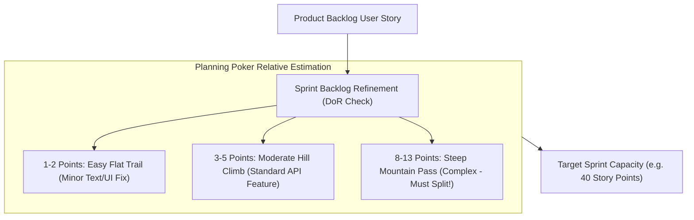

```ppt
# Slide 1: Sprint Planning & Story Point Estimation
- **The Core Discipline:** Structuring 2-week sprint planning sessions and estimating software complexity using relative Story Points instead of rigid hours.
- **Executive Rule:** Story points measure relative effort and complexity — hours measure illusionary precision!
- **Author:** Pankaj Kumar | Associate Architect & Tech Leadership
<!-- slide -->
# Slide 2: The Mountain Hiking Trail Difficulty Analogy
- **Exact Hour Estimation (Rigid Fallacy):** Telling a hiker: *"This mountain trail will take exactly 142 minutes and 30 seconds."* A sudden rainstorm, steep mud slope, or twisted ankle ruins the estimate completely!
- **Relative Trail Rating (Story Points):** Rating trails by relative difficulty: Trail A is a **1-Star Easy Walk** (1 Point), Trail B is a **3-Star Moderate Climb** (3 Points), and Trail C is a **5-Star Steep Mountain Pass** (8 Points). Regardless of weather, Trail C is always 8x more complex than Trail A!
<!-- slide -->
# Slide 3: Why Estimating Code in Hours Fails
- **1. Individual Developer Variance:** A Senior Principal Architect writes a feature in 2 hours; a Junior Developer takes 16 hours.
- **2. Hidden Unknowns:** Integration bugs, API rate limits, and legacy refactoring.
- **3. False Precision Trap:** Managers treating hourly estimates as ironclad contractual deadlines.
<!-- slide -->
# Slide 4: Real-World Case Study: Ananya's Planning Poker Transformation
- **The Challenge:** A software team led by VP **Ananya Verma** wasted 6 hours every sprint arguing over whether a user story was 12 hours or 14 hours.
- **The Estimation Solution:** Ananya introduced Planning Poker using the Fibonacci Sequence (1, 2, 3, 5, 8, 13) for relative complexity estimation.
- **The Result:** Planning time dropped from 6 hours to 90 minutes, and sprint velocity completion reached 92%!
<!-- slide -->
# Slide 5: The Fibonacci Sequence for Story Points
- **1–2 Points:** Minor text fix or small UI button change (Low complexity, low risk).
- **3–5 Points:** Standard feature ticket with backend API and database integration.
- **8 Points:** Large complex feature — candidate for splitting into smaller stories.
- **13+ Points:** Too big! Must be broken down into smaller sprint tasks before estimation.
<!-- slide -->
# Slide 6: The Anatomy of Effective Backlog Refinement
- **Definition of Ready (DoR):** User story contains clear acceptance criteria, UX mocks, and API contracts.
- **Definition of Done (DoD):** Code unit-tested, peer-reviewed, security-scanned, and deployed to staging.
<!-- slide -->
# Slide 7: Common Misconception
- **Myth:** "1 Story Point equals 8 developer working hours."
- **Fact:** Converting story points directly to hours destroys the relative estimation model and brings back rigid hourly estimates!
<!-- slide -->
# Slide 8: Summary for Beginners
- Master sprint planning: estimate relative complexity with Fibonacci Story Points, enforce Definition of Ready, and protect sprint capacity!
```

# Sprint Planning & Estimation: Story Points vs Hours

Why do software engineering teams struggle to hit their sprint commitments, even when developers work 50 hours a week?

In traditional software management, managers forced developers to estimate software tasks in **Exact Hours**:
- *"How many hours will it take to build this payment integration API?"*
- *"Will this checkout page take 14 hours or 16 hours?"*

This hourly estimation model is a trap. **Software engineering is an intellectual discovery process, not a predictable assembly line.**

When you ask developers to estimate code in exact hours:
- Senior developers estimate 4 hours, junior developers estimate 24 hours, creating endless arguments.
- Unforeseen technical debt, third-party API downtime, and edge case bugs ruin the estimate.
- Managers treat 8-hour estimates as contractual deadlines, causing developer anxiety and rushed, buggy code.

To build predictable velocity, **CTOs switch from Hourly Estimates to Relative Story Points!**

Let's understand Story Points using **The Mountain Hiking Trail Analogy**!

---

## 🏔️ The Mountain Hiking Trail Analogy

Imagine rating hiking trails in a national park:



- **The Exact Hour Fallacy (Rigid Estimate):**  
  Telling a hiker: *"You will finish this mountain trail in exactly 142 minutes."* If a sudden rainstorm hits, or if the hiker twists an ankle on a loose rock, the estimate fails completely!

- **The Relative Trail Rating (Story Points):**  
  Rating trails by relative complexity and effort:  
  - **1 Point (Easy Walk):** Smooth, flat paved trail around a lake.  
  - **3 Points (Moderate Hike):** Dirt trail with a gentle incline.  
  - **8 Points (Steep Mountain Pass):** Rocky, steep climb requiring climbing gear.  
  *Whether it rains or shines, the Mountain Pass is ALWAYS 8x more complex than the Lake Walk!*

---

## 📊 Real-World Case Study: Ananya's Planning Poker Transformation

Consider a cloud engineering squad led by Technology VP **Ananya Verma**.


1. **The Problem:** Ananya's team was wasting 6 hours every alternate Monday debating whether a database migration ticket should be estimated at 12 hours or 14 hours.
2. **The Transformation:**  
   - Ananya banned hourly estimates and introduced **Planning Poker using the Fibonacci Sequence (1, 2, 3, 5, 8, 13)**.
   - Developers estimated tasks relatively against a benchmark "1-Point User Story" (a simple text label change).
   - If a story was estimated at **13 Points or higher**, the team automatically split it into 2 smaller 5-point stories before bringing it into the sprint.
3. **The Result:** Planning meeting duration dropped from **6 hours to 90 minutes**, and sprint completion predictability reached **92%**!

---

## 📊 Hourly Estimation vs. Relative Story Point Estimation

| Dimension | Hourly Estimation (Legacy) | Relative Story Point Estimation (Agile) |
| :--- | :--- | :--- |
| **Measured Unit** | Exact elapsed clock hours | Relative complexity, risk, and effort |
| **Developer Variance** | Senior vs. Junior developers produce wildly different hours | Complexity rating remains identical regardless of who builds it |
| **Scale** | Linear scale (1h, 2h, 3h, 4h... 40h) | Non-linear Fibonacci scale (1, 2, 3, 5, 8, 13, 21) |
| **Handling Large Tasks** | Allows bloated 40-hour mega-tickets | Forces tickets > 8 points to be split into smaller stories |
| **Team Predictability** | Poor (Constant missed deadlines & friction) | High (Consistent team velocity over time) |

---

## 💡 Summary for Beginners

- **Story Points** = A unit of measure expressing the overall effort, complexity, and risk required to implement a user story.
- **Fibonacci Sequence (1, 2, 3, 5, 8, 13)** = An estimation scale where gap size increases with complexity, reflecting higher uncertainty in larger tasks.
- **Definition of Ready (DoR)** = An agreed checklist (clear acceptance criteria, mocks, API contracts) a ticket must meet before entering a sprint.
- **CTO Golden Rule** = **"Estimate relative complexity with story points — stop wasting hours predicting exact developer minutes and focus on delivering working software!"**

---

*Written by **Pankaj Kumar** | Associate Architect & Tech Leadership.*
