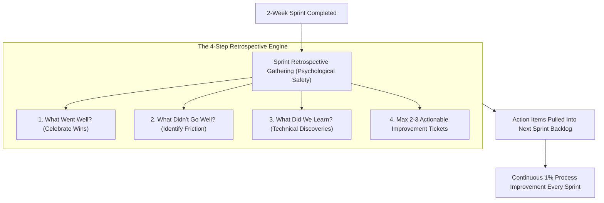
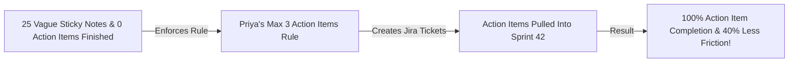

```ppt
# Slide 1: Sprint Retrospectives & Continuous Improvement
- **The Core Discipline:** Conducting structured, psychological safe sprint retrospectives that convert developer complaints into concrete, actionable engineering improvements.
- **Golden Rule:** A sprint retrospective without assigned action items is just a 60-minute complaint session!
- **Author:** Pankaj Kumar | Associate Architect & Tech Leadership
<!-- slide -->
# Slide 2: The Post-Game Locker Room Debrief Analogy
- **Defeated Team (Useless Complaint Session):** After a losing football match, the coach yells at players, everyone complains about bad weather, and no one looks at match video footage. The team repeats the exact same tactical mistakes next week!
- **Championship Team (Actionable Retrospective):** Gathers in the locker room, reviews game film (*Sprint Metrics*), identifies why the defense broke down (*Process Bottleneck*), and assigns 2 specific tactical drills to practice on Monday (*Action Items*)!
<!-- slide -->
# Slide 3: The 4 Classic Retrospective Questions
- **1. What Went Well?** Celebrating squad wins, fast releases, and great collaboration.
- **2. What Went Wrong / Didn't Go Well?** Identifying engineering friction, slow code reviews, or unclear specs.
- **3. What Did We Learn?** Documenting technical discoveries and architectural insights.
- **4. What Will We Commit to Fix Next Sprint?** Defining max 2 actionable improvement tickets with clear owners.
<!-- slide -->
# Slide 4: Real-World Case Study: Priya's 3-Action-Item Rule
- **The Problem:** An engineering squad managed by HR & Ops Director **Priya Nair** held 60-minute retrospectives that generated 25 vague complaint notes, but 0 action items were completed.
- **The Solution:** Priya implemented the "Max 3 Action Items Rule" — creating dedicated Jira improvement tickets with single owners brought directly into the next sprint backlog.
- **The Result:** 100% action item completion rate and a 40% reduction in developer deployment friction!
<!-- slide -->
# Slide 5: The 5-Step Retrospective Facilitation Flow
- **Step 1 (Set the Stage):** Establish psychological safety and blameless ground rules (5 mins).
- **Step 2 (Gather Data):** Silent brainstorm on virtual board (Miro / MetroRetro) (10 mins).
- **Step 3 (Generate Insights):** Group similar topics and vote on top 2 priorities (15 mins).
- **Step 4 (Decide Action Items):** Define SMART action items with assigned owners (20 mins).
- **Step 5 (Close Retro):** Brief feedback on retrospective effectiveness (5 mins).
<!-- slide -->
# Slide 6: Psychological Safety in Retrospectives
- **Blameless Culture:** Focusing 100% on process, tooling, and communication flaws rather than personal developer mistakes.
- **Rotated Facilitators:** Allowing squad engineers to rotate as retrospective facilitators.
<!-- slide -->
# Slide 7: Common Misconception
- **Myth:** "Retrospectives are optional meetings that can be skipped when deadlines are tight."
- **Fact:** Skipping retrospectives traps engineering squads in a cycle of repeating the exact same process mistakes every sprint!
<!-- slide -->
# Slide 8: Summary for Beginners
- Master retrospectives: maintain psychological safety, limit action items to max 2–3 per sprint, assign explicit ticket owners, and track completion!
```

# Sprint Retrospectives: Turning Team Complaints into Action

In the Scrum framework, **The Sprint Retrospective is the single most important meeting for continuous engineering improvement.**

Held at the end of every 2-week sprint, the retrospective gives software developers, QA engineers, and Product Owners a dedicated space to reflect on how they worked together.

However, in many tech companies, **retrospectives become a colossal waste of time!**
- The team spends 60 minutes venting and complaining about slow CI/CD builds or vague product specs.
- Dozens of sticky notes are pasted on a virtual whiteboard.
- At the end of the meeting, everyone logs off, no one takes ownership of fixing the issues, and **the team repeats the exact same mistakes in the next sprint!**

How does a CTO ensure that sprint retrospectives drive real, continuous engineering improvement?

Let's understand Retrospectives using **The Post-Game Locker Room Debrief Analogy**!

---

## 🏈 The Post-Game Locker Room Debrief Analogy

Imagine a professional sports team reviewing a recent match:



- **The Defeated Team (Useless Complaint Session):**  
  After losing a match, players sit in the locker room yelling at each other and blaming the bad weather. No one watches match video footage, and no corrective drills are planned. The team repeats the exact same defensive mistakes next week and loses again!

- **The Championship Team (Actionable Retrospective):**  
  Gathers calmly in the locker room, reviews match video telemetry (**Sprint Burndown & Cycle Time Data**), identifies a specific defensive gap (**Process Bottleneck**), and assigns 2 specific practice drills to master on Monday (**Actionable Sprint Tickets**)!

---

## 📊 Real-World Case Study: Priya's 3-Action-Item Rule

Consider a software engineering squad overseen by HR & Operations Lead **Priya Nair**.



1. **The Problem:** Priya noticed that her squad's bi-weekly retrospectives generated 25 sticky notes on Miro, but 2 weeks later, zero improvements had been made. The team was cynical and viewed retrospectives as a meaningless ritual.
2. **The Transformation:**  
   - Priya introduced the **Max 3 Action Items Rule**: The team was strictly limited to choosing the top 2 or 3 highest-priority pain points per sprint.
   - Every chosen item was converted into a formal Jira ticket (e.g. *"Upgrade CI/CD Docker build cache to reduce test wait times from 25 mins to 5 mins"*).
   - These improvement tickets were assigned explicit owners and pulled directly into the top of the very next sprint backlog alongside product features!
3. **The Result:** Action item completion reached **100%**, build friction dropped by 40%, and team engagement in retrospectives soared!

---

## 📊 Useless Complaint Session vs. High-Impact Retrospective

| Dimension | Useless Complaint Session (Avoid) | High-Impact Actionable Retrospective (Adopt) |
| :--- | :--- | :--- |
| **Meeting Focus** | Venting frustration and personal blaming | Blameless analysis of processes, tooling, and communication |
| **Output** | 20+ vague sticky notes with no assigned owners | Max 2–3 concrete Jira action tickets with assigned single owners |
| **Sprint Integration** | Action items written on a whiteboard and forgotten | Action items prioritized at the top of the next sprint backlog |
| **Facilitation** | Dominated by the loudest voice or manager | Rotated peer facilitation with round-robin silent brainstorming |
| **Long-Term Impact** | Cynicism and repeating identical sprint errors | Continuous compound 1% engineering velocity improvement every sprint |

---

## 💡 Summary for Beginners

- **Sprint Retrospective** = A recurring Scrum meeting held at the end of a sprint to analyze team performance and commit to specific process improvements.
- **Blameless Culture** = A team environment where mistakes are analyzed objectively to fix broken systems rather than punish individuals.
- **CTO Golden Rule** = **"Never end a retrospective without assigned action items — limit improvements to max 3 concrete tickets and pull them directly into your next sprint backlog!"**

---

*Written by **Pankaj Kumar** | Associate Architect & Tech Leadership.*
