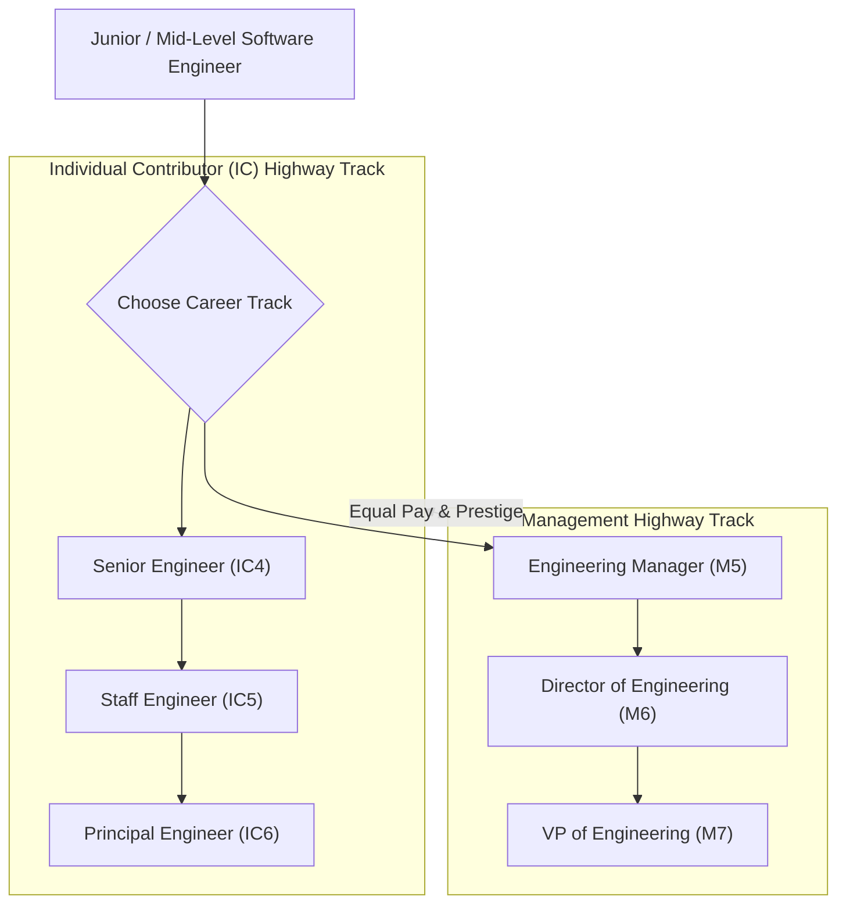

```ppt
# Slide 1: Engineering Career Ladders (IC vs Management)
- **The Core Leadership Challenge:** Creating parallel career progression paths for Individual Contributors (ICs) and Engineering Managers.
- **Golden Rule:** Never force brilliant senior developers to become bad managers just to get a salary raise!
- **Author:** Pankaj Kumar | Associate Architect & Tech Leadership
<!-- slide -->
# Slide 2: The Dual Highway Lanes Analogy
- **Single Lane Road (Traditional Career Trap):** A narrow 1-lane road forces every vehicle (*engineer*) off the highway and into a mountain detour (*management*) if they want to drive faster!
- **Dual Highway (Parallel Tracks):** A 2-lane highway with equal speed limits: Lane 1 (Individual Contributor Track) and Lane 2 (Management Track). Both lanes offer equal compensation, prestige, and executive influence!
<!-- slide -->
# Slide 3: The Individual Contributor (IC) Track
- **Level 4 (Senior Engineer):** Autonomous feature owner & domain expert.
- **Level 5 (Staff Engineer):** Multi-team technical leader & architecture owner.
- **Level 6 (Principal Engineer):** Organization-wide technical strategist & innovator.
- **Level 7 (Distinguished Engineer / Fellow):** Company-wide visionary & industry thought leader.
<!-- slide -->
# Slide 4: The Management Track
- **Engineering Manager (EM):** Squad-level people management, 1-on-1s, and sprint delivery.
- **Director of Engineering:** Multi-team operational leadership & hiring pipelines.
- **VP of Engineering:** Executive leadership over engineering operations, culture, and budgets.
<!-- slide -->
# Slide 5: Equal Compensation & Prestige Calibration
- **Staff Engineer (IC5) = Engineering Manager (M5):** Identical salary bands and equity packages.
- **Principal Engineer (IC6) = Director of Engineering (M6):** Equal C-suite influence and board visibility.
<!-- slide -->
# Slide 6: Enabling Fluid Track Transitions
- **Career Flexibility:** Allowing engineers to switch between IC and Management tracks without penalty.
- **Management Traineeship:** Testing management responsibilities before permanent title changes.
<!-- slide -->
# Slide 7: Common Misconception
- **Myth:** "Managing people is the only way to advance to high executive salary bands in tech."
- **Fact:** World-class Principal Architects generate massive technical leverage equal to senior directors!
<!-- slide -->
# Slide 8: Summary for Beginners
- Build parallel IC and Management career tracks: equalize pay bands, respect technical leverage, and enable fluid transitions!
```

# Structuring Engineering Career Ladders: IC vs Management

Why do so many high-performing software companies lose their best senior developers or turn them into unhappy, ineffective engineering managers?

In traditional corporate hierarchies, there was only one path to earn a higher salary and executive respect: **You had to stop coding and become a manager!**

When companies force brilliant senior architects into people management roles just to give them a promotion, two bad things happen:
1. You lose a world-class software architect who loved writing code.
2. You gain an unhappy, inexperienced manager who struggles with 1-on-1s and performance reviews.

To solve this, modern CTOs build **Parallel Dual-Track Career Ladders (IC vs. Management)**.

Let's understand Career Ladders using **The Dual Highway Lanes Analogy**!

---

## 🛣️ The Dual Highway Lanes Analogy

Imagine driving on a modern high-speed highway:



- **The Single Lane Mountain Trap (Traditional Company):**  
  A narrow 1-lane road forces every car (*developer*) to turn off the highway and take a slow, winding mountain detour (*people management*) if they want to drive above 50 mph.

- **The Dual-Track Superhighway (Parallel CTO Career Ladder):**  
  A 2-lane highway with identical 80 mph speed limits!  
  - **Lane 1 (IC Track):** For engineers who love deep technical architecture, system design, and coding.  
  - **Lane 2 (Management Track):** For leaders who love mentoring people, team operations, and sprint execution.  
  - *Both lanes offer equal compensation, prestige, and executive leverage!*

---

## 📊 Parallel Career Level Mapping & Compensation Equivalence

| Level | Individual Contributor (IC) Track | Management Track | Executive Scope & Impact |
| :--- | :--- | :--- | :--- |
| **Level 4** | **Senior Engineer** | Team Lead (Emerging) | Squad-level feature ownership & mentorship |
| **Level 5** | **Staff Engineer** | **Engineering Manager (EM)** | Multi-squad architecture vs. team 1-on-1s & hiring |
| **Level 6** | **Principal Engineer** | **Director of Engineering** | Org-wide technical strategy vs. multi-team operations |
| **Level 7** | **Distinguished Engineer / Fellow** | **VP of Engineering** | Enterprise technology vision vs. engineering culture & budget |

---

## 💡 Summary for Beginners

- **IC Track** = Progression path for individual technical contributors focusing on software architecture, code quality, and technical leverage.
- **Management Track** = Progression path for leaders focusing on people management, hiring, team morale, and execution.
- **CTO Golden Rule** = **"Equalize compensation and prestige across IC and Management tracks — never force a great architect to become a manager just to earn a promotion!"**

---

*Written by **Pankaj Kumar** | Associate Architect & Tech Leadership.*
