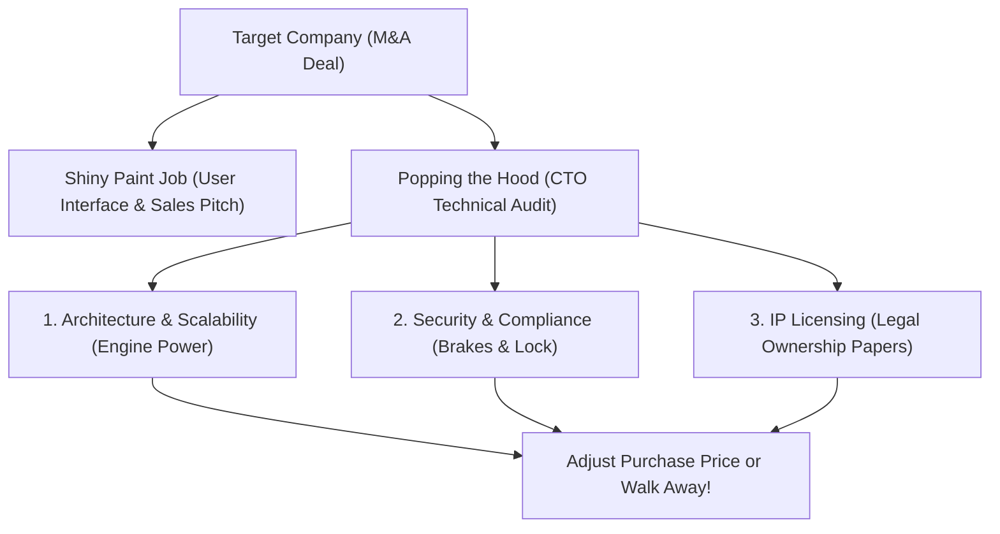

```ppt
# Slide 1: Tech M&A Technical Due Diligence
- **The Core Objective:** Inspecting a target company's technology assets before a multi-million dollar corporate acquisition.
- **Goal:** Identifying hidden architectural flaws, licensing liabilities, and security vulnerabilities before closing the deal.
- **Author:** Pankaj Kumar | Associate Architect & Tech Leadership
<!-- slide -->
# Slide 2: The Used Car Inspection Analogy
- **Shiny Paint Job (Product UI):** Beautiful user interface that looks fast and sleek on the surface.
- **Popping the Hood (Due Diligence):** Inspecting the rusted engine, leaking oil pipes, and worn-out brakes underneath!
<!-- slide -->
# Slide 3: The 4 Pillars of Technical Due Diligence
- **1. Architecture & Scalability:** Can the system handle 10x user growth without crashing?
- **2. Technical Debt & Code Quality:** Is the code clean, modular, and fully documented?
- **3. Security & Compliance:** Are there open vulnerability CVEs or data privacy violations?
- **4. Intellectual Property (IP) & Open Source:** Are there viral GPL license violations in the codebase?
<!-- slide -->
# Slide 4: Real-World Deal Killer: Viral Open Source Licenses
- **The GPL Risk:** If a target company incorporated GPL open source code into proprietary commercial software.
- **The Financial Impact:** Forces the acquiring company to release all proprietary code to the public for free, or spend millions rewriting it!
<!-- slide -->
# Slide 5: The Technical Audit Scorecard
- **Architecture Score:** Red/Yellow/Green rating on cloud infrastructure stability.
- **Key-Person Dependency Risk:** Can the company survive if the founder engineer resigns post-acquisitions?
- **Remediation Cost Estimate:** Deducting $500,000 from purchase price to fix technical debt!
<!-- slide -->
# Slide 6: Red Flags During Mergers & Acquisitions
- Zero automated unit tests in the main code repository.
- Hardcoded database credentials inside frontend source code.
- Cloud hosting bills growing faster than user revenue.
<!-- slide -->
# Slide 7: Common Beginner Misconception
- **Myth:** "Technical due diligence is just counting lines of code or measuring test coverage."
- **Fact:** Technical due diligence evaluates team culture, security risk, scalability limits, and IP ownership!
<!-- slide -->
# Slide 8: Summary for Beginners
- Always pop the hood on codebases before acquisitions to prevent buying hidden millions in technical debt!
```

# Tech M&A Technical Due Diligence: How CTOs Audit Codebases Before Acquisitions

When one technology company acquires another in a multi-million dollar **M&A (Mergers & Acquisitions)** deal, the financial auditors inspect bank statements and profit margins.

However, the **Chief Technology Officer (CTO)** is tasked with the most critical role: **Technical Due Diligence**.

Why? Because a target company might have a beautiful web interface and $5M in annual recurring revenue, but underneath the surface, its software codebase might be a fragile, unmaintainable house of cards!

Let's break down **Technical Due Diligence** using **The Used Car Pre-Purchase Inspection Analogy**!

---

## 🚗 The Used Car Pre-Purchase Inspection Analogy

Imagine buying a luxury used sports car for $80,000:



- **Shiny Paint Job (Product UI):** The car looks gorgeous on the outside. The leather seats are clean, and the air conditioning blows cold.
- **Popping the Hood (Technical Audit):** A master mechanic inspects the engine block. They discover:
  - Rust eating through the transmission (*Technical Debt*).
  - Fake ownership registration papers (*Open Source License Infringement*).
  - Worn-out brakes that will fail on high-speed highways (*Scalability Bottlenecks*).

A smart buyer uses these mechanics' findings to **negotiate a $15,000 price discount** — or walk away from the deal entirely!

---

## 📊 The 4 Pillars of Technical Due Diligence

| Inspection Area | What CTO Auditors Look For | Executive Impact |
| :--- | :--- | :--- |
| **1. Code Quality & Debt** | Test coverage, documentation, refactoring history | Determines how many developers are needed post-acquisition |
| **2. Security & Compliance** | Data encryption, SOC2 compliance, penetration tests | Prevents acquiring massive data breach liabilities |
| **3. Open Source IP Audit** | GPL virus licenses, proprietary code ownership | Protects patent rights and prevents forced code disclosure |
| **4. Cloud Infrastructure** | FinOps unit costs, server redundancy, uptime SLAs | Evaluates margin expansion potential under scaling |

---

## 💡 Summary for Beginners

- **Technical Due Diligence** = A rigorous engineering audit of a company's software assets before acquisition.
- **Viral Licenses (GPL)** = Open source code that can legally force commercial software to become open-source.
- **The CTO's M&A Role** = Protecting investors from buying hidden technical liabilities and pricing engineering remediation into the final purchase deal!

---

*Written by **Pankaj Kumar** | Associate Architect & Tech Leadership.*
