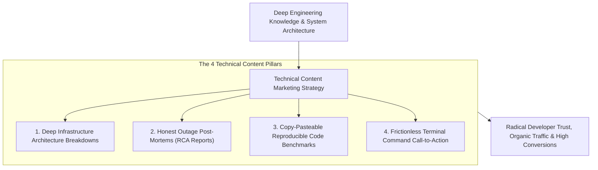
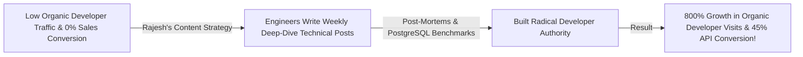

```ppt
# Slide 1: Technical Content Marketing That Converts
- **The Core Strategy:** Educating developers and technical decision-makers by sharing real-world architecture breakdowns, post-mortems, and code tutorials rather than sales pitches.
- **Executive Reality:** Developers don't buy from generic marketing ads — they trust engineering blogs that solve their complex daily coding problems!
- **Author:** Pankaj Kumar | Associate Architect & Tech Leadership
<!-- slide -->
# Slide 2: The Secret Master Chef vs. Open Masterclass Analogy
- **Secretive Guarded Restaurant (Legacy Marketing):** A restaurant chef locking secret recipes in a dark cabinet, refusing to share ingredients (**Gated 30-Page PDFs & Sales Calls**). Customers leave hungry, frustrated, and suspicious!
- **Open Masterclass Kitchen (Technical Content Marketing):** A master chef hosting open cooking classes, breaking down secret recipes step-by-step (**Public Engineering Blogs & Deep Architecture Breakdowns**)! Food lovers taste the dish, trust the chef's expertise, and become lifelong restaurant patrons!
<!-- slide -->
# Slide 3: The 4 Pillars of High-Converting Tech Blogs
- **1. Deep Architecture Deep-Dives:** Explaining how your infrastructure handles 1M requests/sec.
- **2. Honest Outage Post-Mortems:** Publishing transparent incident RCA reports to build radical trust.
- **3. Copy-Pasteable Code Benchmarks:** Providing reproducible benchmark code scripts on GitHub.
- **4. Problem-First Storytelling:** Structuring blogs around real developer pain points instead of feature lists.
<!-- slide -->
# Slide 4: Real-World Case Study: Rajesh's Engineering Blog Strategy
- **The Challenge:** A database startup led by Lead Architect **Rajesh Sharma** had low organic traffic and poor developer conversion.
- **The Content Pivot:** Rajesh instructed senior engineers to publish weekly architecture post-mortems, benchmark comparisons against PostgreSQL, and open-source tuning guides.
- **The Result:** Monthly organic developer visits grew by 800%, and self-service API conversions jumped by 45%!
<!-- slide -->
# Slide 5: The Content Value Pyramid
- **Level 1 (Top):** Practical Code Solutions & Reproduction Scripts.
- **Level 2 (Middle):** System Architecture Schematics & Benchmarks.
- **Level 3 (Base):** Philosophical Engineering Principles & Post-Mortems.
<!-- slide -->
# Slide 6: Converting Readers Without Hard Selling
- **Frictionless Call-to-Action:** Provide a 1-line copy-pasteable terminal command (`npx create-app@latest`) at the end of the post.
- **Interactive Sandboxes:** Embed live CodeSandbox / Postman playgrounds inside the blog.
<!-- slide -->
# Slide 7: Common Misconception
- **Myth:** "Giving away technical knowledge for free allows competitors to steal your secret sauce."
- **Fact:** Transparency establishes industry authority — customers buy from the recognized experts who write the authoritative guides!
<!-- slide -->
# Slide 8: Summary for Beginners
- Master technical content: publish deep architecture breakdowns, share honest outage post-mortems, provide copy-pasteable code, and lead with educational transparency!
```

# Technical Content Marketing: Writing Tech Blogs That Convert

In the modern enterprise technology landscape, traditional corporate content marketing is dead.

Developers, DevOps engineers, and CTOs do not read generic marketing whitepapers or 20-page promotional brochures.
- If a blog post contains superficial marketing fluff, developers press the back button in 3 seconds.
- If a blog post breaks down a real-world **Distributed Database Outage Post-Mortem** or explains **How We Scaled Redis to 1 Million QPS**, engineers read every line, bookmark the link, and share it on Slack!

**Technical Content Marketing is about building authority through radical educational transparency.**

How do technology leaders turn engineering blogs into powerful growth engines that convert developers into customers?

Let's understand Technical Content Marketing using **The Secret Master Chef vs. Open Masterclass Analogy**!

---

## 🍳 The Secret Master Chef vs. Open Masterclass Analogy


Imagine building a world-renowned culinary reputation:



- **The Secretive Guarded Restaurant (Legacy Marketing):**  
  A restaurant chef locking secret recipes inside a dark cabinet, forcing guests to schedule a sales meeting just to sample a sauce (**Gated 30-Page PDFs & Forced Sales Calls**). Customers leave hungry, frustrated, and suspicious.

- **The Open Masterclass Kitchen (Technical Content Marketing):**  
  A master chef hosting open cooking classes, breaking down secret recipes step-by-step (**Public Engineering Blogs & Open Architecture Schematics**)! Food lovers taste the dish, marvel at the chef's expertise, and become lifelong restaurant patrons.

---

## 📊 Real-World Case Study: Rajesh's Engineering Blog Strategy

Consider a distributed database startup where **Rajesh Sharma** serves as Lead Architect.



1. **The Challenge:** Rajesh's database company spent $50,000 hiring an external marketing agency to write corporate blog posts. The posts were full of buzzwords (*"Unlocking Synergistic Cloud Scale"*) and produced zero developer signups.
2. **The Engineering Content Pivot:**  
   - Rajesh cancelled the agency contract and empowered senior engineers to write authentic technical content:
   - **Architecture Breakdowns:** Published deep-dive articles showing exact Raft consensus protocol code implementations.
   - **PostgreSQL Benchmarks:** Released reproducible benchmark test scripts comparing query latencies under 100k concurrent connections.
   - **Transparent Outages:** Published honest Root Cause Analysis (RCA) post-mortems when staging servers experienced downtime.
3. **The Result:** Monthly organic developer visits exploded by **800%**, developer trust skyrocketed, and self-service API conversions jumped by **45%**!

---

## 📊 Corporate Fluff Marketing vs. Authentic Technical Content

| Dimension | Corporate Fluff Marketing (Fails with Devs) | Authentic Technical Content (Converts Devs) |
| :--- | :--- | :--- |
| **Primary Goal** | High-pressure sales lead generation | Educating developers & solving real engineering problems |
| **Content Author** | Non-technical corporate marketing copywriter | Senior Software Architects & Staff Engineers |
| **Content Depth** | Surface-level feature lists & buzzwords | Real code snippets, architecture schematics, & benchmarks |
| **Gating Model** | Gated behind aggressive 10-field contact forms | 100% public, searchable, and open-access on GitHub/Web |
| **Call to Action** | *"Request a 30-Minute Sales Demo Call"* | *"Run `npx create-app@latest` in your terminal to test live"* |

---

## 💡 Summary for Beginners

- **Technical Content Marketing** = The practice of attracting and converting developers by publishing authentic, educational, code-first engineering articles.
- **RCA Post-Mortem** = A Root Cause Analysis article detailing what went wrong during a system outage, how it was fixed, and steps taken to prevent recurrence.
- **Reproducible Benchmark** = A public GitHub script allowing readers to independently verify performance claims on their own hardware.
- **CTO Golden Rule** = **"Developers buy from the recognized experts who write the authoritative guides — publish deep architecture breakdowns, share honest post-mortems, and lead with educational transparency!"**

---

*Written by **Pankaj Kumar** | Associate Architect & Tech Leadership.*
