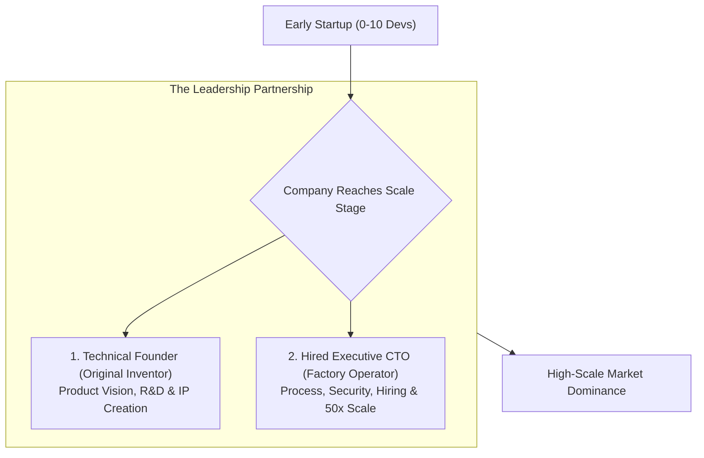

```ppt
# Slide 1: Technical Founder vs Hired Executive CTO
- **The Core Leadership Transition:** Navigating the shift when a startup grows past its original technical founder and hires an experienced executive CTO.
- **Key Conflict:** Emotional attachment to early prototype code vs scaling enterprise operations.
- **Author:** Pankaj Kumar | Associate Architect & Tech Leadership
<!-- slide -->
# Slide 2: The Original Inventor vs Factory Operator Analogy
- **The Technical Founder (Original Garage Inventor):** Built the very first prototype by hand late at night, knows every line of original code, and views the software as their personal baby.
- **The Hired Executive CTO (Professional Factory Operator):** Knows how to design assembly lines, hire 100 workers, enforce quality control standards, and scale production 50x!
<!-- slide -->
# Slide 3: Strengths of the Technical Founder
- **Deep Domain Passion:** Unmatched historical context and deep emotional commitment to the product vision.
- **Speed in Early Days:** Ability to hack together working MVPs rapidly without process overhead.
- **Founder Authority:** High respect among early employees and company co-founders.
<!-- slide -->
# Slide 4: Strengths of the Hired Executive CTO
- **Operational Scalability:** Proven experience structuring 50+ developer organizations.
- **Process & Governance:** Implementing CI/CD pipelines, security compliance (SOC2/PCI), and career ladders.
- **C-Suite & Boardroom Literacy:** Fluency in FinOps, M&A due diligence, and enterprise CFO negotiations.
<!-- slide -->
# Slide 5: The Common Sources of Friction
- **1. Over-Attachment to Legacy Code:** Founder resists refactoring the original MVP script they wrote 4 years ago.
- **2. Process Friction:** Founder feels formal sprint planning and code reviews "slow down innovation."
- **3. Role Confusion:** Founder stepping over the hired CTO to give direct orders to junior developers.
<!-- slide -->
# Slide 6: How to Navigate a Successful Partnership
- **Define Boundaries Early:** Technical Founder owns Product Vision / R&D; Hired CTO owns Engineering Execution & Scale.
- **Respect the Heritage:** Acknowledge that the company wouldn't exist without the founder's original code.
- **Continuous CEO Alignment:** Keep the CEO aligned on leadership boundaries to avoid split directives.
<!-- slide -->
# Slide 7: Common Misconception
- **Myth:** "Hiring an Executive CTO means pushing out the Technical Founder."
- **Fact:** The best tech companies pair the Founder's visionary passion with the Executive CTO's operational scale!
<!-- slide -->
# Slide 8: Summary for Beginners
- Respect original founder code, establish clear operational boundaries, and combine vision with execution scale!
```

# Technical Founder vs Hired Executive CTO: Navigating Dynamics

When a tech startup scales from a 3-person garage team into a 100-person venture-backed enterprise, leadership dynamics inevitably shift.

In the early days, the **Technical Founder** wrote every line of code, built the original prototype, and handled customer support calls late at night.

However, as the company expands toward a Series B or C round, the board often brings in a **Hired Executive CTO** to scale engineering operations, establish SOC2 security compliance, and manage multi-million-dollar cloud budgets.

This transition can create immense friction if not managed with care.

Let's understand this leadership dynamic using **The Original Inventor vs. Factory Operator Analogy**!

---

## 🏬 The Original Inventor vs. Factory Operator Analogy

Imagine a boutique watchmaker expanding into global manufacturing:



- **The Technical Founder (The Original Garage Inventor):**  
  Crafted the first custom timepiece at a wooden workbench. They know every screw and gear inside out, and view the watch design as their personal artistic baby.

- **The Hired Executive CTO (The Professional Factory Operator):**  
  Brought in to build a state-of-the-art automated manufacturing plant that produces 100,000 flawless watches per month with zero defect rates!

---

## 📊 Technical Founder vs. Hired Executive CTO Comparison

| Dimension | Technical Founder | Hired Executive CTO |
| :--- | :--- | :--- |
| **Primary Mindset** | Visionary & Creative Hacker | Operational & Scalable Executive |
| **Core Superpower** | Rapid 0-to-1 prototyping & passion | Structuring 50+ dev teams & governance |
| **Relationship to Code** | Deep emotional attachment to legacy MVP | Views code pragmatically as a business asset |
| **Boardroom Focus** | Product feature roadmap & innovation | Cloud FinOps, security SLAs, M&A readiness |
| **Ideal Complementary Role** | Chief Architect / Chief Product Officer | Executive CTO / VP of Engineering |

---

## 💡 Summary for Beginners

- **Technical Founder** = The creative engine who birthed the original technology vision.
- **Hired Executive CTO** = The operational scaling leader who builds enterprise systems and processes around that vision.
- **CTO Golden Rule** = **"Never undermine the technical founder's heritage code — partner with them to transform early prototype passion into world-class enterprise architecture!"**

---

*Written by **Pankaj Kumar** | Associate Architect & Tech Leadership.*
