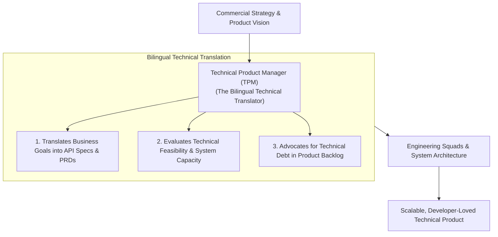

```ppt
# Slide 1: Technical Product Management (TPM)
- **The Core Role:** Bridging deep software engineering architecture with commercial product management strategy.
- **Key Function:** Translating complex technical capabilities into clear customer features and developer user stories.
- **Author:** Pankaj Kumar | Associate Architect & Tech Leadership
<!-- slide -->
# Slide 2: The Bilingual Technical Translator Analogy
- **Siloed Communication Gap:** A non-technical product manager speaks *Commercial Business*; a senior software architect speaks *Distributed Database Schemas*. Without a translator, they talk past each other!
- **The TPM (Bilingual Translator):** Fluently speaks both business strategy AND system architecture, turning high-level product goals into precise technical requirements!
<!-- slide -->
# Slide 3: What is a Technical Product Manager (TPM)?
- **Definition:** A Product Manager with a strong technical background (often ex-software engineer or architect).
- **Core Domain:** Managing complex technical products (APIs, Developer SDKs, Cloud Platforms, AI Infrastructure).
<!-- slide -->
# Slide 4: Key Responsibilities of a TPM
- **1. Technical Requirements (PRDs):** Writing detailed Product Requirement Documents with API specs and data flows.
- **2. Architecture Feasibility:** Evaluating whether proposed features are technically feasible without breaking systems.
- **3. Technical Debt Prioritization:** Advocating for refactoring and performance tasks within the product backlog.
- **4. Developer Experience (DevEx):** Ensuring internal/external APIs are intuitive and easy to integrate.
<!-- slide -->
# Slide 5: Standard PM vs Technical PM (TPM)
- **Standard PM:** Focuses heavily on market research, user personas, UI wireframes, and go-to-market strategy.
- **Technical PM:** Focuses on API contracts, system scalability, data pipelines, SDK developer experience, and tech stack trade-offs.
<!-- slide -->
# Slide 6: How TPMs Partner with Engineering & CTO
- **TPM & CTO:** Aligns technical product roadmap with enterprise cloud architecture and security.
- **TPM & Dev Squads:** Clarifies edge-case user stories, reviews API payloads, and unblocks technical dependencies.
<!-- slide -->
# Slide 7: Common Misconception
- **Myth:** "A TPM is just a Project Manager who writes Jira tickets for developers."
- **Fact:** A TPM owns technical product strategy, API design, and system scalability decisions!
<!-- slide -->
# Slide 8: Summary for Beginners
- TPMs bridge code and strategy: master API design, translate business requirements into technical specs, and drive DevEx!
```

# Technical Product Management (TPM): Role & Responsibilities

In modern software organizations, product management has evolved beyond simple wireframes and market research.

When building complex developer platforms, public APIs, cloud infrastructure, or AI models, a standard product manager often struggles to understand backend database constraints, API latency trade-offs, or microservice dependencies.

This is where **The Technical Product Manager (TPM)** becomes essential!

A TPM is a hybrid leader who combines product strategy with deep technical fluency to bridge the gap between commercial product managers and software engineers.

Let's understand Technical Product Management using **The Bilingual Translator Analogy**!

---

## 🗣️ The Bilingual Technical Translator Analogy

Imagine a high-stakes international summit:



- **The Communication Gap:**  
  The Chief Commercial Officer speaks *Business Spanish* (*"We need real-time multi-tenant data sync for 100,000 users"*). The Backend Lead Architect speaks *Engineering Japanese* (*"We need a Kafka event bus with partition keys and gRPC streams"*). They stare at each other in confusion!

- **The TPM (The Master Bilingual Translator):**  
  Stands between them, fluent in both languages! The TPM translates the business revenue goal into precise API payload specifications, data pipeline requirements, and clear user stories that engineers can build instantly.

---

## 📊 Standard Product Manager (PM) vs. Technical Product Manager (TPM)

| Focus Dimension | Standard Product Manager (PM) | Technical Product Manager (TPM) |
| :--- | :--- | :--- |
| **Primary Domain** | Consumer Apps, B2C UX, E-commerce | APIs, Developer Platforms, Cloud Infrastructure, AI |
| **Core Skillset** | User interviews, wireframes, market positioning | API design, SQL, system architecture, data modeling |
| **Key Artifact** | User Persona & Market PRD | Technical PRD with API Payloads & ER Diagrams |
| **Daily Contacts** | UX Designers, Marketers, Sales Teams | Software Architects, DevOps Engineers, Data Leads |
| **Primary Metric** | User Retention, Conversion Rate, NPS | API Latency, Developer Time-to-First-Call, SLA Uptime |

---

## 💡 Summary for Beginners

- **Technical Product Manager (TPM)** = A product leader with deep technical expertise who manages APIs, developer tools, and platform infrastructure.
- **Key Superpower** = Translating complex business goals into precise, buildable technical requirements for engineering squads.
- **CTO Golden Rule** = **"Hire TPMs to bridge the gap between commercial product vision and deep system architecture — they turn high-level ideas into buildable engineering reality!"**

---

*Written by **Pankaj Kumar** | Associate Architect & Tech Leadership.*
