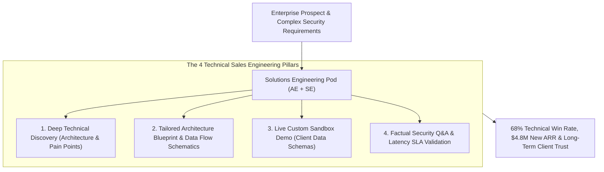

```ppt
# Slide 1: Technical Sales Engineering for Enterprise Growth
- **The Core Strategy:** Pairing Account Executives with Sales Engineers & Solutions Architects to win complex enterprise deals through technical authority, architecture alignment, and customer trust.
- **Executive Reality:** Enterprise buyers don't buy from smooth-talking salespeople alone — they buy when a Sales Engineer answers their toughest architectural questions with deep technical authority!
- **Author:** Pankaj Kumar | Associate Architect & Tech Leadership
<!-- slide -->
# Slide 2: Faking Engine Specs vs. Master Mechanic Collaboration Analogy
- **Faking Engine Specs (Unprepared Sales Pitch):** An uncomfortable salesperson making up fake answers to complex car engine questions from a suspicious enterprise buyer (**Superficial Sales Pitch**). The buyer loses trust and walks away!
- **Master Mechanic Collaboration (Solutions Engineering):** A sharp salesperson paired with a master software architect walking through a digital engine blueprint (**Technical Sales Engineering**)! The architect answers deep system questions, reassures the buyer, and closes the deal!
<!-- slide -->
# Slide 3: The 4 Pillars of Technical Sales Engineering
- **1. Technical Discovery:** Uncovering customer architecture bottlenecks, legacy tech stack friction, & compliance needs.
- **2. Architecture Blueprinting:** Designing custom cloud integration diagrams & data flow schematics.
- **3. Tailored Demo Delivery:** Demonstrating live working software customized to the client's exact data schemas.
- **4. Technical Objection Handling:** Addressing security, latency SLAs, & scalability concerns with factual proof.
<!-- slide -->
# Slide 4: Real-World Case Study: Rajesh's Enterprise Win
- **The Challenge:** A B2B SaaS startup led by Lead Architect **Rajesh Sharma** was losing $500k enterprise deals to legacy competitors because account reps couldn't answer security audit questions.
- **The Sales Engineering Strategy:** Rajesh established a dedicated Solutions Engineering pod, creating custom architecture blueprints and running live 20-minute sandbox demos for client CISOs.
- **The Result:** Enterprise win rates jumped from 22% to 68%, closing $4.8M in new ARR!
<!-- slide -->
# Slide 5: The Sales Engineering Partnership Loop
- **Account Executive (AE):** Manages deal relationships, pricing negotiations, & contract signatures.
- **Sales Engineer (SE):** Owns technical validation, architecture design, POC prototypes, & security Q&A.
- **SLA Alignment:** 100% technical validation completed before commercial pricing proposals are sent.
<!-- slide -->
# Slide 6: Key Metrics for Solutions Engineering
- **Primary Metric:** Technical Win Rate % (Deals won after technical validation).
- **Secondary Metric:** Average Proof-of-Concept (POC) Cycle Duration (< 14 Days).
<!-- slide -->
# Slide 7: Common Misconception
- **Myth:** "Sales Engineers are just junior developers who couldn't write production code."
- **Fact:** Elite Sales Engineers are high-caliber software architects who possess rare dual mastery of complex system design and executive communication!
<!-- slide -->
# Slide 8: Summary for Beginners
- Master Technical Sales Engineering: pair Account Executives with Solutions Architects, conduct deep technical discovery, deliver tailored architecture demos, and build buyer trust to close enterprise deals!
```

# Technical Sales Engineering: Helping Sales Close Enterprise Deals

Welcome to the **Series 7 Kickoff: Sales, Revenue Engineering & Commercial Execution!**

Across the previous series, we mastered engineering culture, system architecture, cloud operations, agile scaling, developer marketing, and DevRel.

Now we enter the commercial growth engine of technology leadership:  
*"How does a Chief Technology Officer (CTO) empower sales teams to win multi-million-dollar enterprise contracts through **Technical Sales Engineering & Solutions Architecture**?"*

In B2B enterprise software sales, a major disconnect often occurs during client meetings:
- **The Superficial Pitch Trap:** An Account Executive (AE) presents polished marketing slides, but when the client's Chief Information Security Officer (CISO) or VP of Infrastructure asks deep technical questions (*"How does your microservice handle multi-region PostgreSQL failover?"* or *"What is your p99 latency under 50k RPS?"*), the salesperson stumbles and makes up vague answers.
- **The Buyer Reaction:** The client immediately loses trust, assumes the platform is unreliable, and buys from a competitor!

**Technical Sales Engineering (Solutions Architecture) is the bridge of trust between enterprise buyers and commercial sales teams.**

How do CTOs build a world-class Solutions Engineering organization that turns complex technical questions into multi-million-dollar sales wins?

Let's understand Technical Sales Engineering using **The Faking Engine Specs vs. Master Mechanic Collaboration Analogy**!

---

## 🛠️ The Faking Engine Specs vs. Master Mechanic Collaboration Analogy


Imagine purchasing a high-performance commercial vehicle for your fleet:



- **Faking Engine Specs (Unprepared Sales Pitch):**  
  An uncomfortable salesperson standing on a car showroom floor, sweating while making up fake answers to complex engine torque questions from a suspicious enterprise buyer (**Superficial Sales Pitch**). The buyer loses trust and walks away!

- **Master Mechanic Collaboration (Solutions Engineering):**  
  A sharp salesperson paired with a master software architect in a clean hoodie, standing beside a digital engine blueprint and accurately explaining system specs (**Technical Sales Engineering**)! The buyer feels completely reassured and signs the contract.

---

## 📊 Real-World Case Study: Rajesh's Enterprise Win

Consider a B2B infrastructure SaaS scale-up where **Rajesh Sharma** serves as Lead Architect.


1. **The Challenge:** Rajesh's company built an outstanding real-time analytics platform. However, the commercial sales team was losing **78% of enterprise deals** because sales reps couldn't answer complex network security and data residency questions during technical procurement reviews.
2. **The Solutions Engineering Strategy:**  
   - Rajesh partnered with the Chief Revenue Officer (CRO) to create a **Solutions Engineering (SE) Function**:
   - **Pod Structure:** Paired every senior Account Executive with a dedicated Solutions Architect.
   - **Tailored Blueprints:** Before every major demo, the SE drew a customized cloud architecture blueprint showing exactly how the platform integrated with the client's AWS/Azure environment.
   - **Factual Objection Handling:** Replaced vague sales answers with real benchmark logs, security SOC2 audit reports, and live sandbox demonstrations.
3. **The Result:** Technical win rates jumped from **22% to 68%**, sales cycle length decreased by 40%, and the company closed **$4.8 Million in new ARR**!

---

## 📊 Account Executive (AE) vs. Sales Engineer (SE) Roles

| Dimension | Account Executive (Commercial Owner) | Sales Engineer (Technical Owner) |
| :--- | :--- | :--- |
| **Primary Focus** | Commercial relationship, pricing, & closing | Technical validation, architecture fit, & proof of value |
| **Key Responsibilities** | Contract negotiation, executive sponsorship, pipeline | Technical discovery, custom demos, POCs, & security Q&A |
| **Target Audience** | Procurement, Chief Financial Officer (CFO), Purchasing | Chief Technology Officer (CTO), CISO, Architects, Engineers |
| **Primary Metric** | Annual Recurring Revenue (ARR) Quota | **Technical Win Rate % & POC Cycle Speed (< 14 Days)** |
| **Superpower** | Persuasion, deal mechanics, & executive relationship | **Deep architectural authority, trust-building, & problem solving** |

---

## 💡 Summary for Beginners

- **Sales Engineering (Solutions Architecture)** = The discipline of providing technical expertise and architectural guidance during the B2B sales cycle to validate product fit.
- **Technical Win Rate** = The percentage of enterprise sales opportunities that pass technical validation and proceed to commercial contract negotiation.
- **Technical Discovery** = The initial consultation process where a Sales Engineer uncovers a prospective customer's technical architecture, pain points, and requirements.
- **CTO Golden Rule** = **"Don't let sales reps fake technical answers — pair commercial reps with elite Solutions Engineers, build custom architecture blueprints, and win enterprise deals through technical authority!"**

---

*Written by **Pankaj Kumar** | Associate Architect & Tech Leadership.*
