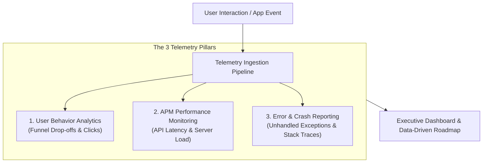

```ppt
# Slide 1: Telemetry & Product Analytics
- **The Core Objective:** Instrumenting applications with real-time event tracking, performance monitoring, and user behavior analytics.
- **Key Insight:** Software engineering without telemetry is like driving a supercar blindfolded at night!
- **Author:** Pankaj Kumar | Associate Architect & Tech Leadership
<!-- slide -->
# Slide 2: The Supermarket Traffic Camera Analogy
- **Traditional Retail Store:** Installs overhead cameras, foot-traffic counters, and aisle heatmaps to observe which displays attract shoppers and where checkout lines stall.
- **Digital Application Telemetry:** Tracks click rates, page view durations, conversion funnels, and error tracebacks across every user session!
<!-- slide -->
# Slide 3: The 3 Layers of Modern Telemetry
- **1. User Behavior Analytics:** Tracking feature usage, button clicks, funnel drop-offs, and active user retention (Mixpanel, PostHog).
- **2. Application Performance Monitoring (APM):** Latency metrics, API response times, database query execution, and CPU usage (Datadog, New Relic).
- **3. Error & Crash Reporting:** Unhandled exceptions, stack traces, and frontend crash rates (Sentry).
<!-- slide -->
# Slide 4: Building an Event-Driven Telemetry Architecture
- **Step 1 (Client Instrumentation):** Dispatching clean JSON event payloads on user actions.
- **Step 2 (Event Pipeline):** Ingesting events through Kafka/Segment into a centralized data warehouse (Snowflake/BigQuery).
- **Step 3 (Dashboards):** Visualizing user funnels and system health for Product and Engineering.
<!-- slide -->
# Slide 5: Data Privacy & Security (GDPR / HIPAA)
- **PII Masking:** Stripping Personally Identifiable Information (passwords, credit cards, emails) before emitting telemetry events.
- **Consent Management:** Respecting user cookie consent and opt-out preferences.
<!-- slide -->
# Slide 6: Telemetry-Driven Engineering Decisions
- **Feature Deprecation:** Safely retiring legacy features used by less than 0.1% of users.
- **Performance Optimization:** Identifying slow database queries based on real user latency histograms.
<!-- slide -->
# Slide 7: Common Misconception
- **Myth:** "Telemetry is just for product managers to count page views."
- **Fact:** Telemetry is the lifeblood of system architecture, security debugging, performance tuning, and business strategy!
<!-- slide -->
# Slide 8: Summary for Beginners
- Instrument your software with event tracking, APM, and error monitoring to make data-driven engineering decisions!
```

# Telemetry & Product Analytics: Instrumenting User Behavior

How do you know if a newly launched software feature is actually helping users or causing frustration?

Without **Telemetry & Product Analytics**, software teams rely on guesswork, opinions, and loud customer complaints. Engineers build features in the dark, ship code to production, and hope users figure out how to use them.

In modern software engineering, **Telemetry is the central nervous system of your application.**

Let's demystify Telemetry using **The Supermarket Traffic Camera Analogy**!

---

## 🛒 The Supermarket Traffic Camera Analogy

Imagine managing a high-volume retail supermarket:



- **The Blind Supermarket Manager:**  
  Walks around with a broom, having no idea which aisles customers visit, where shoppers abandon their carts, or why checkout line #3 is always backed up.

- **The Data-Driven Supermarket Manager (Telemetry Leader):**  
  Installs overhead heatmaps, automated aisle sensors, and register timers. They discover instantly that 40% of shoppers turn back at the bakery aisle because the sign is hidden, allowing them to fix the layout immediately and boost sales!

---

## 📊 The 3 Pillars of Software Telemetry

| Telemetry Pillar | Primary Tooling | Key Metrics Tracked | Engineering Value |
| :--- | :--- | :--- | :--- |
| **1. User Behavior Analytics** | PostHog, Mixpanel, Amplitude | Funnel conversion, feature clicks, active retention | Identifies dead features & UX friction points |
| **2. APM & Infrastructure** | Datadog, New Relic, Prometheus | P99 API latency, CPU load, DB query execution time | Guides server scaling & database query tuning |
| **3. Crash & Error Tracking** | Sentry, Bugsnag | Unhandled exceptions, JavaScript stack traces | Enables proactive bug fixing before users complain |

---

## 💡 Summary for Beginners

- **Telemetry** = Collecting real-time data on user behavior, application performance, and system errors.
- **Data-Driven Engineering** = Using empirical usage data to decide which features to expand and which legacy code to deprecate.
- **CTO Golden Rule** = **"Never ship code to production without telemetry — if you can't measure it, you can't optimize it or protect it!"**

---

*Written by **Pankaj Kumar** | Associate Architect & Tech Leadership.*
