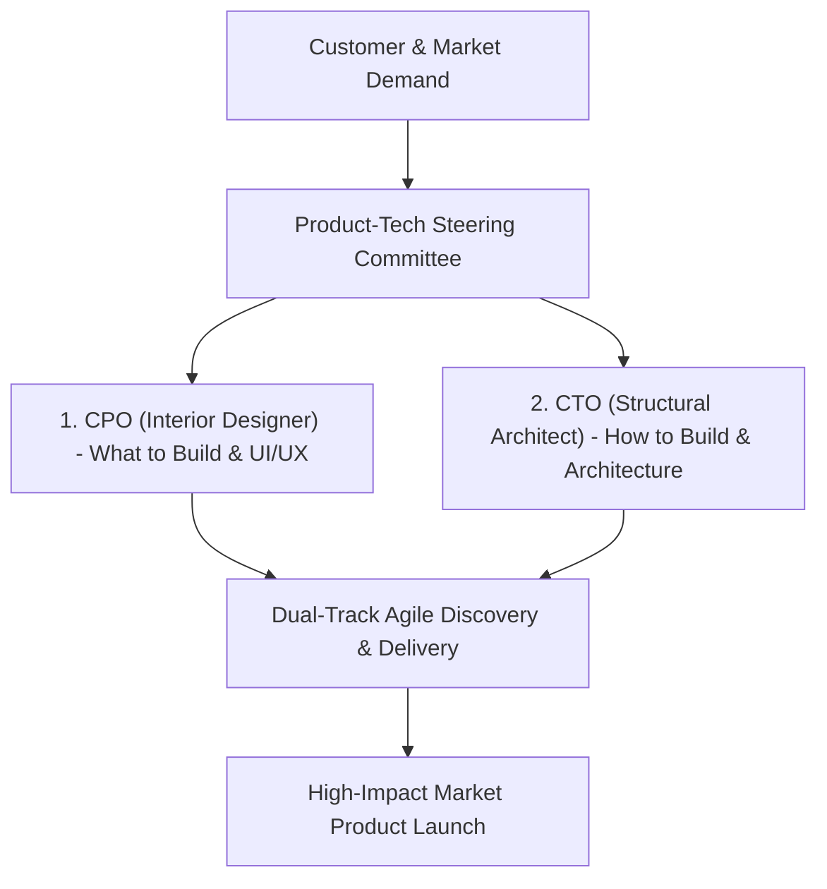

```ppt
# Slide 1: The CTO & CPO Dynamic Partnership
- **The Core Goal:** Building a harmonious executive partnership between the Chief Technology Officer (CTO) and Chief Product Officer (CPO).
- **Core Synergy:** Unifying *What & Why to Build* (CPO) with *How & When to Build* (CTO).
- **Author:** Pankaj Kumar | Associate Architect & Tech Leadership
<!-- slide -->
# Slide 2: The Architect & Interior Designer Analogy
- **The CPO (Interior Designer & User Specialist):** Understands customer needs, room layouts, wall colors, furniture aesthetics, and user experience.
- **The CTO (Structural Architect & Building Engineer):** Ensures foundation beams, load-bearing walls, plumbing, electrical wiring, and building safety meet strict standards!
<!-- slide -->
# Slide 3: Why Product & Tech Teams Conflict
- **Product Demand:** CPO wants 10 user-facing features shipped this quarter to hit sales targets.
- **Engineering Reality:** CTO warns that adding features without fixing legacy database bugs will cause site crashes.
- **The Solution:** A unified Product-Tech Steering Committee and joint roadmap ownership.
<!-- slide -->
# Slide 4: Defining Responsibilities (CPO vs CTO)
- **CPO Owns:** Customer discovery, user research, feature backlog prioritization, product positioning, and UI/UX design.
- **CTO Owns:** System architecture, database scaling, API design, developer tooling, security, and release pipelines.
<!-- slide -->
# Slide 5: The Dual-Track Agile Framework
- **Track 1 (Discovery - CPO):** Testing product concepts, user interviews, and wireframing future features.
- **Track 2 (Delivery - CTO):** Writing production code, automated testing, CI/CD deployment, and infrastructure scaling.
<!-- slide -->
# Slide 6: Joint Metrics of Success
- **1. Customer Churn Rate:** Reduced through high performance, zero bugs, and great UX.
- **2. Feature Adoption:** Measuring whether new features actually drive user engagement.
- **3. Deployment Predictability:** Delivering promised features on schedule without outages.
<!-- slide -->
# Slide 7: Common Misconception
- **Myth:** "Product Managers tell engineers *how* to write code; Engineers decide *what* features to build."
- **Fact:** CPO defines the customer problem and feature *what*; CTO defines the architectural solution and *how*!
<!-- slide -->
# Slide 8: Summary for Beginners
- Build an empathetic CTO-CPO alliance: CPO drives customer value, CTO drives technical execution!
```

# The CTO and CPO Dynamic Partnership: Aligning Code & Product

In high-growth technology companies, no relationship is more critical to product success than the executive partnership between the **Chief Technology Officer (CTO)** and the **Chief Product Officer (CPO)**.

When these two leaders are out of sync:
- The Product team complains: *"Engineering is too slow and spends all their time refactoring code instead of shipping features!"*
- The Engineering team complains: *"Product keeps changing user stories mid-sprint, creating technical debt and spaghetti code!"*

However, when the CTO and CPO act as unified co-pilots, **they ship commercial software fast while maintaining bulletproof system stability.**

Let's demystify this executive synergy using **The Architect & Interior Designer Analogy**!

---

## 🏡 The Architect & Interior Designer Analogy

Imagine designing and constructing a luxury home:



- **The CPO (The Interior Designer):**  
  Spends time with the homeowners (*customers*), understands how they live, designs room layouts, chooses wall paint colors, and selects furniture. They know **WHAT** will make the home delightful to live in!

- **The CTO (The Structural Architect & Building Engineer):**  
  Calculates load-bearing wall capacity, designs plumbing lines, routes electrical breaker boxes, and enforces building codes. They know **HOW** to make the home safe, durable, and energy-efficient!

---

## 📊 CPO vs. CTO Responsibility & Boundary Matrix

| Focus Area | Chief Product Officer (CPO) | Chief Technology Officer (CTO) | Joint Executive Ownership |
| :--- | :--- | :--- | :--- |
| **Primary Question** | *"WHAT should we build and WHY?"* | *"HOW should we build it and WHEN?"* | *"WHERE does this drive company growth?"* |
| **Daily Focus** | User research, wireframes, backlog priorities | System architecture, APIs, CI/CD, security | Product-Engineering Roadmap |
| **Core Metrics** | User retention, NPS score, feature adoption | System SLA uptime, latency, DORA velocity | Customer Churn & Revenue ROI |
| **Artifact Owned** | Product Vision & User Story Backlog | Technical Roadmap & System Architecture | Unified 12-Month Release Plan |

---

## 💡 Summary for Beginners

- **CTO-CPO Synergy** = The strategic alliance between technical architecture execution and customer product vision.
- **Dual-Track Framework** = CPO runs Product Discovery; CTO runs Technical Delivery.
- **CTO Golden Rule** = **"The CPO defines the customer problem and product vision; the CTO designs the technical architecture and delivery execution to solve it!"**

---

*Written by **Pankaj Kumar** | Associate Architect & Tech Leadership.*
