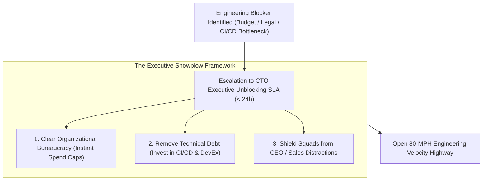
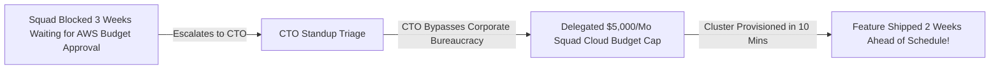

```ppt
# Slide 1: The CTO's Role in Scrum Execution
- **The Core Leadership Responsibility:** Serving as the ultimate executive "Snowplow" clearing organizational, technical, and cross-departmental blockers so engineering squads maintain high velocity.
- **Executive Rule:** The CTO is not a sprint micro-manager — the CTO is the chief unblocker of engineering squads!
- **Author:** Pankaj Kumar | Associate Architect & Tech Leadership
<!-- slide -->
# Slide 2: The Snowplow Truck Clearing Highway Ice Analogy
- **Passive Highway Inspector (Micro-managing CTO):** Stands on the side of a frozen highway taking notes while ambulances and delivery trucks (*Engineering Squads*) skid on black ice and crash into snowdrifts. They demand to know why trucks are late!
- **Master Snowplow Commander (Unblocking CTO):** Drives a heavy 10-ton snowplow truck ahead of the convoy (**Clearing Cross-Departmental Blockers**), salts the icy road (**Providing Cloud Tooling & CI/CD Infrastructure**), and creates a smooth 80-mph open highway for squads!
<!-- slide -->
# Slide 3: The 3 Categories of Engineering Blockers
- **1. Organizational Blockers:** Delays in getting legal/compliance approval or procurement budget.
- **2. Technical & Architecture Blockers:** Legacy monolith technical debt, slow CI/CD builds (> 30 mins).
- **3. Cross-Departmental Blockers:** Product Managers dumping un-refined requirements mid-sprint.
<!-- slide -->
# Slide 4: Real-World Case Study: Vikram's Cloud Procurement Unblocked
- **The Blocker:** An engineering squad led by Lead Architect **Vikram Patel** was blocked for 3 weeks waiting for corporate finance to approve a $200/month AWS Kafka staging cluster.
- **The CTO Snowplow Action:** The CTO stepped in during daily standup triage, bypassed corporate procurement bureaucracy in 10 minutes, and delegated a $5,000 monthly cloud spending cap to squad leads.
- **The Result:** The squad resumed work immediately and shipped the real-time streaming feature 2 weeks ahead of schedule!
<!-- slide -->
# Slide 5: The Daily Standup Escalation Protocol
- **Sprint Impeditment Escalation:** If a blocker cannot be resolved inside the squad within 24 hours, it escalates to the Engineering Director/CTO.
- **24-Hour CTO SLA:** Guaranteeing executive resolution or escalation for team blockers within 24 business hours.
<!-- slide -->
# Slide 6: Protecting Squad Autonomy
- **Shielding Squads:** Deflecting top-down executive distraction requests from the CEO or Sales team.
- **Scrum Ceremony Respect:** Allowing Scrum Masters and Product Owners to run daily standups without executive interference.
<!-- slide -->
# Slide 7: Common Misconception
- **Myth:** "The CTO should attend every daily standup to assign daily tasks to individual developers."
- **Fact:** Daily standups belong to the squad — the CTO intervenes only when high-level organizational blockers threaten squad velocity!
<!-- slide -->
# Slide 8: Summary for Beginners
- Act as an executive snowplow: resolve cross-departmental friction, enforce a 24-hour blocker SLA, shield squads from distraction, and empower team autonomy!
```

# The CTO Role in Scrum: Removing Engineering Blockers

In Scrum, the **Daily Standup** is a 15-minute sync where developers answer three simple questions:
1. *What did I complete yesterday?*
2. *What will I work on today?*
3. *What blockers or impediments are standing in my way?*

When developers report impediments—such as waiting 3 weeks for finance to approve a $200 AWS server budget, or waiting for legal approval on a third-party API contract—**what is the Chief Technology Officer's role?**

Many inexperienced CTOs make two major mistakes:
1. **The Micromanager:** They hijack daily standups, turning them into 60-minute interrogations where they re-assign daily tasks to individual developers.
2. **The Absentee Leader:** They ignore team blockers completely, leaving junior Scrum Masters to fight corporate bureaucracy alone.

In high-performing engineering organizations, **the CTO acts as the Executive Snowplow!**

Let's understand the CTO's role in Scrum using **The Snowplow Truck Clearing Highway Ice Analogy**!

---

## 🚜 The Snowplow Truck Clearing Highway Ice Analogy

Imagine managing a critical mountain highway during a winter blizzard:



- **The Passive Highway Inspector (Micromanaging CTO):**  
  Stands on the side of a frozen highway taking notes while delivery trucks (*Engineering Squads*) skid on black ice and crash into snowdrifts. The inspector yells at the drivers demanding to know why their deliveries are late!

- **The Master Snowplow Commander (Executive Unblocking CTO):**  
  Drives a heavy 10-ton snowplow truck ahead of the convoy (**Clearing Cross-Departmental Blockers**), salts the icy pavement (**Investing in CI/CD & Cloud Infrastructure**), and creates a smooth 80-mph open highway for squads to deliver value safely!

---

## 📊 Real-World Case Study: Vikram's Cloud Procurement Unblocked in 10 Minutes

Consider a fintech engineering squad led by Lead Architect **Vikram Patel**.



1. **The Blocker:** Vikram's squad was building a real-time fraud detection service. The team was completely blocked for 3 weeks waiting for corporate finance to approve a $200/month AWS Kafka staging cluster. The Scrum Master had sent 5 emails to procurement with zero response.
2. **The CTO Snowplow Action:**  
   - During a bi-weekly engineering triage, Vikram highlighted the 3-week procurement stall.
   - The CTO immediately picked up the phone, called the CFO, and established a new policy: **Every engineering squad lead was delegated a $5,000 monthly self-service cloud budget cap** without requiring manual procurement approval tickets.
3. **The Result:** The Kafka cluster was provisioned in **10 minutes**, the squad resumed development immediately, and the fraud detection feature was shipped to production **2 weeks ahead of schedule**!

---

## 📊 Micromanager CTO vs. Executive Snowplow CTO

| Leadership Dimension | Micromanager CTO (Avoid) | Executive Snowplow CTO (Adopt) |
| :--- | :--- | :--- |
| **Standup Role** | Hijacks daily standups to assign daily tasks to engineers | Attends as an observer; intervenes ONLY when high-level blockers arise |
| **Blocker Response** | Tells Scrum Masters to *"figure it out with finance yourself"* | Enforces a 24-hour CTO SLA to resolve cross-departmental friction |
| **Squad Protection** | Passes every urgent CEO request directly to developers mid-sprint | Shields squads from scope creep; routes all requests through Product Owner |
| **Technical Friction** | Ignores broken CI/CD builds and legacy refactoring needs | Allocates budget and Staff Engineers to fix technical debt bottlenecks |

---

## 💡 Summary for Beginners

- **Executive Snowplow** = The CTO leadership pattern focused on removing organizational, financial, and technical impediments for engineering squads.
- **Blocker Escalation SLA** = A commitment that any team impediment unresolvable at the squad level will be resolved by technical executives within 24 hours.
- **CTO Golden Rule** = **"Don't micromanage daily developer tasks — act as an executive snowplow, clear cross-departmental bureaucracy, and give your squads an open highway to ship!"**

---

*Written by **Pankaj Kumar** | Associate Architect & Tech Leadership.*
