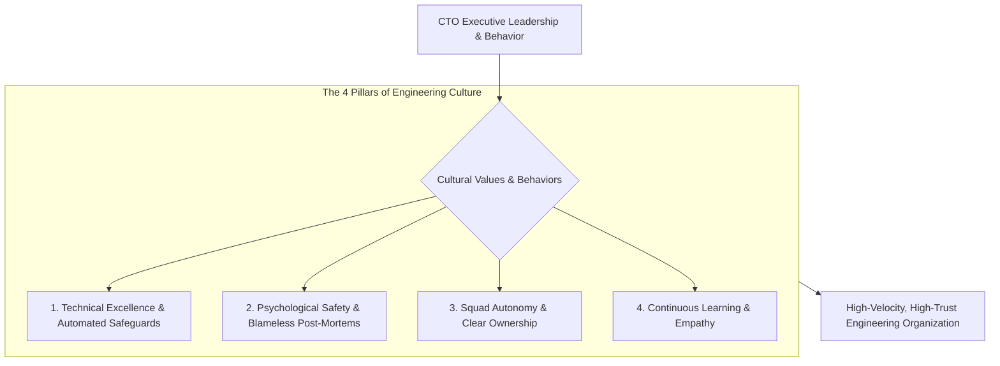

```ppt
# Slide 1: The CTO's Role in Engineering Culture
- **The Executive Responsibility:** Shaping, modeling, and scaling core engineering values, standards, and cultural behaviors.
- **Golden Rule:** Culture is not what you write on posters — culture is what you tolerate and reward every day!
- **Author:** Pankaj Kumar | Associate Architect & Tech Leadership
<!-- slide -->
# Slide 2: The Ship Captain Setting Crew Tone Analogy
- **Negligent Captain (Toxic Culture):** Ignores safety protocols, allows crew members to cut corners on deck, and screams during stormy weather. The crew operates in fear, hides engine leaks, and the ship founders during a storm!
- **Master Captain (Empathetic CTO Leader):** Demonstrates disciplined safety checks, remains calm during high-pressure storms, empowers squad leaders, and praises crew teamwork. The crew operates with pride, high trust, and navigational excellence!
<!-- slide -->
# Slide 3: The 4 Core Pillars of Engineering Culture
- **1. Technical Excellence:** High coding standards, automated testing, and blameless post-mortems.
- **2. Customer Empathy:** Aligning engineering decisions directly with customer value.
- **3. Autonomy & Ownership:** Empowering stream-aligned squads to make architectural choices.
- **4. Continuous Learning:** Reserving time for R&D, hackathons, and technical mentorship.
<!-- slide -->
# Slide 4: How Culture Drives DORA Velocity
- **High Trust = High Speed:** Teams with high psychological safety deploy code 208x more frequently and recover from outages 2,600x faster!
- **Low Trust = Bureaucracy:** Punitive cultures require 5 levels of manual approvals, slowing releases to a crawl.
<!-- slide -->
# Slide 5: Cultural Anti-Patterns to Eliminate
- **Hero Culture:** Rewarding lone-wolf developers who stay up all night fixing self-created emergencies.
- **Blame Culture:** Punishing engineers when production outages occur.
- **Technical Snobbery:** Elitism around specific programming languages or frameworks.
<!-- slide -->
# Slide 6: Scaling Culture Through Hypergrowth
- **Culture Handoff:** Training Engineering Managers to model company values during 1-on-1s.
- **Culture Add in Hiring:** Interviewing for candidates who enrich company culture rather than conform to rigid stereotypes.
<!-- slide -->
# Slide 7: Common Misconception
- **Myth:** "Engineering culture happens organically and doesn't require executive intervention."
- **Fact:** Without intentional CTO leadership, culture defaults to cynicism, technical debt, and burnout!
<!-- slide -->
# Slide 8: Summary for Beginners
- Shape culture intentionally: model psychological safety, reward collaboration over heroism, and align tech standards with customer value!
```

# The CTO Role in Shaping Engineering Values & Culture

What is **Engineering Culture**, and why is it the single most important factor determining whether a software organization succeeds or fails?

Culture is not the ping-pong tables in the breakroom, free snacks, or corporate motivational posters hanging on the office walls.

**Engineering Culture is the collective set of values, behaviors, habits, and standards that developers practice when no one is watching!**

It dictates:
- How engineers react when a production outage occurs (*Blameless post-mortem vs Panic & Blame*).
- How pull requests are reviewed (*Constructive mentorship vs Harsh criticism*).
- How technical debt is addressed (*Proactive maintenance vs Ignoring bad code*).

How does a Chief Technology Officer shape and scale an exceptional engineering culture?

Let's understand Culture Leadership using **The Ship Captain Setting Crew Tone Analogy**!

---

## 🚢 The Ship Captain Setting Crew Tone Analogy

Imagine commanding an ocean-going naval vessel:



- **The Negligent Captain (Toxic Culture):**  
  Ignores safety protocols, tolerates corner-cutting on deck, and screams at sailors during stormy weather. The crew operates in fear, hides engine leaks, and the ship Founders during the first major ocean storm!

- **The Master Captain (Empathetic CTO Leader):**  
  Demonstrates disciplined safety checks, remains calm during high-pressure storms, empowers squad leaders, and praises crew teamwork. The crew operates with pride, deep trust, and navigational excellence!

---

## 📊 Cultural Anti-Patterns vs. High-Performance CTO Culture

| Cultural Dimension | Toxic Anti-Pattern (Avoid) | High-Performance CTO Culture (Adopt) |
| :--- | :--- | :--- |
| **Hero Culture** | Rewarding "lone-wolf" coders who pull 80-hour all-nighters to fix self-created fires | Rewarding squads who build automated CI/CD guardrails that prevent fires altogether |
| **Outage Reaction** | Assigning personal blame & publicly reprimanding developers | Conducting blameless post-mortems focused on fixing root system vulnerabilities |
| **Code Reviews** | Harsh, nitpicky code reviews that demoralize junior engineers | Constructive, empathetic peer code reviews focused on learning & standards |
| **Decision Making** | Top-down micromanagement from executives | Autonomous stream-aligned squads empowered to make local architecture choices |

---

## 💡 Summary for Beginners

- **Engineering Culture** = The shared values, standards, and behaviors that define how an engineering team operates daily.
- **Culture is Modeled** = Culture is defined by what the CTO rewards, tolerates, and practices in high-stakes situations.
- **CTO Golden Rule** = **"Culture is not what you write on posters — model psychological safety, reward collaboration over heroism, and build an environment where engineers thrive!"**

---

*Written by **Pankaj Kumar** | Associate Architect & Tech Leadership.*
