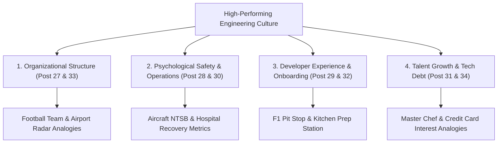

```ppt
# Slide 1: Engineering Culture & Leadership Masterclass
- **The Capstone Goal:** Unifying Team Topologies, Blameless Postmortems, DevEx, DORA Metrics, Dual Career Tracks, and Tech Debt into an executive culture playbook.
- **Series 3 Completion:** Masterclass summary for engineering leaders.
- **Author:** Pankaj Kumar | Associate Architect & Tech Leadership
<!-- slide -->
# Slide 2: The High-Performing Culture Engine
- **Traditional Culture:** Siloed departments, punitive finger-pointing, slow onboarding, and manager-only promotions.
- **Modern High-Performing Culture:** Autonomous team topologies, blameless psychological safety, fast inner loop DevEx, and dual IC/Management tracks!
<!-- slide -->
# Slide 3: Unified Engineering Culture Map
- **1. Team Topologies:** Football Team — Stream-aligned vs Platform teams.
- **2. Blameless Postmortems:** Aircraft NTSB Investigation — 5 Whys root cause analysis.
- **3. DevEx & Inner Loop:** F1 Pit Stop — Removing developer friction & tollbooths.
- **4. DORA Metrics:** Hospital Recovery — Measuring speed & stability outcomes.
<!-- slide -->
# Slide 4: Talent & Governance Execution Map
- **5. Dual Career Ladder:** Master Chef vs Restaurant Manager — IC & Manager parity.
- **6. 30-Day Onboarding:** Kitchen Prep Workstation — Reducing Time-to-First-PR.
- **7. Async-First Remote Work:** Airport Flight Radar — Protecting 4-hour deep work blocks.
- **8. Technical Debt Governance:** Credit Card Interest — 20% refactoring sprint budget.
<!-- slide -->
# Slide 5: The 5 Golden Rules of Engineering Culture
- **Rule 1:** Reduce developer cognitive load using self-service platform tools.
- **Rule 2:** Treat outages as system failures, never human failures.
- **Rule 3:** Measure DORA outcomes (Speed + Stability) over vanity output stats.
- **Rule 4:** Pay master technical ICs equally with engineering managers.
- **Rule 5:** Default to written async RFC documents over live status meetings.
<!-- slide -->
# Slide 6: The Cultural ROI
- **Developer Retention:** Turnover drops by 60% when psychological safety & DevEx are prioritized.
- **Market Velocity:** Lead time for changes drops from months to hours!
<!-- slide -->
# Slide 7: Series 3 Graduation Milestone
- **Congratulations!** You have completed all 8 modules of Series 3: Engineering Culture, Team Topologies & Talent Retention!
- **Outcome:** You now possess a world-class organizational design playbook!
<!-- slide -->
# Slide 8: Summary & Final Executive Checklist
- Transform engineering from an operational cost center into a high-trust, high-velocity innovation engine!
```

# The Engineering Culture & Leadership Masterclass: Summary & Series 3 Capstone Guide

Welcome to the **Master Capstone Summary** of **Series 3: Engineering Culture, Team Topologies & Talent Retention**!

Throughout this series, we explored how high-performing software organizations structure teams, foster psychological safety, remove developer friction, and retain world-class technical talent.

A great engineering culture is not built by offering free snacks or beanbag chairs; it is built by creating **fast flow, psychological safety, and clear growth paths**!

Let's review the complete **Unified Engineering Culture Map**!

---

## 🗺️ Unified Engineering Culture Map



---

## 📚 Masterclass Retrospective: 8 Core Pillars

1. **Team Topologies ([Post 027](https://cto.mycodeyatra.com/?post=post-027)):** Structuring Stream-Aligned, Enabling, Complicated-Subsystem, and Platform teams to minimize cognitive load.
2. **Blameless Postmortems ([Post 028](https://cto.mycodeyatra.com/?post=post-028)):** Analyzing systemic root causes using the 5 Whys instead of blaming individual engineers.
3. **Developer Experience & DevEx ([Post 029](https://cto.mycodeyatra.com/?post=post-029)):** Eliminating administrative tollbooths to maximize inner loop productivity and deep work.
4. **DORA Metrics ([Post 030](https://cto.mycodeyatra.com/?post=post-030)):** Balancing speed (Deployment Frequency, Lead Time) with stability (Change Failure Rate, MTTR).
5. **Dual Career Tracks ([Post 031](https://cto.mycodeyatra.com/?post=post-031)):** Offering equal pay and status for Staff/Principal ICs and Engineering Managers.
6. **30-Day Onboarding ([Post 032](https://cto.mycodeyatra.com/?post=post-032)):** Using automated Cloud Developer Environments (Codespaces) to reduce Time-to-First-PR to 3 days.
7. **Async-First Remote Work ([Post 033](https://cto.mycodeyatra.com/?post=post-033)):** Protecting 4-hour maker's schedule blocks via written RFCs and async updates.
8. **Managing Technical Debt ([Post 034](https://cto.mycodeyatra.com/?post=post-034)):** Allocating 20% of sprint capacity to refactoring high-interest debt into feature velocity.

---

## 🏆 The 5 Golden Rules of Engineering Culture

1. **Protect Developer Cognitive Load:** Empower stream-aligned teams with automated, self-service internal developer portals (IDPs).
2. **Cultivate Psychological Safety:** Never blame a human for a failure that an automated system check should have caught!
3. **Measure Outcomes, Not Output:** Replace lines of code and story points with DORA speed and stability benchmarks.
4. **Elevate Technical Leadership:** Ensure your top technical architects earn as much as directors so you never lose master builders.
5. **Default to Async RFCs:** Write 2-page design proposals before jumping onto synchronous Zoom brainstorming calls.

---

*Written by **Pankaj Kumar** | Associate Architect & Tech Leadership.*
