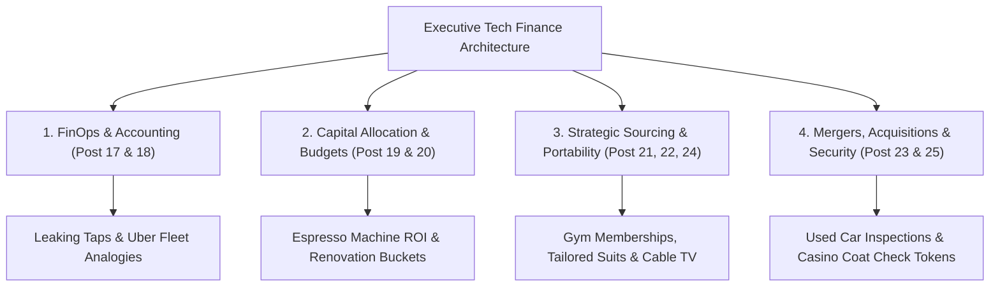

```ppt
# Slide 1: The Executive Finance & Tech Budgeting Masterclass
- **The Capstone Goal:** Unifying Cloud FinOps, CapEx vs OpEx, ROI, SaaS optimization, and M&A due diligence into an executive playbook.
- **Series 2 Completion:** Masterclass summary for CTOs, VPs, and engineering executives.
- **Author:** Pankaj Kumar | Associate Architect & Tech Leadership
<!-- slide -->
# Slide 2: The CFO & CTO Strategic Partnership
- **Old Dynamic:** Engineering presents technical requests; CFO views tech as a black-hole cost center.
- **New Executive Dynamic:** Technology is an automated value driver; CTO presents board-ready financial ROI metrics!
<!-- slide -->
# Slide 3: Unified Executive Tech Finance Map
- **1. Cloud FinOps:** Leaking Hotel Taps — Controlling variable AWS/Azure utility spend.
- **2. CapEx vs OpEx:** Delivery Truck Fleet vs Uber Freight — Server buying vs cloud flexibility.
- **3. Project ROI:** Espresso Machine Automation — Financial returns and payback periods.
- **4. Engineering Budget:** House Renovation — Run, Grow, Protect, and Maintain buckets.
<!-- slide -->
# Slide 4: Strategic Sourcing & Governance Map
- **5. SaaS & Shadow IT:** Gym Memberships & Secret Pantry — Eliminating zombie software seats.
- **6. Build vs Buy:** Tailored Suit vs Off-the-Rack — Building secret moats vs buying utilities.
- **7. M&A Due Diligence:** Used Car Pre-Purchase Inspection — Auditing codebases & GPL viral risk.
- **8. Cloud Negotiation:** Cable TV Package — Containers, open standards, and EDP discounts.
<!-- slide -->
# Slide 5: Payment Architecture Integration
- **9. FinTech Architecture:** Casino Coat Check Ticket — PCI-DSS compliance and card tokenization.
- **Key Insight:** Securing customer financial data while eliminating compliance audit liabilities.
<!-- slide -->
# Slide 6: The 5 Golden Financial Rules for CTOs
- **Rule 1:** Link every engineering dollar to a business revenue metric or risk reduction.
- **Rule 2:** Track Cloud Cost per Active User as a core unit economics metric.
- **Rule 3:** Never build non-core software utilities in-house.
- **Rule 4:** Audit SaaS zombie seats quarterly.
- **Rule 5:** Build on open standards to retain cloud negotiation leverage.
<!-- slide -->
# Slide 7: Series 2 Graduation Milestone
- **Congratulations!** You have completed all 9 modules of Series 2: Finance & Tech Budgeting!
- **Outcome:** You can now speak fluent finance with CFOs, boards of directors, and venture capital investors.
<!-- slide -->
# Slide 8: Summary & Final Executive Checklist
- Transform engineering from an opaque expense department into a predictable, revenue-generating engine!
```

# The Executive Finance & Tech Budgeting Masterclass: Summary & Series 2 Capstone Guide

Welcome to the **Master Capstone Summary** of **Series 2: Finance & Tech Budgeting (Cloud FinOps, ROI, CapEx vs OpEx)**!

Over the course of this series, we bridged the historical gap between technology engineering and corporate finance.

Historically, CTOs and CFOs spoke completely different languages:
- **CTOs spoke in:** *Kubernetes clusters, microservices, code coverage, and API latency.*
- **CFOs spoke in:** *Gross margins, EBITDA, CapEx vs OpEx, and Return on Invested Capital (ROIC).*

By mastering the financial frameworks in Series 2, technology leaders gain a seat at the executive table, securing board approval and driving business valuation!

Let's review the complete **Executive Financial Framework Map**!

---

## 🗺️ Unified Executive Tech Finance Map



---

## 📚 Masterclass Retrospective: 9 Core Concepts

1. **Cloud FinOps ([Post 017](https://cto.mycodeyatra.com/?post=post-017)):** Stopping cloud bill leaks through tagging, reserved instances, and unit economics.
2. **CapEx vs OpEx ([Post 018](https://cto.mycodeyatra.com/?post=post-018)):** Transitioning from buying server hardware to renting utility cloud compute.
3. **Calculating Software ROI ([Post 019](https://cto.mycodeyatra.com/?post=post-019)):** Proving automation value to the CFO using payback period metrics.
4. **Board-Ready Engineering Budgets ([Post 020](https://cto.mycodeyatra.com/?post=post-020)):** Allocating tech spending into Run (40%), Grow (35%), Protect (15%), and Maintain (10%) buckets.
5. **SaaS & Shadow IT ([Post 021](https://cto.mycodeyatra.com/?post=post-021)):** Eliminating zombie software seats and securing unapproved employee apps.
6. **Build vs Buy Framework ([Post 022](https://cto.mycodeyatra.com/?post=post-022)):** Building custom secret sauce while buying commodity SaaS utilities.
7. **M&A Technical Due Diligence ([Post 023](https://cto.mycodeyatra.com/?post=post-023)):** Popping the hood on target codebases to identify GPL viral licenses and tech debt.
8. **Cloud Negotiation & Lock-in ([Post 024](https://cto.mycodeyatra.com/?post=post-024)):** Using Docker containers and open standards to negotiate 25%+ EDP discounts.
9. **FinTech & Payment Systems ([Post 025](https://cto.mycodeyatra.com/?post=post-025)):** Processing card payments via tokenization to achieve zero PCI liability.

---

## 🏆 The 5 Golden Financial Rules for Technology Leaders

1. **Link Every Dollar to Value:** Never request budget for technical tools without specifying the revenue growth or risk reduction metric it produces.
2. **Track Cloud Unit Economics:** Measure `Cloud Cost per Active User` — ensure unit costs decrease as user scale increases!
3. **Never Build Commodity Utilities:** Preserve senior developer time exclusively for code that builds a competitive moat.
4. **Enforce Single Sign-On (SSO):** Automatically revoke SaaS licenses when employees leave HR systems to eliminate zombie seats.
5. **Maintain Cloud Portability:** Build on open-source standards so cloud providers compete for your contract business!

---

*Written by **Pankaj Kumar** | Associate Architect & Tech Leadership.*
