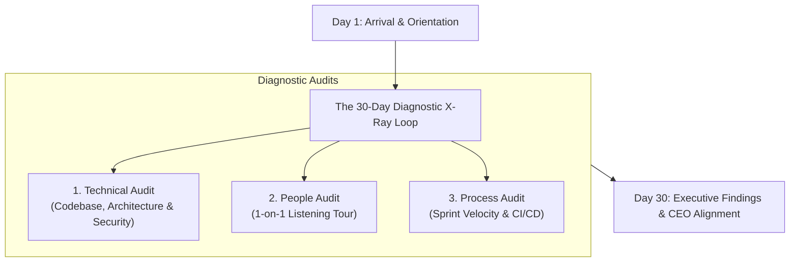

```ppt
# Slide 1: The First 30 Days as CTO
- **The Core Objective:** Auditing legacy codebases, team dynamics, and cloud architecture while establishing trust with the CEO.
- **Golden Rule:** Listen and diagnose before prescribing big architectural changes!
- **Author:** Pankaj Kumar | Associate Architect & Tech Leadership
<!-- slide -->
# Slide 2: The Doctor's Full Body X-Ray Analogy
- **Surgeon's Rule:** A responsible doctor never rushes a patient into open-heart surgery without taking X-rays, blood tests, and MRI scans first.
- **CTO Parallel:** Never rewrite codebases or fire team leads during your first 30 days — audit the system thoroughly before making cuts!
<!-- slide -->
# Slide 3: The 3 Audit Pillars of the First 30 Days
- **1. Technical Audit:** Architecture diagrams, security vulnerabilities, single points of failure, and cloud spending.
- **2. Process Audit:** Sprint velocity, deployment frequency, bug backlog, and deployment friction.
- **3. People Audit:** 1-on-1 interviews with developers, product managers, and executive peers.
<!-- slide -->
# Slide 4: Building CEO & Executive Trust
- **Understand the Business Strategy:** Ask the CEO *"What are the top 3 revenue goals for the next 12 months?"*
- **No Technical Jargon:** Present findings in risk & business impact language rather than framework debates.
- **Identify Quick Wins:** Fix small user-facing bugs to build early credibility.
<!-- slide -->
# Slide 5: The Technical Assessment Matrix
- **Critical Risks:** Unpatched security flaws, missing database backups, single engineer dependencies.
- **Tech Debt Hotspots:** Legacy monolith code slowing down feature delivery.
- **FinOps Audit:** Identifying unused AWS EC2 instances and idle staging databases.
<!-- slide -->
# Slide 6: 1-on-1 Listening Tour Questions
- Ask engineers: *"If you had a magic wand, what 1 thing would you fix in our codebase today?"*
- Ask product leads: *"Where is engineering slowest at delivering value?"*
<!-- slide -->
# Slide 7: Common Beginner Misconception
- **Myth:** "A new CTO should immediately announce a complete microservices rewrite on Day 1."
- **Fact:** Premature rewrites bankrupt companies; 90% of early CTO rewrites fail!
<!-- slide -->
# Slide 8: Summary for Beginners
- Listen deeply, run diagnostic X-rays, identify quick wins, and win executive trust before proposing major changes!
```

# The First 30 Days as CTO: Auditing Systems & Winning CEO Trust

Stepping into a new **Chief Technology Officer (CTO)** role is both thrilling and intimidating.

On your first day, developers will dump a list of technical debt complaints, product managers will demand faster feature releases, and the CEO will ask: *"How soon can we scale our technology to support 10x user growth?"*

The biggest mistake a first-time CTO can make is **rushing in on Day 1 to rewrite the entire codebase or change all engineering tools!**

Let's understand how to navigate your first month using **The Doctor's Full Body X-Ray Analogy**!

---

## 🩺 The Doctor's Full Body X-Ray Analogy

Imagine a patient walking into a clinic with chest pain:



- **The Amateur Surgeon:**  
  Rushes the patient onto the operating table and immediately starts cutting with a scalpel without asking questions or checking medical history. The patient bleeds out!

- **The Master Physician (The Executive CTO):**  
  Takes blood samples, reviews X-rays, orders an MRI, and listens carefully to the patient's symptoms. Only after understanding the full diagnosis do they prescribe a targeted treatment plan!

---

## 📋 The First 30 Days Audit Checklist

| Audit Category | What to Inspect | Key Output / Artifact |
| :--- | :--- | :--- |
| **Technical & Architecture** | Single points of failure, cloud bills, database backups, security patches | System Health Risk Map |
| **People & Team** | Team morale, 1-on-1 feedback, key-person dependencies | Talent & Skills Matrix |
| **Process & Delivery** | Time-to-first-PR, deployment frequency, bug resolution rate | DevEx Bottleneck Report |
| **Executive Alignment** | CEO business priorities, CFO budget constraints, CPO roadmap | Strategic Alignment Matrix |

---

## 💡 Summary for Beginners

- **First 30 Days Focus** = Listen 80% of the time, audit systems deeply, and build trust across the executive team.
- **Quick Wins** = Fix small, annoying developer friction points early to boost morale.
- **CTO Golden Rule** = **"Diagnose before you prescribe — never announce a major system rewrite until you fully understand why the legacy system was built that way!"**

---

*Written by **Pankaj Kumar** | Associate Architect & Tech Leadership.*
