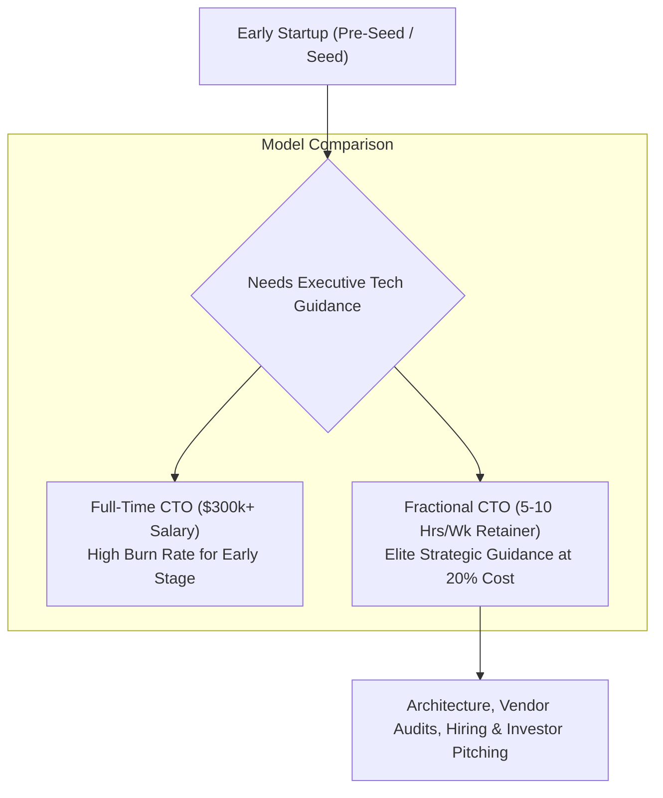

```ppt
# Slide 1: The Fractional CTO Model
- **The Core Question:** How can early-stage startups get executive technology leadership without paying a $300,000+ full-time salary?
- **Key Solution:** Renting a Fractional CTO for 5 to 10 hours a week to guide software architecture and executive strategy.
- **Author:** Pankaj Kumar | Associate Architect & Tech Leadership
<!-- slide -->
# Slide 2: The Master Architect Consultant Analogy
- **Building a House:** If you are building a single-family house, you don't hire a world-famous master architect full-time for 12 months to sit on the construction site every day.
- **Fractional Parallel:** You pay the master architect for 5 hours to draw structural blueprints, review foundation engineering, and advise contractors — saving 80% on costs while gaining elite expertise!
<!-- slide -->
# Slide 3: What is a Fractional CTO?
- **Definition:** An experienced executive CTO who works with multiple startups on a part-time retainer basis (e.g. 5-15 hours/week).
- **Core Value:** Providing strategic direction, technical auditing, cloud FinOps, and hiring advice at a fraction of full-time cost.
<!-- slide -->
# Slide 4: When Startups Should Hire a Fractional CTO
- **1. Pre-Seed / Seed Stage:** Need architectural validation before pitching investors or spending $100k on dev agencies.
- **2. Agency Oversight:** Managing third-party software development agencies to ensure code quality.
- **3. Technical Audits:** Preparing for investor due diligence or SOC2 security compliance.
- **4. Interim Transition:** Filling the gap between departing and new permanent CTOs.
<!-- slide -->
# Slide 5: Fractional CTO vs Full-Time CTO vs Tech Lead
- **Tech Lead:** Writes code daily, owns sprint backlog, manages day-to-day bugs.
- **Fractional CTO:** High-level tech vision, cloud architecture, vendor negotiations, executive strategy (Part-Time).
- **Full-Time CTO:** 100% dedicated executive managing 20+ internal developers and long-term scaling.
<!-- slide -->
# Slide 6: How to Transition to a Full-Time CTO
- **Trigger 1:** Engineering team grows past 8-10 internal full-time developers.
- **Trigger 2:** Series A/B funding secured with dedicated executive headcount budget.
- **Handoff:** Fractional CTO helps recruit, interview, and onboard their permanent full-time successor!
<!-- slide -->
# Slide 7: Common Misconception
- **Myth:** "A Fractional CTO will write all our code and build our MVP."
- **Fact:** Fractional CTOs deliver strategic architecture and oversight; developers or agencies write the code!
<!-- slide -->
# Slide 8: Summary for Beginners
- Access elite C-suite technology guidance on a flexible retainer to scale your startup smartly before hiring full-time!
```

# The Fractional CTO Model: When Startups Should Rent a CTO

For early-stage startups and small businesses, executive technology leadership is essential. 

However, hiring a seasoned full-time **Chief Technology Officer (CTO)** can easily cost $250,000 to $400,000 per year in salary, plus equity. For a Seed-stage company with limited runway, that single executive salary can burn through capital in months!

To solve this dilemma, modern startups turn to **The Fractional CTO Model**.

Let's demystify Fractional CTOs using **The Master Architect Consultant Analogy**!

---

## 🏛️ The Master Architect Consultant Analogy

Imagine building a custom luxury house:



- **The Expensive Mistake:**  
  Hiring a world-famous master architect to sit full-time in a folding chair on the dirt construction site 40 hours a week just to watch bricklayers work. You pay $2,000 a day for idle time!

- **The Fractional Solution:**  
  Hiring the master architect for **5 hours a month** to draw structural blueprints, review foundation safety, inspect plumbing plans, and advise the builder. You get elite, world-class expertise at 20% of the cost!

---

## 📊 Fractional CTO vs. Full-Time CTO vs. Technical Agency

| Dimension | Fractional CTO | Full-Time Executive CTO | Software Dev Agency |
| :--- | :--- | :--- | :--- |
| **Primary Role** | Strategic Guidance & Architecture | Full-time C-Suite Leadership | Code Execution & Feature Building |
| **Weekly Time** | 5 to 15 hours / week | 40+ hours / week | Fixed project hours |
| **Cost Model** | Flexible monthly retainer ($3k–$8k/mo) | High base salary ($250k+) + Equity | Hourly rates ($50–$150/hr) |
| **Best For** | Pre-Seed to Seed Stage (0-10 devs) | Series A+ Growth Stage (10+ devs) | Building the initial MVP prototype |

---

## 💡 Summary for Beginners

- **Fractional CTO** = A part-time executive technology leader guiding architecture, hiring, and strategy on a flexible retainer.
- **Key Value** = Avoids expensive architectural blunders early without blowing startup runway on a full-time salary.
- **CTO Golden Rule** = **"Rent executive technology wisdom early to build solid architecture, then hire a full-time CTO once your team scales past 10 internal developers!"**

---

*Written by **Pankaj Kumar** | Associate Architect & Tech Leadership.*
