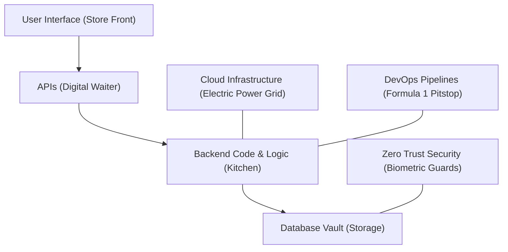

```ppt
# Slide 1: Series 1 Master Capstone
- **Series Goal:** Demystifying technical leadership jargon for absolute beginners.
- **The Core Lesson:** Technology is not magic; it is an organized ecosystem of structural trade-offs!
- **Author:** Pankaj Kumar | Associate Architect & Tech Leadership
<!-- slide -->
# Slide 2: The Executive Architecture Map
- **Frontend (Store Front):** Where customers interact (Web & Mobile Apps).
- **Backend (Kitchen):** Where business logic, code, and servers run.
- **Database (Vault):** Where customer records and financial ledgers live.
- **APIs (Messengers):** Connecting external services (Payments, Maps, AI).
<!-- slide -->
# Slide 3: The 5 Core CTO Principles
- **1. Align Tech with Revenue:** Never build cool tech for the sake of tech.
- **2. Manage Tech Debt:** Pay down 20% interest before code becomes brittle.
- **3. Embrace DevOps:** Automate pipelines for fast, safe deployments.
- **4. Practice Zero Trust Security:** Never trust, always verify at every layer.
- **5. Leverage AI Responsibly:** Combine LLM speed with RAG data accuracy.
<!-- slide -->
# Slide 4: Real-World Business Scenario
- **The Challenge:** Building a global AI-powered e-commerce platform.
- **The Solution:** Combining Cloud (AWS), Microservices, APIs (Stripe), and Open-Source AI (Llama 3).
<!-- slide -->
# Slide 5: Key Takeaways for Aspiring Leaders
- You don't need a Computer Science PhD to lead technology organizations!
- Focus on clarity, everyday analogies, architectural blueprints, and empowering your team.
<!-- slide -->
# Slide 6: What's Next in the CTO Series?
- **Series 2:** Finance & Tech Budgeting (Cloud FinOps, ROI, CapEx vs OpEx).
- **Series 3:** HR, Hiring & Engineering Culture.
- **Series 4:** Operations, Site Reliability & Disaster Recovery.
<!-- slide -->
# Slide 7: Graduation Checklist
- Demystified 15 core tech terms: CTO, VP Eng, Architecture, Code, APIs, Cloud, SaaS, DevOps, Monolith, Microservices, Tech Debt, Open Source, Cybersecurity, AI, LLMs.
<!-- slide -->
# Slide 8: Final Executive Summary
- Congratulations on completing Series 1! You are now equipped with executive tech fluency!
```

# The Modern Executive Tech Stack: Summary & Capstone Guide for Non-Tech Leaders

Congratulations! By completing **Series 1: CTO Fundamentals & Tech Jargon Buster**, you have journeyed through 15 foundational topics in executive technology leadership.

Whether you started as an aspiring CTO, a non-technical founder, or a senior business leader, you now possess the vocabulary and conceptual mental models to navigate technical boardrooms with confidence.

Let's review the **Master Executive Tech Architecture Map** and summarize our key takeaways!

---

## 🗺️ The Master Executive Tech Architecture Map

Every digital application on Earth — from Amazon to Uber and ChatGPT — connects five fundamental layers:



1. **User Interface (Frontend):** The store front windows, buttons, and mobile app screens designed for customer delight. *(Post 004)*
2. **APIs (The Waiter):** The polite digital messengers connecting your app to payment gateways (Stripe), maps (Google Maps), and AI models (OpenAI). *(Post 006)*
3. **Backend Code & Logic (The Kitchen):** The precise line-by-line instructions written in Python, Java, or JavaScript executed by CPU chips. *(Post 005)*
4. **Database (The Vault):** Encrypted digital vaults storing user passwords, order histories, and financial records. *(Post 013)*
5. **Cloud & DevOps Infrastructure:** Utility server power (AWS/GCP) running automated deployment pipelines. *(Posts 007 & 009)*

---

## 🎓 The 5 Golden Rules for Tech Leaders

- **Rule 1: Business Revenue First.** Technology is a revenue multiplier. A CTO's job is not to build complex systems, but to build simple systems that drive business goals.
- **Rule 2: Control Technical Debt.** Take intentional debt to launch fast, but pay down the 20% interest regularly so your engineering team maintains high velocity. *(Post 011)*
- **Rule 3: Default to Zero Trust Security.** Assume hackers are already inside the network. Implement Multi-Factor Authentication (MFA) and least privilege access. *(Post 013)*
- **Rule 4: Start Simple (Monolith Before Microservices).** Build a monolithic foundation for speed, and split into microservices only when team scale demands it. *(Post 010)*
- **Rule 5: Augment Humans with AI.** Use Large Language Models (LLMs) as 24/7 interns to draft code and automate support, while using human architectural oversight for accuracy. *(Posts 014 & 015)*

---

## 🚀 What's Ahead in the Upcoming Series?

Now that you have mastered **CTO Fundamentals**, our masterclass series will dive into dedicated Business Department Playbooks:

- 📊 **Series 2:** *Finance & Tech Budgeting (Cloud FinOps, CapEx vs OpEx, ROI)*
- 👥 **Series 3:** *HR, Tech Hiring & Engineering Culture*
- ⚙️ **Series 4:** *Operations, Site Reliability & Disaster Recovery*
- 📈 **Series 5:** *Sales & Marketing Technology (MarTech, CRM, Funnel Automation)*
- ⚖️ **Series 6:** *Legal, IP Protection, Compliance & AI Governance*

Thank you for following along with Series 1!

---

*Written by **Pankaj Kumar** | Associate Architect & Tech Leadership.*
