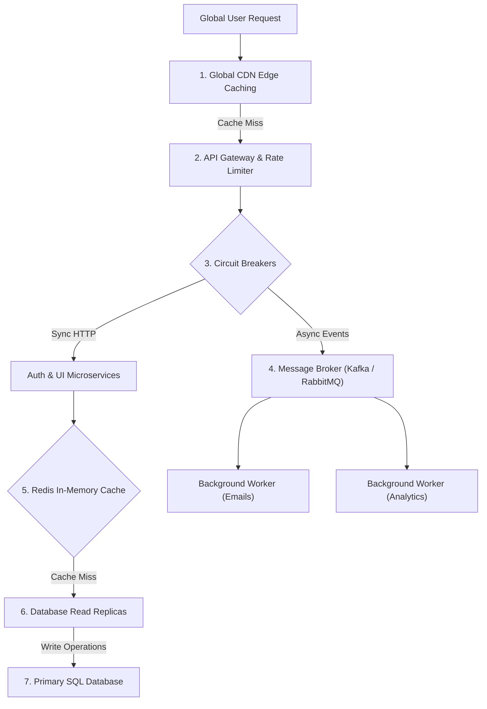

```ppt
# Slide 1: System Architecture & Disaster Recovery Summary
- **The Series 4 Capstone:** Unifying Monolith Evolution, High Availability, Disaster Recovery, Load Balancing, Database Scaling, EDA, and API Resiliency.
- **Series Goal:** Equipping technology leaders to design software systems that never crash and scale seamlessly to millions of users.
- **Author:** Pankaj Kumar | Associate Architect & Tech Leadership
<!-- slide -->
# Slide 2: Architectural Evolution (Monolith ➔ Microservices ➔ Serverless)
- **Monolith (Department Store):** Simple to build initially; risk of single point of failure.
- **Microservices (Specialty Shops):** Decoupled independence; high operational complexity.
- **Serverless (Food Truck Fleet):** Zero infrastructure management; pay purely per execution millisecond!
<!-- slide -->
# Slide 3: High Availability (SLA / SLO / SLI)
- **The Cost of Nines:** 99.9% uptime (8.7 hours downtime/year) vs 99.999% uptime (5 minutes downtime/year).
- **Hospital Backup Generator Analogy:** Automated failover from primary power grids to secondary emergency generators in < 10 seconds!
<!-- slide -->
# Slide 4: Disaster Recovery (RTO & RPO Targets)
- **RPO (Recovery Point Objective):** Maximum tolerable data loss (Nightly backups = 24 hours lost; Continuous replication = 0 data lost).
- **RTO (Recovery Time Objective):** Maximum tolerable downtime to restore normal operations.
- **The 3-2-1 Rule:** 3 copies of data, 2 media types, 1 off-site cloud region!
<!-- slide -->
# Slide 5: Traffic Management & Global Load Balancing
- **Content Delivery Networks (CDNs):** Serving 90% of static images and media from 300+ edge nodes near users.
- **Layer 4 Load Balancers:** Ultra-fast IP/Port packet forwarding.
- **Layer 7 Load Balancers:** Smart HTTP routing based on URLs, cookies, and headers.
<!-- slide -->
# Slide 6: Database Scaling & Resilience
- **Step 1:** In-Memory Caching (Redis) offloads 90% of database reads.
- **Step 2:** Read Replicas scale read-heavy traffic (`SELECT` queries).
- **Step 3:** Horizontal Sharding partitions tables across physical servers for hyper-scale writes.
<!-- slide -->
# Slide 7: Event-Driven Architecture & API Protection
- **Request-Response (REST/gRPC):** Synchronous blocking for immediate UI user queries.
- **Event-Driven Queues (Kafka/RabbitMQ):** Asynchronous non-blocking background processing.
- **API Gateways & Circuit Breakers:** Protecting microservices from DDoS attacks and cascading outages.
<!-- slide -->
# Slide 8: The CTO Architectural Commandments
- 1. Build monoliths first, microservices second.
- 2. Test DR plans with Chaos Engineering drills.
- 3. Cache first, replicate second, shard last.
- 4. Never expose internal APIs without an API Gateway and Circuit Breaker!
```

# The System Architecture, High Availability & Disaster Recovery Masterclass Summary

Welcome to the **Master Capstone Guide** for **Series 4: System Architecture, High Availability & Disaster Recovery**!

Throughout Series 4, we explored how modern tech giants build resilient, high-performance systems capable of serving millions of concurrent users without breaking down.

Let's review the complete architectural framework in one unified executive playbook!

---

## 🏛️ The Complete System Architecture Map



---

## 📚 Summary of Core Architecture Pillars

### 1. Monolith vs. Microservices vs. Serverless (`post-036`)
- **Monolith:** Great for early startups; low operational overhead.
- **Microservices:** Necessary for large engineering teams requiring independent deployments.
- **Serverless:** Event-driven functions executing on-demand with zero server maintenance.

### 2. High Availability & SLAs (`post-037`)
- **SLI:** Actual measured uptime metrics.
- **SLO:** Internal team performance target (e.g. 99.9% uptime).
- **SLA:** Contractual financial commitment to customers.

### 3. Disaster Recovery & Business Continuity (`post-038`)
- **RTO (Recovery Time Objective):** Maximum tolerable downtime.
- **RPO (Recovery Point Objective):** Maximum tolerable data loss.
- **3-2-1 Backup Rule:** 3 copies of data, 2 different storage media, 1 off-site cloud region.

### 4. Load Balancing & Traffic Management (`post-039`)
- **L4 Load Balancer:** High-speed packet routing operating at Transport Layer (IP/Port).
- **L7 Load Balancer:** Smart application routing operating at HTTP Layer (URLs/Cookies).
- **CDN:** Edge caching offloading static media traffic close to users globally.

### 5. Database Scaling Strategies (`post-040`)
- **Caching Layer (Redis):** Offloads 90% of reads into RAM memory.
- **Read Replicas:** Multiple read-only databases handling query traffic.
- **Horizontal Sharding:** Partitioning data across multiple physical database nodes.

### 6. Event-Driven Architecture (`post-041`)
- **REST APIs:** Synchronous blocking communication for live UI queries.
- **Message Queues (Kafka / RabbitMQ):** Asynchronous non-blocking events for background processing.

### 7. API Gateway & Resiliency (`post-042`)
- **API Gateway:** Central security bouncer validating tokens and rate-limiting bots.
- **Circuit Breaker:** Automated electrical fuse preventing cascading microservice failures.

---

## 🏆 The CTO Architectural Commandments

1. **Start Simple:** Build a modular monolith before jumping into microservices.
2. **Design for Failure:** Assume every server, database, and cloud region will eventually fail!
3. **Test DR Plans:** A disaster recovery plan that has never been tested in Chaos Drills is just a wish list.
4. **Cache First:** Always cache in Redis before scaling databases or sharding tables.
5. **Decouple Heavy Work:** Never block HTTP requests for long-running background tasks — use Event Queues!

---

*Written by **Pankaj Kumar** | Associate Architect & Tech Leadership.*
