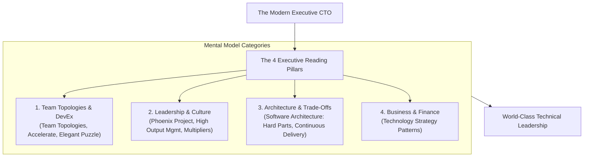

```ppt
# Slide 1: The Ultimate CTO Reading List
- **The Core Objective:** Expanding executive intelligence through the 10 fundamental books every software technology leader must master.
- **Key Insight:** Technical brilliance gets you promoted to CTO, but continuous learning keeps you thriving in the C-suite!
- **Author:** Pankaj Kumar | Associate Architect & Tech Leadership
<!-- slide -->
# Slide 2: The Master Playbook Collection Analogy
- **Grandmaster Chess Library:** A world-class chess grandmaster doesn't invent every move from scratch during a tournament; they study classic games and strategies played by historical champions.
- **CTO Parallel:** Reading foundational executive books equips you with proven mental models for team structure, technical debt, and boardroom strategy!
<!-- slide -->
# Slide 3: Category 1 — Team Structure & Organization
- **1. Team Topologies (Matthew Skelton & Manuel Pais):** Structuring engineering squads for fast flow and low cognitive load.
- **2. An Elegant Puzzle (Will Larson):** Systems and frameworks for scaling engineering organizations.
- **3. Accelerate (Nicole Forsgren, Jez Humble, Gene Kim):** The science behind DevOps and DORA metrics.
<!-- slide -->
# Slide 4: Category 2 — Leadership & Culture
- **4. The Phoenix Project (Gene Kim, Kevin Behr, George Spafford):** A business novel explaining DevOps, IT bottlenecks, and flow.
- **5. High Output Management (Andrew Grove):** Former Intel CEO's classic masterclass on executive leverage and 1-on-1s.
- **6. Multipliers (Liz Wiseman):** How top leaders make everyone around them smarter.
<!-- slide -->
# Slide 5: Category 3 — Architecture & Strategy
- **7. Software Architecture: The Hard Parts (Neal Ford et al.):** Making difficult trade-offs in distributed systems.
- **8. Continuous Delivery (Jez Humble & David Farley):** Reliable software releases through automated pipelines.
- **9. Modern Software Engineering (Dave Farley):** Core principles for building quality software predictably.
<!-- slide -->
# Slide 6: Category 4 — Finance & Business Strategy
- **10. Technology Strategy Patterns (Eben Hewitt):** Translating technical decisions into boardroom executive plans.
<!-- slide -->
# Slide 7: Common Misconception
- **Myth:** "CTOs only need to read technical manuals and programming documentation."
- **Fact:** Great CTOs spend 50% of their reading time on psychology, management, finance, and organizational design!
<!-- slide -->
# Slide 8: Summary for Beginners
- Build your executive mental library: Master team topologies, DevOps metrics, management leverage, and financial strategy!
```

# The Ultimate CTO Reading List: 10 Books Every Leader Must Read

In software engineering, technical knowledge changes fast. Frameworks, cloud services, and AI models evolve every few months.

However, **the core principles of technology leadership, human psychology, organizational design, and strategic trade-offs remain constant!**

When an engineer is promoted to Chief Technology Officer, they quickly discover that coding skills only cover 20% of their executive responsibilities. To master the remaining 80% — team topologies, boardroom negotiations, cloud FinOps, and culture — you must build a strong executive mental library.

Let's explore the 10 must-read books using **The Grandmaster Chess Library Analogy**!

---

## ♟️ The Grandmaster Chess Library Analogy

Imagine preparing for an international chess championship:



- **The Amateur Player:**  
  Tries to invent every opening move and defensive tactic from scratch during a high-stakes match, quickly falling into predictable traps.

- **The Grandmaster (The Executive CTO):**  
  Studies historical playbooks, tactical endgame maneuvers, and proven strategic patterns written by master grandmasters. When a crisis occurs, they recognize the exact pattern instantly and execute with confidence!

---

## 📚 The 10 Essential Books for Technology Leaders

| # | Book Title | Authors | Core Executive Takeaway |
| :--- | :--- | :--- | :--- |
| **1** | **Team Topologies** | Matthew Skelton & Manuel Pais | Structuring stream-aligned vs enabling squads to reduce cognitive load. |
| **2** | **The Phoenix Project** | Gene Kim et al. | IT operational flow, bottleneck identification, and DevOps transformation. |
| **3** | **Accelerate** | Nicole Forsgren et al. | The empirical science behind DORA metrics and high-performing tech teams. |
| **4** | **High Output Management** | Andrew Grove (Ex-Intel CEO) | Executive leverage, effective 1-on-1s, and operational productivity. |
| **5** | **An Elegant Puzzle** | Will Larson | Systems and organizational design for scaling engineering teams. |
| **6** | **Multipliers** | Liz Wiseman | How great leaders amplify team intelligence rather than suppressing it. |
| **7** | **Software Architecture: The Hard Parts** | Neal Ford et al. | Navigating complex trade-offs in distributed microservice systems. |
| **8** | **Continuous Delivery** | Jez Humble & David Farley | Building automated deployment pipelines for zero-downtime releases. |
| **9** | **Modern Software Engineering** | Dave Farley | Essential principles for managing complexity and iterative feedback loops. |
| **10** | **Technology Strategy Patterns** | Eben Hewitt | Structuring board-ready technology roadmaps and financial proposals. |

---

## 💡 Summary for Beginners

- **Continuous Learning** = Reading executive playbooks builds a mental repository for high-stakes decision making.
- **Balanced Reading** = Combine technical architecture books with human psychology, finance, and team design.
- **CTO Golden Rule** = **"Read 15 minutes a day to build mental models — great CTOs are shaped by the strategic playbooks they study!"**

---

*Written by **Pankaj Kumar** | Associate Architect & Tech Leadership.*
