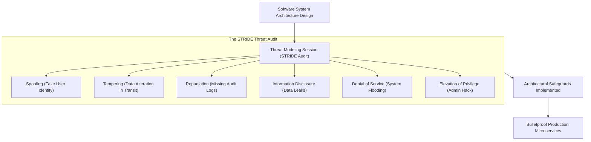
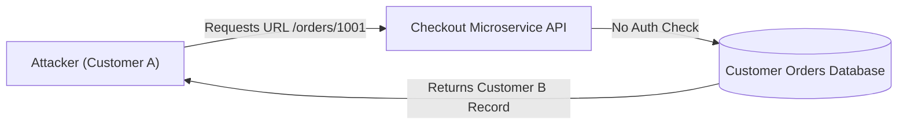

```ppt
# Slide 1: Threat Modeling in Software Engineering
- **The Core Security Practice:** Identifying, analyzing, and mitigating security threats during the architectural design phase before writing code.
- **Golden Rule:** Fixing architectural flaws during threat modeling costs $100; fixing them after a data breach costs $1 Million!
- **Author:** Pankaj Kumar | Associate Architect & Tech Leadership
<!-- slide -->
# Slide 2: The Friendly Home Security Auditor Analogy


- **Careless Homeowner (No Threat Modeling):** Builds a luxury mansion, puts expensive jewelry inside, and locks the front door. But leaves a basement window unlocked and a spare key hidden under the doormat! A burglar breaks in effortlessly.
- **Master Home Security Auditor (CTO Threat Modeling):** Hires a security specialist (*Friendly Auditor*) to walk around the perimeter, test every window latch, inspect the garage roof, and install motion sensors *before* moving valuable artwork inside!
<!-- slide -->
# Slide 3: The STRIDE Threat Modeling Framework
- **S - Spoofing:** Pretending to be someone else (*Fake Identity*).
- **T - Tampering:** Modifying data in transit or database storage (*Data Alteration*).
- **R - Repudiation:** Denying an action took place (*Lack of Audit Logging*).
- **I - Information Disclosure:** Exposing sensitive customer data (*Data Leaks*).
- **D - Denial of Service (DoS):** Flooding system resources to cause an outage.
- **E - Elevation of Privilege:** Gaining unauthorized admin permissions.
<!-- slide -->
# Slide 4: Real-World Case Study: Rajesh's E-Commerce Payment API
- **The Architectural Flaw:** An e-commerce startup launched a checkout API where `orderId` was a sequential integer (e.g. `api.com/orders/1001`).
- **The Vulnerability (Broken Object Level Authorization):** A customer changed the URL to `/orders/1000` and viewed another customer's full credit card details!
- **Threat Modeling Fix:** Caught early using STRIDE to enforce UUIDs and strict user authorization checks.
<!-- slide -->
# Slide 5: The 4 Steps of Threat Modeling
- **Step 1 (Deconstruct):** Draw a Data Flow Diagram (DFD) showing user inputs, APIs, and databases.
- **Step 2 (Identify Threats):** Apply STRIDE to every data boundary and trust boundary.
- **Step 3 (Mitigate):** Design architectural safeguards (Encryption, Input Validation, OAuth2).
- **Step 4 (Validate):** Audit architectural mitigations during pull request code reviews.
<!-- slide -->
# Slide 6: Integrating Threat Modeling into Sprints
- **Shift-Left Security:** Conducting 30-minute threat modeling sessions during sprint backlog refinement.
- **Developer Ownership:** Engineering leads facilitate threat modeling alongside security architects.
<!-- slide -->
# Slide 7: Common Misconception
- **Myth:** "Threat modeling requires 50-page security documents and slows down feature delivery."
- **Fact:** Lightweight 30-minute threat modeling sessions prevent months of emergency bug fixes and breach triage!
<!-- slide -->
# Slide 8: Summary for Beginners
- Practice threat modeling early: apply STRIDE during design, audit trust boundaries, and fix security flaws before writing code!
```

# Threat Modeling: Auditing System Vulnerabilities Early

Why do so many software applications suffer from critical security flaws, even when developers write clean code and run automated unit tests?

The problem is that **unit tests check if software works as intended — they do NOT check how an attacker can abuse the software!**

If software architects don't analyze how a system can be exploited during the design phase, security vulnerabilities get baked into the core architecture.

Fixing a security vulnerability in production after a breach costs 100x more than catching it on a whiteboard.

To build secure software, **CTOs mandate Threat Modeling before writing code!**

Let's understand Threat Modeling using **The Friendly Home Security Auditor Analogy**!

---

## 🏡 The Friendly Home Security Auditor Analogy


Imagine protecting a new luxury home before moving in:



- **The Careless Homeowner (No Threat Modeling):**  
  Builds a beautiful home, locks the front door, and moves in. But leaves a basement window unlocked and a spare key under the doormat! A burglar enters through the basement and steals everything.

- **The Master Security Auditor (CTO Threat Modeling):**  
  Hires a friendly security auditor to walk around the house perimeter *before* moving in. The auditor tests every window latch (**Tampering Check**), checks if the front door lock can be picked (**Spoofing Check**), and installs motion sensors (**Audit Logging**)!

---

## 📊 Real-World Case Study: Rajesh's E-Commerce Checkout API

Consider an e-commerce startup led by an engineering manager named **Rajesh Sharma**.



1. **The Architectural Mistake:** Rajesh's team built an order status API using sequential numbers in the URL: `https://api.store.com/orders/1001`.
2. **The Vulnerability (Broken Object Level Authorization - BOLA):** An attacker logged into their own account (`Order #1001`), changed the URL in their browser to `Order #1000`, and instantly viewed another customer's home address and payment details!
3. **How Threat Modeling Saved the System:** During a 30-minute STRIDE threat modeling session, a senior engineer asked: *"What happens if a user tampered with the URL parameter?"* The team caught the vulnerability on a whiteboard, replaced sequential IDs with random UUIDs (`/orders/550e8400-e29b-41d4`), and enforced strict user authorization checks before shipping to production!

---

## 📊 The STRIDE Threat Modeling Reference Matrix

| STRIDE Threat | What It Means | Real-World Attack Scenario | Technical Safeguard / Fix |
| :--- | :--- | :--- | :--- |
| **Spoofing** | Pretending to be another user/system | Attacker steals session token to impersonate admin | Multi-Factor Auth (MFA) & TLS Certificate Binding |
| **Tampering** | Modifying data in transit or storage | Man-in-the-middle altering payment amount from $100 to $1 | TLS 1.3 Encryption & HMAC API Signature Verification |
| **Repudiation** | Denying an action took place | Malicious insider deleting database records & denying it | Immutable Centralized Audit Logging (AWS CloudTrail) |
| **Information Disclosure** | Exposing private customer data | API returning raw database records containing passwords | Data masking, API response filtering & AES-256 encryption |
| **Denial of Service** | Flooding system to crash servers | Botnet firing 100,000 requests/sec at login endpoint | Cloudflare WAF Rate Limiting & Auto-scaling |
| **Elevation of Privilege** | Gaining unauthorized admin access | Normal user manipulating JWT claims to become super-admin | Strict Role-Based Access Control (RBAC) validation |

---

## 💡 Summary for Beginners

- **Threat Modeling** = A structured engineering practice for identifying and mitigating security vulnerabilities during system design.
- **STRIDE** = A popular threat modeling framework analyzing Spoofing, Tampering, Repudiation, Information Disclosure, Denial of Service, and Elevation of Privilege.
- **CTO Golden Rule** = **"Shift security left — conduct a 30-minute STRIDE threat modeling session during sprint design to catch vulnerabilities before writing a single line of code!"**

---

*Written by **Pankaj Kumar** | Associate Architect & Tech Leadership.*
