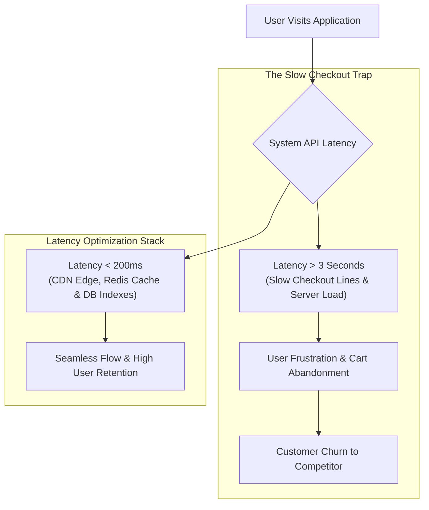

```ppt
# Slide 1: User Retention Tech & Latency Optimization
- **The Revenue Impact:** How API latency directly causes customer churn and abandoned user sessions.
- **Core Realization:** Speed is not just a technical metric — speed is a primary customer retention feature!
- **Author:** Pankaj Kumar | Associate Architect & Tech Leadership
<!-- slide -->
# Slide 2: The Department Store Checkout Line Analogy
- **Slow Checkout Bottleneck:** A shopper fills their shopping cart with items, but arrives at the checkout counter to find a 45-minute slow line. Frustrated, they abandon their full cart on the floor and walk out to buy from a competitor across the street!
- **Digital Latency Parallel:** If an app page or API takes more than 2 seconds to load, users abandon the session, un-install the app, and cancel subscriptions!
<!-- slide -->
# Slide 3: The Cost of Latency on Customer Churn
- **100ms Latency Impact:** Amazon proved that every 100ms of latency reduction increased revenue by 1%.
- **Mobile Churn Spike:** 53% of mobile users abandon a site if it takes longer than 3 seconds to load.
- **Cognitive Friction:** Slow user interfaces break user flow and destroy brand trust.
<!-- slide -->
# Slide 4: Architectural Strategies to Reduce Latency
- **1. CDN & Edge Caching:** Serving static assets and API responses from edge locations (Cloudflare / Fastly) close to the user.
- **2. Database Query Optimization:** Adding composite indexes, eliminating N+1 queries, and using read-replicas.
- **3. In-Memory Caching:** Caching hot data in Redis / Memcached to reduce database load.
- **4. Asynchronous Processing:** Moving heavy tasks (email notifications, PDF reports) to background queues (RabbitMQ / BullMQ).
<!-- slide -->
# Slide 5: Measuring Latency (Percentiles vs Averages)
- **Average Latency (Misleading):** An average load time of 500ms hides the fact that 10% of users wait 8 seconds!
- **P95 / P99 Latency (True Metric):** Measuring the experience of the slowest 5% and 1% of user sessions.
<!-- slide -->
# Slide 6: Continuous Latency Monitoring
- **Real User Monitoring (RUM):** Capturing actual user load times across different devices and geographies.
- **Automated Performance Budgets:** CI/CD builds fail if a pull request increases JavaScript bundle size by > 50KB or API latency by > 20ms.
<!-- slide -->
# Slide 7: Common Misconception
- **Myth:** "Users churn primarily because our app lacks new features."
- **Fact:** Over 60% of user churn is caused by poor performance, slow load times, and frequent bugs in existing features!
<!-- slide -->
# Slide 8: Summary for Beginners
- Treat speed as a core feature: optimize database queries, implement Redis caching, edge CDNs, and track P99 latency!
```

# User Retention Tech: Reducing Latency to Fix Customer Churn

Why do SaaS companies and e-commerce platforms lose customers even after spending millions of dollars on marketing and new feature development?

When product executives analyze customer churn, they often blame missing features, pricing models, or competitor advertising.

However, software telemetry reveals a far simpler, brutal truth: **Customers churn when software is slow!**

Every extra second a user waits for a page to render or an API to respond increases frustration, breaks cognitive flow, and drives users straight into the arms of competitors.

Let's understand User Retention Tech using **The Department Store Checkout Line Analogy**!

---

## 🛒 The Department Store Checkout Line Analogy

Imagine shopping at a high-end department store:



- **The Slow Checkout Line:**  
  A shopper spends 30 minutes picking out clothes and fills their shopping cart. They walk to the front counter, only to find a single slow register with a 45-minute wait line. Frustrated, they dump their full cart on the floor and walk out to buy from the store across the street!

- **The Instant Express Lane (Latency Optimized System):**  
  Shoppers scan items on their phone and walk out in 5 seconds. The experience is so fast and delightful that they return to shop every week!

---

## 📊 The 4 Technical Pillars of Latency Reduction

| Technical Layer | Optimization Strategy | Latency Impact |
| :--- | :--- | :--- |
| **1. Edge CDN Layer** | Cloudflare / Fastly CDN edge caching for static assets & API responses | Reduces latency from 300ms ➔ **15ms** for global users |
| **2. Application Caching** | Redis / Memcached in-memory key-value store for hot database queries | Reduces database lookup time from 150ms ➔ **2ms** |
| **3. Database Indexing** | Composite indexes, read-replicas, and N+1 query elimination | Prevents slow full-table scans during peak user traffic |
| **4. Asynchronous Queue** | RabbitMQ / BullMQ for background email & PDF processing | Moves heavy tasks off the main API thread instantly |

---

## 💡 Summary for Beginners

- **Latency-Driven Churn** = Customers leaving your software because page load times and API responses are slow.
- **P99 Latency** = Measuring the experience of the slowest 1% of users to eliminate extreme performance bottlenecks.
- **CTO Golden Rule** = **"Speed is your most valuable retention feature — slash API latency below 200ms to keep customers delighted and loyal!"**

---

*Written by **Pankaj Kumar** | Associate Architect & Tech Leadership.*
