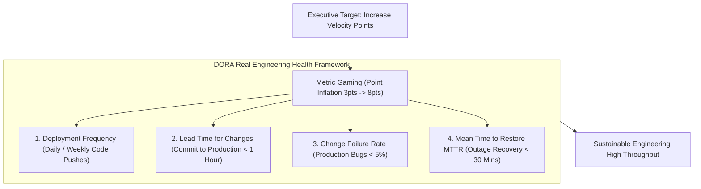

```ppt
# Slide 1: Engineering Velocity & Metric Misuse
- **The Core Discipline:** Using sprint velocity as an internal squad capacity planning tool rather than a competitive management weapon or developer performance rating.
- **Executive Metric Law (Goodhart's Law):** When a metric becomes a target, it ceases to be a good metric!
- **Author:** Pankaj Kumar | Associate Architect & Tech Leadership
<!-- slide -->
# Slide 2: The Speedometer Without Fuel Efficiency Analogy
- **Reckless Driver (Velocity Obsession):** Stomping the gas pedal to reach 120 mph (*Artificially Inflating Story Points*) to impress passengers. The engine overheats, tires blow out, and the car runs out of fuel mid-highway!
- **Master Racing Captain (Holistic Engineering Health):** Monitors speedometer (*Velocity*), engine temperature (*Code Quality / Technical Debt*), and fuel efficiency (*Developer Burnout & Cycle Time*) to complete a 500-mile endurance race safely!
<!-- slide -->
# Slide 3: The Danger of Velocity Point Inflation
- **The Metric Gaming Trap:** When executives compare Squad A (40 points) to Squad B (80 points), Squad A inflates 3-point tickets to 8-point tickets to look productive!
- **Zero Business Value Added:** Story points increase, but actual working software delivered remains identical.
<!-- slide -->
# Slide 4: Real-World Case Study: Vikram's Metric Gaming Reset
- **The Misuse:** A VP of Product compared 6 engineering squads led by Lead Architect **Vikram Patel** by total story points closed per developer, causing developers to inflate estimates by 200%.
- **The Reset:** Vikram eliminated cross-squad velocity comparisons and replaced them with DORA Metrics (Lead Time, Change Failure Rate, Deployment Frequency).
- **The Result:** Stopped story point inflation, reduced deployment failure rates by 60%, and restored team trust!
<!-- slide -->
# Slide 5: The 4 Key Metrics That Actually Matter (DORA)
- **1. Deployment Frequency:** How often code is pushed to production (Daily / Weekly).
- **2. Lead Time for Changes:** Time from git commit to production deployment (< 1 hour).
- **3. Change Failure Rate:** Percentage of deployments requiring hotfixes (< 5%).
- **4. Mean Time to Restore (MTTR):** Time to recover from production outages (< 30 mins).
<!-- slide -->
# Slide 6: How to Correctly Use Velocity
- **Capacity Planning Only:** Predicting how many story points a single squad can commit to in the next 2-week sprint based on their 3-sprint rolling average.
- **Internal Squad Baseline:** Measuring squad stability over time, not comparing different teams.
<!-- slide -->
# Slide 7: Common Misconception
- **Myth:** "Squad A closing 100 story points is twice as productive as Squad B closing 50 story points."
- **Fact:** Story points are relative to each individual team — a 5-point story in Squad A may equal a 2-point story in Squad B!
<!-- slide -->
# Slide 8: Summary for Beginners
- Use velocity correctly: treat points as internal squad capacity tools, never compare velocity across teams, and measure real delivery using DORA metrics!
```

# Velocity Metrics: Why Tracking Velocity Can Be Misused

In Agile development, **Sprint Velocity** is defined as the total number of Story Points an engineering squad completes during a 2-week sprint.

On paper, velocity sounds like the ultimate executive management metric.  
Executives often ask:
- *"How many story points did Team A complete this month?"*
- *"Why is Team B's velocity 40 points while Team A's velocity is 80 points?"*
- *"Can we demand that engineers increase their velocity by 20% next quarter?"*

This executive approach triggers a catastrophic management trap known as **Goodhart's Law:**  
> *"When a metric becomes a target, it ceases to be a good metric."*

When executives weaponize velocity to rate developer performance or stack-rank teams:
- Developers artificially inflate story points (a simple 2-point fix gets estimated as an 8-point ticket).
- Squads skip unit testing, refactoring, and documentation to close more points.
- Story points double, but actual working software delivered to users remains completely unchanged!

How do CTOs track real engineering productivity without falling into the velocity gaming trap?

Let's understand Velocity Metrics using **The Speedometer Without Fuel Efficiency Analogy**!

---

## 🚗 The Speedometer Without Fuel Efficiency Analogy

Imagine driving a vehicle in a 500-mile endurance race:



- **The Reckless Driver (Velocity Point Obsession):**  
  Stomps the gas pedal to force the speedometer to 120 mph (**Artificially Inflating Story Points**) just to impress passengers. The engine overheats, tires explode, and the car runs out of fuel mid-highway (**Developer Burnout & Production Outages**)!

- **The Master Racing Captain (Holistic Engineering Health):**  
  Monitors the speedometer (**Velocity Capacity**), engine temperature (**Code Quality & Technical Debt**), and fuel efficiency (**Developer Burnout & Lead Time**) to finish the 500-mile endurance race safely in record time!

---

## 📊 Real-World Case Study: Vikram's Metric Gaming Reset

Consider a multi-squad software department where **Vikram Patel** serves as Lead Architect.


1. **The Metric Misuse:** A newly hired VP of Product began stack-ranking 6 engineering squads by total story points closed per developer.
2. **The Metric Gaming Response:** To protect their performance reviews, developers across all 6 squads secretly agreed to double their story point estimates. A basic text label fix previously estimated at 1 point was suddenly estimated at 5 points!
3. **The CTO Reset:**  
   - Vikram stepped in, eliminated cross-team story point comparisons, and educated executives that story points are relative internal squad baselines.
   - He replaced velocity targets with **DORA Metrics** (Deployment Frequency, Lead Time for Changes, Change Failure Rate, and Mean Time to Restore).
4. **The Result:** Story point inflation ceased, production deployment failure rates dropped by **60%**, and genuine engineering trust was restored!

---

## 📊 Misused Velocity vs. DORA Engineering Health Metrics

| Metric Dimension | Misused Velocity Target (Toxic) | DORA Engineering Health Metrics (Adopt) |
| :--- | :--- | :--- |
| **Primary Metric** | Total Story Points closed per sprint | Lead Time, Deployment Frequency, Change Failure Rate |
| **Executive Use** | Stack-ranking teams & rating individual developers | Measuring pipeline automation, CI/CD speed, and system stability |
| **Developer Behavior** | Inflating point estimates & skipping unit tests | Writing small PRs, automating tests, and shipping daily |
| **Cross-Team Comparison** | Comparing Squad A (40 pts) vs. Squad B (80 pts) | Evaluating squad lead time improvement against their own baseline |
| **Business Impact** | High points, low quality, high burnout | Continuous, predictable delivery of working customer value |

---

## 💡 Summary for Beginners

- **Velocity** = An internal squad planning metric estimating how many story points a specific team can complete in a 2-week sprint based on past averages.
- **Goodhart's Law** = The principle that when a metric becomes a management target, it loses its validity because people manipulate the system to hit the number.
- **DORA Metrics** = Four key operational metrics (Deployment Frequency, Lead Time for Changes, Change Failure Rate, MTTR) established by DevOps Research and Assessment to measure software delivery performance.
- **CTO Golden Rule** = **"Use velocity strictly for internal squad sprint capacity planning — never compare story points across teams or weaponize points as performance targets!"**

---

*Written by **Pankaj Kumar** | Associate Architect & Tech Leadership.*
