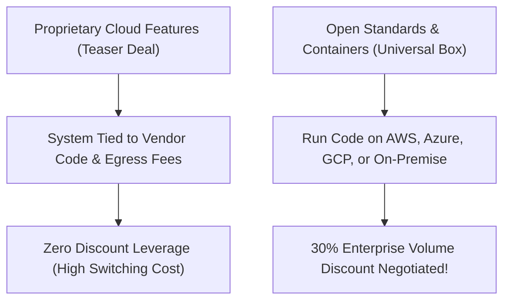

```ppt
# Slide 1: Vendor Lock-in & Cloud Negotiation Strategy
- **Executive Threat:** Becoming so dependent on a single cloud vendor (AWS/Azure/GCP) that switching costs make negotiation impossible.
- **The CTO Mandate:** Maintaining leverage and portability to secure massive cloud contract discounts.
- **Author:** Pankaj Kumar | Associate Architect & Tech Leadership
<!-- slide -->
# Slide 2: The Cable TV Subscription Analogy
- **Initial Deal:** Getting 100 channels for $29/month on a 1-year teaser deal.
- **Year 2 Price Hike:** The provider hikes the bill to $150/month because all your smart home devices are tied to their proprietary set-top box!
<!-- slide -->
# Slide 3: The 3 Flavors of Tech Lock-in
- **1. Infrastructure Lock-in:** Proprietary database engines (e.g. AWS DynamoDB vs standard PostgreSQL).
- **2. Data Egress Lock-in:** Cloud providers charging heavy fees when transferring data *out* of their data centers.
- **3. API & Protocol Lock-in:** Code built around vendor-specific serverless frameworks.
<!-- slide -->
# Slide 4: Strategic Portability: Containers & Open Standards
- **Docker & Kubernetes:** Packaging code into universal containers that run on AWS, Azure, GCP, or on-premise servers identically.
- **Open-Source Databases:** Using open standards like PostgreSQL, Redis, and Kafka to maintain instant migration portability.
<!-- slide -->
# Slide 5: The Enterprise Cloud Negotiation Playbook
- **1. Multi-Cloud Credible Threat:** Demonstrating to AWS sales reps that your workload can migrate to GCP within 30 days.
- **2. Committed Use Discounts (EDP):** Committing to annual cloud spend in exchange for 20% to 35% upfront price cuts.
- **3. Negotiating Egress Fee Waivers:** Requesting custom enterprise contract clauses to eliminate data transfer penalties.
<!-- slide -->
# Slide 6: Multi-Cloud vs Single-Cloud Reality
- **Multi-Cloud Pros:** Zero vendor lock-in, ultimate negotiation leverage, zero single-point-of-failure risk.
- **Multi-Cloud Cons:** Increased engineering complexity, multi-cloud management overhead.
<!-- slide -->
# Slide 7: Common Beginner Misconception
- **Myth:** "All vendor lock-in is evil and must be avoided at all costs."
- **Fact:** Strategic lock-in is acceptable in early-stage startups to move fast, provided you track your switching costs!
<!-- slide -->
# Slide 8: Summary for Beginners
- Build software on open standards so cloud vendors compete for your business, not the other way around!
```

# Vendor Lock-in & Cloud Negotiation Strategy: How CTOs Avoid Vendor Dependency

When a startup first launches, signing up for proprietary cloud features (like AWS DynamoDB, Azure Cosmos DB, or GCP BigQuery) feels magical. You can launch an app in hours without managing database servers!

However, 5 years later when your cloud bill grows to **$1,000,000 per year**, you ask your cloud provider for a 20% volume discount.

If your software is deeply tied to their proprietary tools, the cloud provider knows it will cost you $500,000 in developer time to rewrite your code for another cloud platform. **You have zero negotiation leverage!**

This traps companies in **Vendor Lock-in**.

Let's break down **Vendor Lock-in & Cloud Negotiation** using **The Cable TV Teaser Deal Analogy**!

---

## 📺 The Cable TV Teaser Deal Analogy

Imagine signing up for a household cable TV package:



- **The Teaser Deal (Vendor Lock-in):**  
  A cable company sells you a smart home box for $20/month. However, your TV, security cameras, and smart locks only work through their proprietary box. In Year 2, they raise the price to $120/month. You are forced to pay because replacing all your home electronics costs $3,000!

- **The Universal Set-Top Box (Portability):**  
  You buy smart home devices that run on universal Wi-Fi standards. If Cable Provider A raises prices, you unplug their box and switch to Cable Provider B in 10 minutes. Because Provider A knows this, they voluntarily offer you a **30% loyalty discount**!

---

## 📊 3 Technical Rules for Maintaining Vendor Leverage

1. **📦 Package Code in Containers (Docker / Kubernetes):** Encapsulate software into standardized Docker containers. Containers run identically whether hosted on Amazon Web Services, Google Cloud Platform, or Microsoft Azure.
2. **🗄️ Standardize on Open Source Engines:** Choose open-source databases (PostgreSQL, MySQL, Redis) instead of vendor-proprietary databases.
3. **💰 Monitor Cloud Data Egress Costs:** Cloud providers charge minimal fees to ingest data, but charge high fees when transferring data out. Negotiate data egress fee caps in enterprise contracts upfront!

---

## 💡 Summary for Beginners

- **Vendor Lock-in** = Architectural dependency that makes switching cloud providers prohibitively expensive.
- **Portability** = Structuring code with open standards so it can move across any cloud infrastructure instantly.
- **The CTO's Strategy** = Maintaining a credible migration threat to secure 25%+ enterprise cloud discounts!

---

*Written by **Pankaj Kumar** | Associate Architect & Tech Leadership.*
