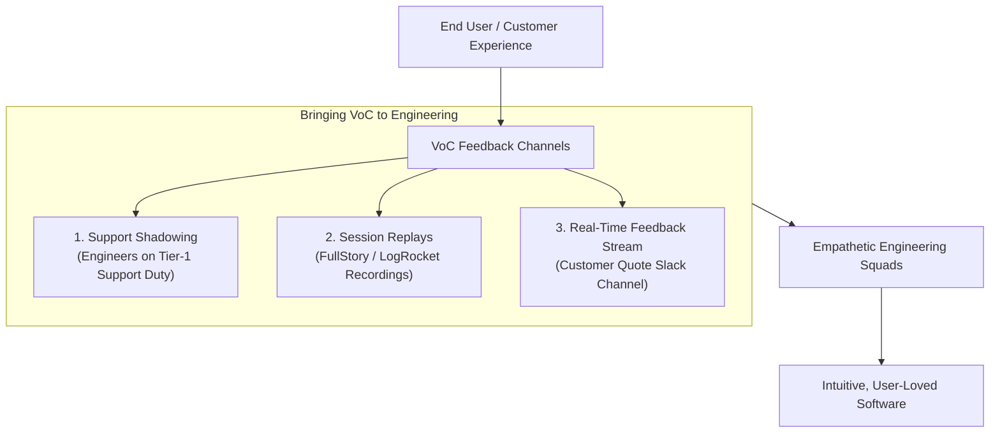

```ppt
# Slide 1: Voice of the Customer (VoC) in Engineering
- **The Core Problem:** Connecting software developers directly with real customer pain points to build empathetic, user-centric software.
- **Key Insight:** Developers who never hear customer feedback end up building software for compilers rather than human beings!
- **Author:** Pankaj Kumar | Associate Architect & Tech Leadership
<!-- slide -->
# Slide 2: The Chef Stepping into the Dining Room Analogy
- **Isolated Kitchen Chef:** Cooks behind closed metal doors, never sees diners, and assumes an overly salty soup recipe is perfect because the recipe book said so.
- **Master Executive Chef:** Steps out into the dining room, watches guests react after taking the first spoon of soup, listens to their feedback, and tweaks the recipe immediately!
<!-- slide -->
# Slide 3: Why Developers Get Isolated from Customers
- **The Proxy Wall:** Product managers and support tickets act as heavy filters, stripping emotional context from user complaints.
- **Jargon Disconnect:** Developers talk in database schemas; users talk in frustrating UI workflow delays.
<!-- slide -->
# Slide 4: 4 Channels to Bring VoC to Engineering Squads
- **1. Support Rotation ("Support Shadowing"):** Engineers spending 2 hours a month responding to live customer support tickets.
- **2. Shared Slack / Discord Feedback Channels:** Real-time stream of customer quotes and NPS survey feedback.
- **3. User Session Replays:** Watching anonymized session recordings (FullStory, LogRocket) of users struggling with complex forms.
- **4. Customer Advisory Boards:** Inviting engineers to observe quarterly client feedback meetings.
<!-- slide -->
# Slide 5: Transforming Complaints into Backlog Priority
- **Raw User Complaint:** *"The invoice download button is broken and taking forever!"*
- **Engineering Translation:** *"Fix PDF generation API latency (P99 > 8s) and add client-side loading indicator."*
<!-- slide -->
# Slide 6: Empathy-Driven Engineering Culture
- **Blameless Product Iteration:** Empowering engineers to propose UI micro-optimizations based on user session replays.
- **Celebrating Customer Wins:** Highlighting customer success stories in bi-weekly sprint demos.
<!-- slide -->
# Slide 7: Common Misconception
- **Myth:** "Developers shouldn't interact with customer feedback because it distracts them from coding."
- **Fact:** Developers who understand real user pain write cleaner, more intuitive software that requires 50% fewer redesigns!
<!-- slide -->
# Slide 8: Summary for Beginners
- Connect engineers directly to user feedback via support shadowing, session replays, and real-time customer quotes!
```

# Voice of the Customer: Bringing User Feedback to Developers

In many software organizations, an invisible wall exists between the developers who write code and the end users who rely on that software every day.

Developers sit behind dual monitors in quiet offices, receiving rigid tickets like *"Fix bug #4092: NullPointerException in UserAuth.ts"*.

Because they never see a real human being struggle to complete an order or burst into frustration over a clunky form, engineers treat software as a set of abstract logic puzzles.

To build software that truly succeeds in the market, **CTOs must bring the Voice of the Customer (VoC) directly into the engineering culture!**

Let's understand Voice of the Customer using **The Chef Stepping into the Dining Room Analogy**!

---

## 🍽️ The Chef Stepping into the Dining Room Analogy

Imagine running a high-end restaurant:



- **The Isolated Kitchen Chef:**  
  Stays locked behind heavy stainless-steel kitchen doors, never seeing a single diner. When a waiter reports that 5 customers returned their soup untouched because it was too salty, the chef angrily insists: *"The recipe book calls for 2 spoons of salt; the customers are wrong!"*

- **The Master Executive Chef (The Empathetic CTO):**  
  Steps out into the dining room, observes guests taking their first spoon of soup, notices them reaching for water glasses, and listens directly to their feedback. They walk back to the kitchen and adjust the seasoning immediately!

---

## 📊 4 Practical Mechanisms to Connect Engineers with Customers

| VoC Mechanism | Implementation Strategy | Impact on Engineering Squads |
| :--- | :--- | :--- |
| **1. Support Shadowing** | Engineers spend 2 hours/month handling real customer support tickets alongside Support Reps | Builds deep empathy for customer frustration and everyday bugs |
| **2. Session Replay Parties** | Hosting a 30-minute monthly session watching anonymized user recordings (FullStory) | Exposes UX friction, confusing button labels, and slow page loads |
| **3. Customer Quote Feed** | Automated Slack/Teams channel streaming positive & negative NPS user comments | Keeps real user sentiment top-of-mind during daily standups |
| **4. Customer Advisory Sync** | Inviting tech leads to observe quarterly customer advisory board sessions | Connects architecture choices directly to enterprise customer ROI |

---

## 💡 Summary for Beginners

- **Voice of the Customer (VoC)** = Integrating real user feedback, session replays, and support stories directly into developer workflows.
- **Empathy-Driven Engineering** = Building software with deep care for the human being sitting on the other side of the screen.
- **CTO Golden Rule** = **"Tear down the wall between developers and customers — engineers who hear user feedback write software that solves real human problems!"**

---

*Written by **Pankaj Kumar** | Associate Architect & Tech Leadership.*
