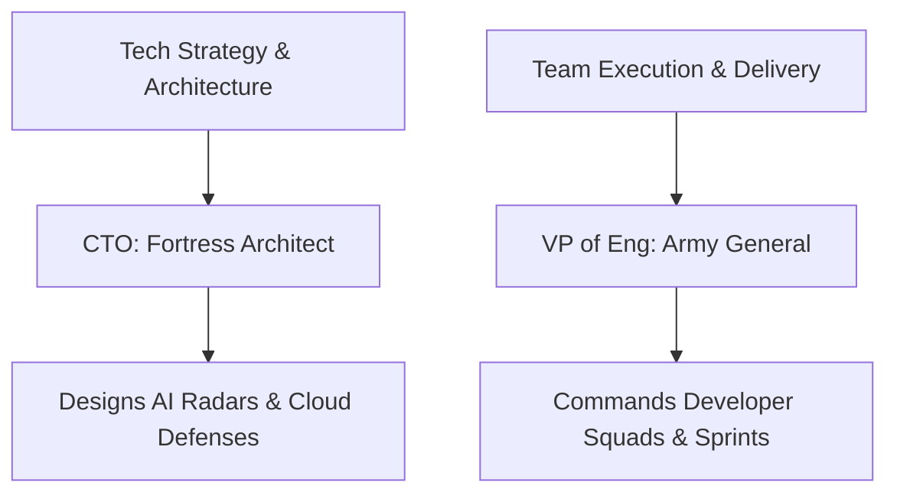

```ppt
# Slide 1: VP of Engineering vs CTO
- **Common Confusion:** Thinking VP of Eng and CTO do the exact same job.
- **The Core Difference:** CTO focuses on **Where we are going (Strategy)**; VP of Eng focuses on **How we get there (Execution & People)**.
- **Author:** Pankaj Kumar | Associate Architect & Tech Leadership
<!-- slide -->
# Slide 2: The Military Army Analogy
- **CTO = The Fortress Architect:** Designs the grand blueprint of defense walls, AI radars, and siege weapons.
- **VP of Eng = The General:** Commands the soldiers, manages supply lines, trains troops, and ensures missions succeed on time.
<!-- slide -->
# Slide 3: Primary Focus Areas Compared
- **CTO Focus:** Long-term technology radar, AI models, market innovation, and investor trust.
- **VP of Eng Focus:** Daily developer sprints, hiring top 1% talent, career growth, and delivering software on schedule.
<!-- slide -->
# Slide 4: Real-World Story: The E-Commerce Outage
- **The Crisis:** Website crashes during big holiday sale rush.
- **CTO Action:** Redesigns cloud architecture to handle 5x traffic next quarter.
- **VP of Eng Action:** Re-organizes engineering squads to deploy a bug fix in 20 minutes.
<!-- slide -->
# Slide 5: Who Reports to Whom?
- **Small Startup (Seed/Series A):** CTO often manages engineers directly.
- **Growing Company (Series B+):** VP of Engineering reports to the CTO or CEO to manage daily dev operations.
<!-- slide -->
# Slide 6: Key Skills Needed for Each Role
- **CTO Skills:** Executive vision, AI research, public speaking, investor pitching, financial budgeting.
- **VP of Eng Skills:** Team leadership, hiring pipelines, developer onboarding, sprint velocity, empathetic management.
<!-- slide -->
# Slide 7: Real-Time Restaurant Analogy
- **CTO:** Master Chef designing revolutionary new fusion recipes and kitchen tech.
- **VP of Eng:** Kitchen Operations Director managing 20 line cooks, fresh ingredient supply, and dish delivery speed.
<!-- slide -->
# Slide 8: What Happens When You Miss One?
- **Without CTO:** Team builds fast, but on outdated, unsafe technology stacks.
- **Without VP of Eng:** Great technical vision, but dev team is disorganized and misses release deadlines.
<!-- slide -->
# Slide 9: Executive Takeaway
- Successful tech companies need **BOTH** strategic architecture (CTO) and disciplined team execution (VP of Eng).
```

# VP of Engineering vs CTO: What is the Real Difference?

When non-technical founders, managers, or beginners look at an engineering organization, two top titles often create immense confusion: **Chief Technology Officer (CTO)** and **Vice President of Engineering (VP of Engineering)**.

Both are senior executive roles, both earn top-tier compensation, and both sit near the head of technology. But their daily responsibilities, skillsets, and goals are fundamentally different.

Let's break down the real difference using simple everyday analogies!

---

## 🏰 The Military Army Analogy

Imagine defending a kingdom against enemy invaders:



- **The CTO (Chief Technology Officer) = The Fortress Architect:** Sits in the war room designing the grand blueprints, evaluating future weapons (AI models), and deciding where the fortress walls should be built.
- **The VP of Engineering = The Army General:** Steps onto the battlefield to command squad leaders, manage supply lines, train soldiers, and ensure missions are completed smoothly on time.

---

## 🆚 Direct Head-to-Head Comparison

| Leadership Aspect | Chief Technology Officer (CTO) | VP of Engineering (VP of Eng) |
| :--- | :--- | :--- |
| **Primary Question** | *"What technology should we build for the future?"* | *"How fast and reliably can our team build it today?"* |
| **Main Responsibility** | Long-term technology strategy, AI selection & architecture | Daily engineering execution, hiring, and team management |
| **Key Metric** | Technology ROI, system scalability & security | Sprint velocity, on-time delivery & developer retention |
| **Everyday Analogy** | **Master Chef** designing new fusion menu items | **Kitchen Manager** coordinating line cooks & dinner rush |

---

## 🍕 Real-World Example: Building a Global Food Delivery App

Let's look at how both executives handle a major company goal:

### Scenario: "We need to deliver hot food to users in under 15 minutes using AI navigation."

- **The CTO's Job:**
  - Researches open-source AI algorithms for route optimization.
  - Decides whether to build custom mapping software or partner with Google Maps APIs.
  - Ensures customer credit card details and location data are locked inside secure cloud vaults.

- **The VP of Engineering's Job:**
  - Hires 15 senior iOS and Android developers to build the mobile app.
  - Organizes developers into 2-week Agile sprints so code is shipped continuously.
  - Mentors team leads, conducts performance reviews, and removes daily coding blockers.

---

## 💡 Summary for Beginners

- **CTO** focus = **Technology, Architecture & Future Strategy** *(Where we are going)*.
- **VP of Engineering** focus = **People, Execution & Delivery** *(How fast we get there)*.
- **Together** = They form the twin engines powering world-class engineering organizations.

---

*Written by **Pankaj Kumar** | Associate Architect & Tech Leadership.*
