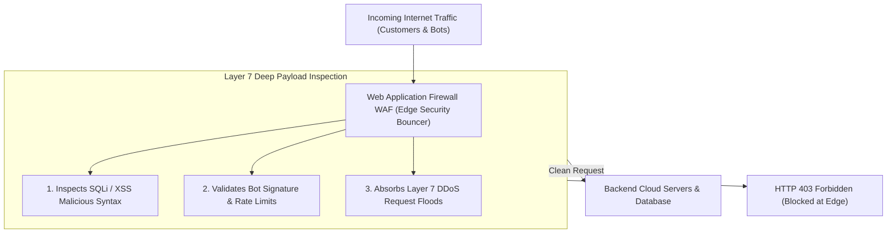
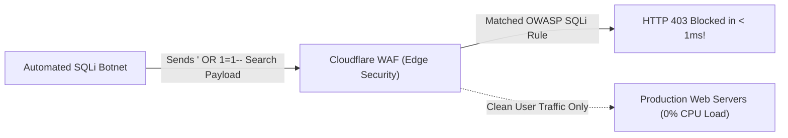

```ppt
# Slide 1: Web Application Firewalls (WAF)
- **The Core Edge Defense:** Inspecting and filtering incoming HTTP/HTTPS traffic to block cyberattacks before they reach backend application servers.
- **Executive Security Rule:** Inspect traffic at the perimeter — block malicious payloads at Layer 7!
- **Author:** Pankaj Kumar | Associate Architect & Tech Leadership
<!-- slide -->
# Slide 2: The Nightclub Bouncer Analogy
- **Unguarded Venue Entrance (No WAF):** A luxury nightclub leaves its front doors wide open. Troublemakers carry concealed weapons (*SQL Injections*), bring fake IDs (*Cross-Site Scripting*), and flood the dance floor in 500-person mobs (*DDoS Attacks*). The club is destroyed!
- **Master Security Bouncer (WAF Edge Security):** A 7-foot trained bouncer (*Web Application Firewall*) inspects every guest's ID at the velvet rope, runs metal detector wands (*Payload Inspection*), and denies entry to troublemakers in **< 1 millisecond**!
<!-- slide -->
# Slide 3: OSI Layer 3/4 Firewall vs Layer 7 WAF
- **Network Firewall (Layer 3/4):** Checks IP addresses and port numbers (e.g. Allow Port 443). Cannot inspect HTTP payload content!
- **Web Application Firewall (Layer 7):** Deeply inspects HTTP headers, URL parameters, POST body data, and cookie tokens for malicious patterns.
<!-- slide -->
# Slide 4: Real-World Case Study: Priya's E-Commerce SQL Injection Saved
- **The Vulnerability:** An online retail store managed by HR & Ops Director **Priya Nair** was targeted by an automated botnet executing SQL injection attacks on the search bar (`search?query=' OR 1=1--`).
- **The Protection:** Priya's CTO had deployed Cloudflare WAF.
- **The Result:** The WAF recognized the malicious SQL syntax at the edge, blocked 1.5 Million attack requests per hour, and kept the web store 100% online!
<!-- slide -->
# Slide 5: The 3 Core Functions of a Modern WAF
- **1. OWASP Top 10 Attack Blocking:** Filtering SQLi, Cross-Site Scripting (XSS), and Remote Code Execution (RCE).
- **2. Bot Management & Rate Limiting:** Blocking malicious web scrapers and credential-stuffing botnets.
- **3. DDoS Protection:** Absorbing multi-gigabit Layer 7 Distributed Denial of Service floods.
<!-- slide -->
# Slide 6: Managed WAF Rulesets vs. Custom Rules
- **Managed OWASP Rulesets:** Pre-configured security threat intelligence updated automatically in real time (Cloudflare / AWS WAF).
- **Custom Rate-Limiting Rules:** Blocking specific suspicious API endpoints (e.g. Max 5 login attempts per minute per IP).
<!-- slide -->
# Slide 7: Common Misconception
- **Myth:** "A Web Application Firewall (WAF) replaces the need to write secure code."
- **Fact:** WAF is a perimeter shield — it provides defense-in-depth, but developers must still write secure, sanitized backend code!
<!-- slide -->
# Slide 8: Summary for Beginners
- Deploy WAF edge protection: filter Layer 7 HTTP payloads, block OWASP threats at the perimeter, absorb DDoS floods, and protect backend servers!
```

# Web Application Firewalls (WAF): Filtering Malicious Traffic

Imagine launching a high-traffic web application or e-commerce platform.

Every second, thousands of HTTP requests hit your servers:
- 95% are legitimate customers browsing products and making purchases.
- 5% are **malicious automated bots and hackers** attempting to inject SQL code, steal passwords, or launch Denial of Service (DDoS) attacks!

If your backend web servers must inspect, process, and reject every malicious request individually, your database CPU usage spikes to 100%, and your website crashes for real customers.

How do technology leaders inspect and filter out malicious traffic before it reaches backend servers?

They deploy a **Web Application Firewall (WAF)!**

Let's understand WAF using **The Nightclub Bouncer Analogy**!

---

## 🚪 The Nightclub Bouncer Analogy

Imagine managing security at an exclusive VIP nightclub:



- **The Unguarded Venue (No WAF Protection):**  
  A luxury venue leaves its front doors wide open with no security staff. Troublemakers carry concealed weapons (**SQL Injections**), present forged credentials (**Cross-Site Scripting**), and rush the bar in 500-person mobs (**DDoS Attacks**). The bar gets trashed!

- **The Master VIP Bouncer (WAF Edge Security):**  
  A 7-foot trained bouncer (**Web Application Firewall**) stands at the velvet rope outside the venue. He inspects every guest's ID (**HTTP Header Analysis**), scans bags with metal detector wands (**Payload Inspection**), and denies entry to troublemakers in **< 1 millisecond**!

---

## 📊 Real-World Case Study: Priya's E-Commerce SQL Injection Attack

Consider a fast-scaling online retail store where **Priya Nair** oversees operations and system availability.



1. **The Attack:** During a major holiday shopping sale, an automated hacker botnet launched a SQL Injection attack targeting the website search bar: `GET /search?query=' OR 1=1--`.
2. **The Goal:** The attackers hoped to trick the backend database into dumping 50,000 credit card records.
3. **The WAF Protection:**  
   - Priya's CTO had deployed **Cloudflare WAF** in front of the web servers.
   - The WAF inspected the incoming HTTP request payload at the global edge network, instantly recognized the malicious `' OR 1=1--` SQL syntax pattern, and dropped the connection.
   - The WAF blocked **1.5 Million attack requests per hour** with zero impact on backend database CPU load, keeping the store 100% online for real shoppers!

---

## 📊 Network Firewall (Layer 3/4) vs. Web Application Firewall (Layer 7)

| Feature Dimension | Network Firewall (Layer 3/4) | Web Application Firewall (Layer 7) |
| :--- | :--- | :--- |
| **OSI Model Layer** | Network & Transport Layer (Layer 3 & 4) | Application Layer (Layer 7) |
| **Inspected Data** | IP addresses, TCP/UDP ports, protocol types | HTTP/HTTPS headers, URL parameters, POST JSON body, cookies |
| **Example Rule** | *"Block incoming traffic on Port 22 except from IP 192.168.1.1"* | *"Block HTTP requests containing SQL injection syntax `' OR 1=1`"* |
| **Threat Protection** | Port scans, SYN floods, IP spoofing | SQL Injection (SQLi), Cross-Site Scripting (XSS), Bot scraping, Layer 7 DDoS |
| **Analogy** | Checking the street address on the outside of an envelope | Opening the letter inside to check for dangerous poison words |

---

## 💡 Summary for Beginners

- **Web Application Firewall (WAF)** = A specialized security barrier that monitors, filters, and blocks HTTP/HTTPS traffic to and from a web application.
- **Layer 7 Inspection** = Analyzing the actual content of HTTP requests (JSON body, headers, cookies) rather than just network IP addresses.
- **CTO Golden Rule** = **"Deploy a WAF at the cloud edge to block OWASP Top 10 attacks and bot floods before malicious traffic ever touches your backend servers!"**

---

*Written by **Pankaj Kumar** | Associate Architect & Tech Leadership.*
