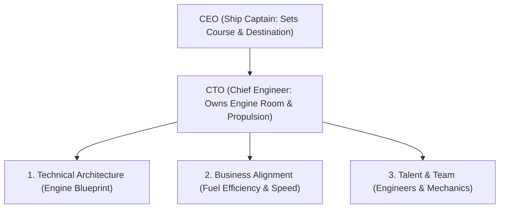

```ppt
# Slide 1: What is a CTO? Demystifying the Role
- **The Core Objective:** Explaining the Chief Technology Officer role to business leaders and non-tech executives.
- **Key Responsibilities:** Technology vision, technical strategy, engineering velocity, and business alignment.
- **Author:** Pankaj Kumar | Associate Architect & Tech Leadership
<!-- slide -->
# Slide 2: The Ship Captain vs Chief Engineer Analogy
- **The CEO (Ship Captain):** Sets the destination, navigates business waters, and talks to passengers & investors.
- **The CTO (Chief Engineer):** Owns the engine room, ensures power systems run smoothly, and builds boilers that won't explode at high speed!
<!-- slide -->
# Slide 3: The 4 Core Pillars of a CTO
- **1. Technical Vision:** Choosing tools and software architecture for 3-5 years out.
- **2. Business Alignment:** Translating revenue goals into technical roadmaps.
- **3. Engineering Culture:** Hiring, retaining, and empowering top-tier developers.
- **4. Execution Velocity:** Ensuring features ship fast without accumulating dangerous technical debt.
<!-- slide -->
# Slide 4: CTO vs Other C-Suite Executives
- **CTO vs CEO:** Strategy & destination vs Technical engine & execution.
- **CTO vs VP of Engineering:** Long-term technology vision vs Day-to-day team management & sprint delivery.
- **CTO vs CIO:** Internal business IT & security vs External customer-facing software products.
<!-- slide -->
# Slide 5: Common Misconceptions About CTOs
- **Myth 1:** "The CTO is just the most senior coder in the company."
- **Fact:** A CTO spends 80% of their time on business strategy, architecture, talent, and leadership — not writing line-by-line code!
<!-- slide -->
# Slide 6: Evolution of the CTO Role by Company Stage
- **Early Stage (0-10 devs):** Hands-on coding, building the MVP, setting up initial architecture.
- **Growth Stage (10-50 devs):** Hiring managers, setting up CI/CD pipelines, establishing security baselines.
- **Enterprise Stage (50+ devs):** Boardroom strategy, M&A due diligence, cloud FinOps, and enterprise architecture.
<!-- slide -->
# Slide 7: The CTO Golden Rule
- **Rule:** A great CTO never builds technology for the sake of technology; every architectural decision must drive real business value!
<!-- slide -->
# Slide 8: Summary for Beginners
- The CTO is the strategic bridge between business goals and software engineering execution!
```

# What is a CTO? Demystifying the Chief Technology Officer Role

In modern companies, technology is no longer just a support function in the basement — it is the core engine of business growth.

Yet, when non-technical executives or new entrepreneurs hear the title **CTO (Chief Technology Officer)**, they often wonder:  
*"Is the CTO just a super-senior programmer who sits in a dark room writing code all day?"*

The answer is a resounding **NO!**

Let's demystify the Chief Technology Officer role using **The Ship Captain vs. Chief Engineer Analogy**!

---

## 🚢 The Ship Captain vs. Chief Engineer Analogy

Imagine a large ocean liner sailing across stormy seas:



- **The CEO (The Ship Captain):**  
  Stands on the upper bridge, holds the telescope, decides which port to sail toward, and talks to passengers, board members, and investors.

- **The CTO (The Chief Engineer):**  
  Stands down in the engine room surrounded by turbines, boilers, and fuel lines. The CTO ensures the engine generates maximum speed (*engineering velocity*), uses fuel efficiently (*cloud costs*), and never explodes under pressure (*system reliability*)!

---

## 📊 CTO vs. VP of Engineering vs. CIO

| Role | Primary Focus | Daily Responsibility | Core Metric |
| :--- | :--- | :--- | :--- |
| **CTO (Chief Technology Officer)** | Technology Vision & Architecture | External Product Innovation & Tech Strategy | Business ROI & Tech Scalability |
| **VP of Engineering** | Team Management & Execution | Sprint Delivery, Hiring & Process Management | On-Time Feature Delivery |
| **CIO (Chief Information Officer)** | Internal IT Infrastructure | Office WiFi, Laptops, ERP & Corporate Security | System Uptime & Cost Efficiency |

---

## 💡 Summary for Beginners

- **CTO** = Executive leader bridging software engineering with corporate strategy.
- **Primary Responsibility** = Making sure technology drives business revenue instead of consuming budget blindly.
- **CTO Rule** = **"Always align software architecture decisions with the CEO's revenue vision!"**

---

*Written by **Pankaj Kumar** | Associate Architect & Tech Leadership.*
