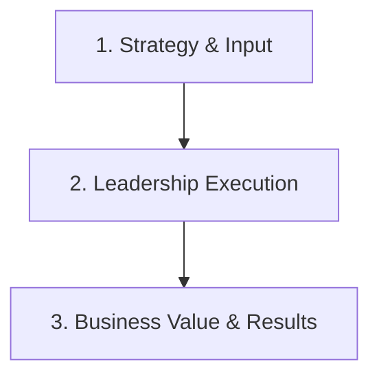

```ppt
# Slide 1: What is AI? Smart Calculator vs Human Brain Assistant
- **Core Focus:** Bite-sized micro-guide breaking down What is AI? Smart Calculator vs Human Brain Assistant with clear real-world analogies.
- **Everyday Analogy:** Pattern recognition machine trained on millions of examples
- **Author:** Pankaj Kumar | Associate Architect & Tech Leadership
<!-- slide -->
# Slide 2: The Core Analogy
- **Analogy:** Pattern recognition machine trained on millions of examples
- **Executive Context:** Translating complex technical concepts into clear business value for C-suite alignment.
<!-- slide -->
# Slide 3: Executive Principles & Framework
- **Principle 1:** Aligning engineering velocity with business revenue goals.
- **Principle 2:** Maintaining technical excellence while delivering commercial value.
<!-- slide -->
# Slide 4: Key Implementation Takeaways
- **Action Step:** Implement structured communication loops and automated metrics tracking.
- **Summary:** Bite-sized micro-guide breaking down What is AI? Smart Calculator vs Human Brain Assistant with clear real-world analogies.
```

# What is AI? Smart Calculator vs Human Brain Assistant

Bite-sized micro-guide breaking down What is AI? Smart Calculator vs Human Brain Assistant with clear real-world analogies.

Understanding how to balance technical architecture with business strategy is a core responsibility for modern technology leaders.

Let's break down **What is AI? Smart Calculator vs Human Brain Assistant** using **The Pattern recognition machine trained on millions of examples Analogy**!

---

## 💡 The Pattern recognition machine trained on millions of examples Analogy

Imagine managing a high-stakes operations environment:



- **Core Concept:** Just like pattern recognition machine trained on millions of examples, successful technical leaders focus on clarity, risk reduction, and predictable execution.
- **Executive Alignment:** Communicating technical decisions using clear business metrics guarantees C-suite trust and alignment.

---

## 📊 Strategic Implementation Framework

| Dimension | Legacy / Reactive Approach | Executive Best Practice |
| :--- | :--- | :--- |
| **Communication** | Technical jargon & isolation | Business outcomes & clear ROI |
| **Execution** | Unstructured ad-hoc fixes | Structured, measurable sprints |
| **Impact** | High friction & misalignment | Seamless cross-functional synergy |

---

## 💡 Summary for Beginners

- **Primary Goal:** Bite-sized micro-guide breaking down What is AI? Smart Calculator vs Human Brain Assistant with clear real-world analogies.
- **CTO Rule:** **"Always translate technical decisions into business value and clear executive communication!"**

---

*Written by **Pankaj Kumar** | Associate Architect & Tech Leadership.*
