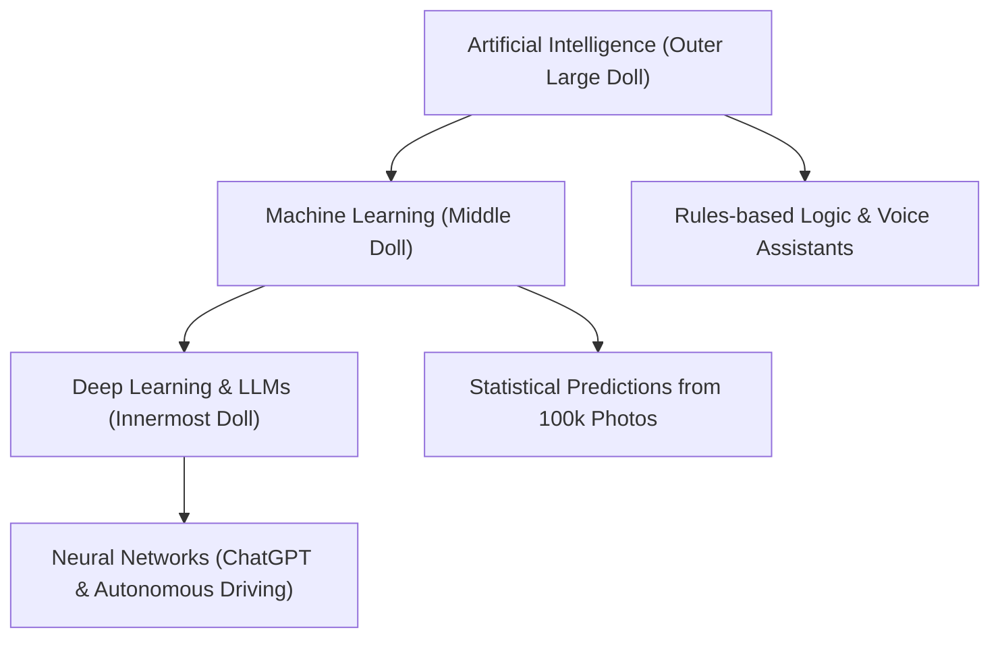

```ppt
# Slide 1: AI vs ML vs Deep Learning
- **Core Confusion:** People use AI, Machine Learning, and Deep Learning interchangeably.
- **The Russian Nesting Doll Concept:** AI is the outer umbrella, ML is inside AI, and Deep Learning is inside ML.
- **Author:** Pankaj Kumar | Associate Architect & Tech Leadership
<!-- slide -->
# Slide 2: The Smart Calculator vs Apprentice Chef
- **Traditional Software:** A calculator following explicit rules typed by humans (If X then Y).
- **Machine Learning (Apprentice Chef):** Shown 100,000 photos of pizzas until it discovers what a pizza looks like without human rules!
<!-- slide -->
# Slide 3: The 3 Layers Explained
- **1. Artificial Intelligence (AI):** Any computer system mimicking human intelligence (Voice assistants, chess bots).
- **2. Machine Learning (ML):** Algorithms learning from statistical data without explicit coding.
- **3. Deep Learning (DL):** Artificial neural networks mimicking the human brain (ChatGPT, Self-driving Tesla).
<!-- slide -->
# Slide 4: Real-World Example: Email Spam Filtering
- **Old Rule-Based AI:** IF email subject contains "FREE MONEY", mark as spam.
- **Modern ML Spam Filter:** Analyzes sender reputation, word patterns, links, and timing across 1 Billion emails automatically.
<!-- slide -->
# Slide 5: What is Generative AI & LLMs?
- **Generative AI:** AI models that create NEW text, images, code, or audio (ChatGPT, Claude, Midjourney).
- **LLMs (Large Language Models):** Neural networks trained on entire libraries of human internet text.
<!-- slide -->
# Slide 6: The Executive Business Value of AI
- **Automation:** Automating 80% of routine customer support tickets.
- **Prediction:** Predicting customer churn and machine maintenance breakdowns before they happen.
<!-- slide -->
# Slide 7: Common Beginner Misconception
- **Myth:** "AI is conscious and thinks like a human mind."
- **Fact:** AI is advanced statistical pattern prediction — calculating the most probable next word or pixel!
<!-- slide -->
# Slide 8: Summary for Beginners
- AI is the vision, Machine Learning is the engine, and Deep Learning is the superpower!
```

# What is AI vs ML vs Deep Learning? Smart Calculators vs Autonomous Pattern Learning

In business boardrooms today, no buzzword generates more excitement — and confusion — than **Artificial Intelligence (AI)**, **Machine Learning (ML)**, and **Deep Learning (DL)**.

Executives often hear:
- *"Our product is powered by AI!"*
- *"We are building Machine Learning predictive models."*
- *"We are training Deep Learning Large Language Models (LLMs)."*

Are these three terms the same thing? No!

Let's break down AI, ML, and Deep Learning using the **Russian Nesting Doll (Matryoshka) Analogy**!

---

## 🪆 The Russian Nesting Doll Analogy

Imagine a set of wooden Russian nesting dolls:



1. **Artificial Intelligence (The Outer Doll):** The broad overall vision of building machines that mimic human intelligence. This includes everything from simple chess computers in 1990 to modern voice assistants.
2. **Machine Learning (The Middle Doll):** A subset of AI where instead of humans writing hardcoded rules, computers analyze 100,000 historical data records to discover patterns by themselves!
3. **Deep Learning (The Innermost Doll):** A specialized subset of Machine Learning inspired by the human brain's biological neural network (neurons). This powers ChatGPT, Gemini, and Tesla self-driving cars.

---

## 🍕 The Apprentice Chef Analogy

To understand the difference between traditional software and Machine Learning:

- **Traditional Software (Hardcoded Rules):**  
  You write a strict manual for a kitchen intern: *"If pizza has pepperoni, bake at 200°C for 12 minutes."* If the intern encounters a pineapple pizza, he freezes because no rule was written for pineapples.
- **Machine Learning (The Apprentice Chef):**  
  You show the intern **500,000 photos of baked pizzas** and 500,000 photos of raw dough. The intern analyzes crust colors, cheese bubbles, and toppings automatically. Over time, the intern accurately predicts when ANY pizza is cooked without needing a rulebook!

---

## 📊 Summary Comparison for Non-Tech Executives

| Concept | Simple Definition | How It Works | Everyday Example |
| :--- | :--- | :--- | :--- |
| **Artificial Intelligence (AI)** | Machines mimicking human smarts | Logic, rules & algorithms | Siri, Alexa, Traffic Lights |
| **Machine Learning (ML)** | Computers learning from data | Statistical pattern recognition | Netflix Movie Recommendations |
| **Deep Learning (DL)** | Multi-layer artificial brain networks | Deep neural networks | ChatGPT, Self-Driving Cars |

---

## 💡 Summary for Beginners

- **AI** = The overarching goal of smart machines.
- **ML** = Learning patterns from data automatically.
- **Deep Learning / LLMs** = Advanced neural networks generating human text, images, and code!

---

*Written by **Pankaj Kumar** | Associate Architect & Tech Leadership.*
