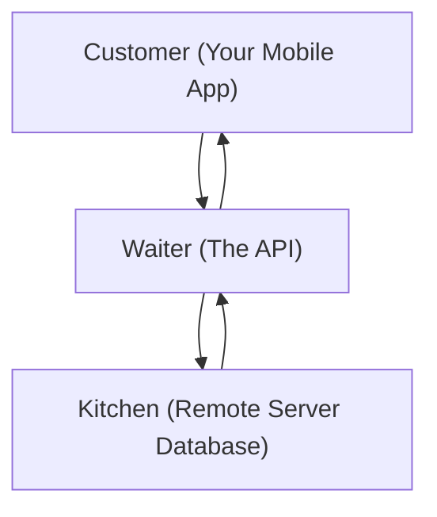

```ppt
# Slide 1: What is an API?
- **Full Form:** Application Programming Interface.
- **Simple Definition:** A digital messenger that allows two different apps to talk to each other safely.
- **Author:** Pankaj Kumar | Associate Architect & Tech Leadership
<!-- slide -->
# Slide 2: The Restaurant Waiter Analogy
- **You (The User):** Sitting at a dining table looking at the menu.
- **The Kitchen (The Server):** Where food (data) is prepared.
- **The Waiter (The API):** Takes your order to the kitchen and brings back your meal!
<!-- slide -->
# Slide 3: Real-World Example: Uber & Google Maps
- **The Problem:** Uber needs maps, but building a global mapping system costs $10 Billion.
- **The API Solution:** Uber uses Google Maps API to fetch maps in milliseconds for a tiny fee.
<!-- slide -->
# Slide 4: Real-World Example: Paying with Credit Cards
- **The Problem:** E-commerce site shouldn't store private credit card numbers.
- **The API Solution:** Stripe/PayPal API handles payment securely without the store touching private keys.
<!-- slide -->
# Slide 5: The 3 Core Benefits of APIs
- **1. Speed:** Integrate complex tools in hours instead of months.
- **2. Security:** Keeps private databases isolated from external eyes.
- **3. Cost Savings:** Leverage existing software rather than reinventing the wheel.
<!-- slide -->
# Slide 6: The API Economy & Monetization
- **API-First Companies:** Stripe, Twilio, and SendGrid make billions selling API services.
- **CTO Role:** Deciding which APIs to rent vs which core tech to build from scratch.
<!-- slide -->
# Slide 7: Common Beginner Misconceptions
- **Myth:** "API is a user interface screen."
- **Fact:** API is invisible code operating behind the scenes!
<!-- slide -->
# Slide 8: Summary for Beginners
- APIs are the universal glue connecting modern software across the globe!
```

# What is an API? The Restaurant Waiter Analogy Explained

In the modern digital world, terms like **"API"** are thrown around in almost every business meeting. 

- *"We need to integrate the Payment API."*
- *"Can we fetch that data via API?"*
- *"Is our API secure?"*

For beginners, **API** sounds like complex computer science. In reality, an API is simply a **polite digital messenger** that takes requests from one software app and fetches answers from another.

Let's break down APIs using the famous **Restaurant Waiter Analogy**!

---

## 🍽️ The Restaurant Waiter Analogy

Imagine dining at a busy Italian restaurant:



1. **You (The User / App):** Are sitting at a dining table. You want a plate of fresh pasta, but you are not allowed to walk into the hot kitchen to cook it yourself.
2. **The Kitchen (The Server / Database):** Contains all raw ingredients, chef tools, and secret recipes (your user data).
3. **The Waiter (The API):** Walks up to your table with a menu (available options), takes your order, delivers it to the kitchen chef, and brings back your hot pasta safely!

> **Key Takeaway:** You don't need to know how the kitchen chef cooks the pasta; you just need the Waiter (API) to bring it to your table cleanly!

---

## 🚕 Real-World Example: Uber & Google Maps

Have you ever wondered how **Uber** shows a live map of cars driving down your street?

- Uber did **not** launch satellites into space or drive cars across 190 countries to photograph every road on Earth. That would cost billions of dollars!
- Instead, Uber uses the **Google Maps API**. 
- Whenever you open Uber, the app calls the Google Maps API: *"Hey Google, send me the street map for my current GPS location!"* 
- In milliseconds, Google's API sends back the map layer!

---

## 🔒 3 Reasons Why CTOs Love APIs

1. **⚡ Speed to Market:** Build apps in weeks by combining ready-made APIs (Stripe for payments, Twilio for SMS alerts, OpenAI for AI chat).
2. **🛡️ Maximum Security:** External users never get direct access to your private database vault. The API acts as a secure front desk guard checking permissions.
3. **💰 Revenue Opportunities (The API Economy):** Selling access to your company's unique data or algorithms to other businesses via paid API keys.

---

## 💡 Summary for Beginners

- **API** = Application Programming Interface (The Digital Messenger / Waiter).
- **Function** = Connecting separate software applications safely.
- **Why It Matters** = APIs power modern online payments, maps, AI tools, and mobile apps!

---

*Written by **Pankaj Kumar** | Associate Architect & Tech Leadership.*
