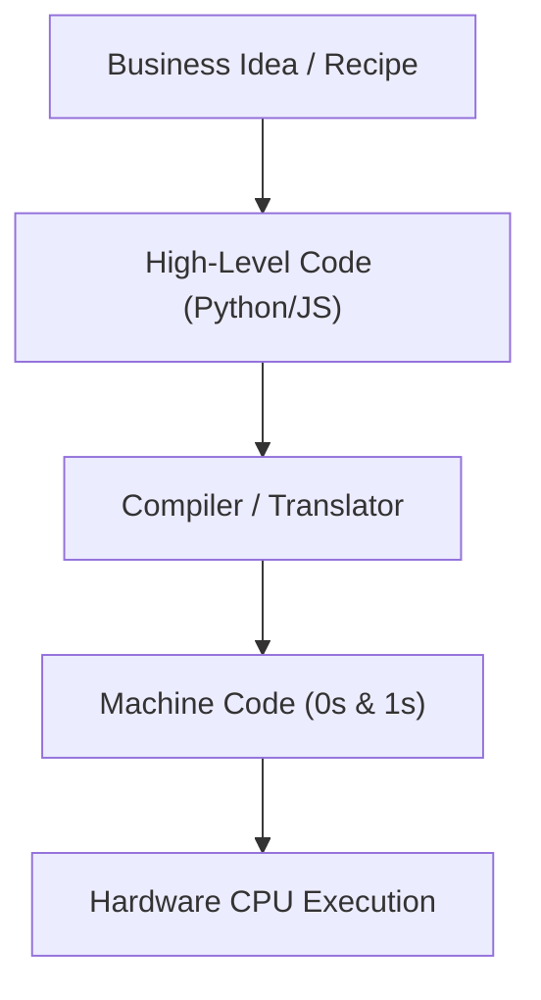

```ppt
# Slide 1: What is Code?
- **Definition:** Exact line-by-line instructions written by humans for computers to execute.
- **Why It Matters:** Computers are super-fast but totally literal; they follow instructions word-for-word.
- **Author:** Pankaj Kumar | Associate Architect & Tech Leadership
<!-- slide -->
# Slide 2: The Recipe & Robot Chef Analogy
- **Human Chef:** Understands "add a pinch of salt" intuitively.
- **Robot Chef (Computer):** Needs exact measurement: "add 0.5 grams of sodium chloride at 72°C."
- **Code:** The master recipe book written in exact mathematical language.
<!-- slide -->
# Slide 3: How Code Translates into Business Apps
- **High-Level Languages:** Python, JavaScript, Java (human-readable text).
- **Compilers / Interpreters:** The bilingual translator converting human code into 0s and 1s.
- **Binary Code:** 0s and 1s (electrical switches ON and OFF) executed by the CPU chip.
<!-- slide -->
# Slide 4: 3 Core Logic Elements of Code
- **1. Variables:** Named storage boxes holding data (e.g. `user_balance = $500`).
- **2. Conditions (If/Else):** Decision rules (e.g. `IF balance > cost THEN approve order`).
- **3. Loops:** Repeating repetitive actions 1,000 times automatically.
<!-- slide -->
# Slide 5: The Difference Between Code & Software
- **Line of Code:** A single instruction (e.g. "turn light on").
- **Software App:** Millions of lines of code working together like a complete city infrastructure.
<!-- slide -->
# Slide 6: What Has Changed in the AI Era?
- **Old World:** Developers typed every single semicolon manually.
- **AI-Led Era:** Developers instruct AI assistants in plain English to generate 80% of code.
<!-- slide -->
# Slide 7: Common Non-Tech Executive Misconceptions
- **Myth:** "Coding is just typing fast on a keyboard."
- **Fact:** Coding is 10% typing syntax and 90% logical problem-solving!
<!-- slide -->
# Slide 8: Summary for Beginners
- Code turns business ideas into automated digital magic!
```

# What is Code? Explaining Programming to Non-Tech Executives

For many business executives, non-technical founders, and beginners, **"code"** looks like an intimidating matrix of green text, mysterious symbols, and cryptic formulas typed by developers late at night.

In reality, **code is simply a structured recipe book written in a language that computers can read and execute.**

Let's break down what code actually is using a fun, everyday kitchen analogy!

---

## 🤖 The Recipe & Robot Chef Analogy

Imagine hiring a futuristic **Robot Chef** to work in your restaurant kitchen:



- **If you tell a Human Chef:** *"Make a cheese sandwich."*  
  The human chef uses intuition to open the fridge, pick fresh cheddar, slice bread, and grill it to perfection.
- **If you tell a Robot Chef (Computer):** *"Make a cheese sandwich."*  
  The robot freezes! It doesn't know what bread is, where the fridge handle is, or how much pressure to apply when holding a knife.
- **Writing Code = Giving Exact Step-by-Step Instructions:**  
  1. `Move left hand 30cm forward.`
  2. `Grasp handle of white refrigerator.`
  3. `If door is locked, sound alarm. Else, open door.`
  4. `Retrieve object labeled 'Cheddar Cheese'.`

> **Key Takeaway:** Computers are insanely fast, but completely literal. They do not guess or assume — they execute your exact line-by-line instructions without emotion!

---

## 📦 The 3 Building Blocks of All Programming

Every app on your phone (WhatsApp, Uber, Amazon) is built using just 3 fundamental logic structures:

### 1️⃣ Variables (Labeled Storage Boxes)
A variable is a labeled container that stores information inside memory:
- `customer_name = "Pankaj"`
- `account_balance = $1,500`

### 2️⃣ Conditions (If / Else Decisions)
Decision-making rules that tell the software what to do based on different scenarios:
- **IF** `account_balance >= $50`, **THEN** approve purchase.
- **ELSE**, show red warning message: *"Insufficient Funds"*.

### 3️⃣ Loops (Automated Repetition)
Telling the computer to repeat a task thousands of times instantly without getting tired:
- *"Send promotional email discount code to all 500,000 registered users."*

---

## ⚡ How Code Works: Human Text to Electricity

1. **High-Level Code:** Developers write human-readable code in languages like Python, JavaScript, or Java.
2. **The Translator (Compiler/Interpreter):** A software engine converts human code into machine code.
3. **Machine Code (Binary 0s and 1s):** Microscopic electrical switches turning ON (1) and OFF (0) billions of times per second inside your computer's CPU processor.

---

## 💡 Summary for Beginners

- **Code** = Clear, logical instructions for computers.
- **Programming** = Translating human business rules into automated digital workflows.
- **In the AI Era** = AI assistants now write routine code syntax, allowing technical leaders to focus on high-level architecture and executive strategy!

---

*Written by **Pankaj Kumar** | Associate Architect & Tech Leadership.*
