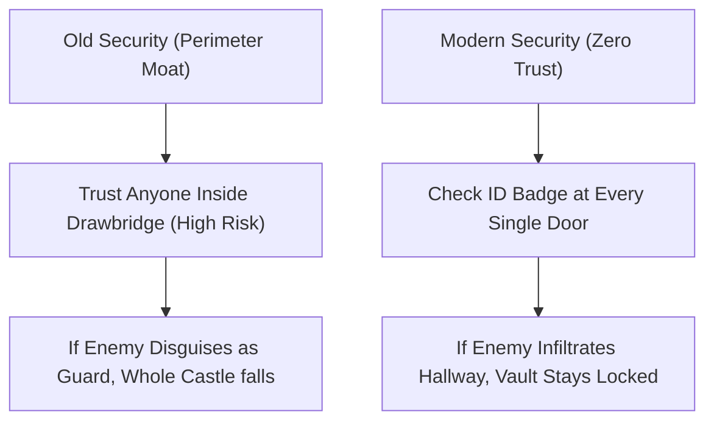

```ppt
# Slide 1: What is Cybersecurity?
- **Definition:** Protecting digital assets, customer databases, and cloud infrastructure from hackers and data breaches.
- **Why It Matters:** One data breach can bankrupt a company through regulatory fines and lost customer trust.
- **Author:** Pankaj Kumar | Associate Architect & Tech Leadership
<!-- slide -->
# Slide 2: Castle Moat Security vs Zero Trust Architecture
- **Old World (Perimeter Castle Moat):** Building a deep moat around the castle. Anyone inside the drawbridge is trusted 100%.
- **Modern World (Zero Trust):** Never trust, always verify — checking ID badges at every room door inside the castle!
<!-- slide -->
# Slide 3: The 3 Main Cyber Threats
- **1. Phishing:** Fake emails tricking employees into revealing passwords.
- **2. Ransomware:** Encrypting company databases and demanding bitcoin payouts.
- **3. DDoS Attacks:** Flooding website servers with fake traffic until they crash.
<!-- slide -->
# Slide 4: Real-World Disaster: The $50M Ransomware Attack
- **The Attack:** Hacker tricks an intern with a fake password reset email.
- **The Consequence:** Entire corporate network locked down for 5 days.
- **The Lesson:** Cybersecurity is an executive business strategy, not just an IT department issue!
<!-- slide -->
# Slide 5: The 3 Pillars of Zero Trust Security
- **1. Explicit Verification:** Always authenticate user identity, device health, and location.
- **2. Least Privilege Access:** Give employees minimum access needed for their specific job.
- **3. Assume Breach:** Design systems under the assumption that hackers are already inside the building.
<!-- slide -->
# Slide 6: Multi-Factor Authentication (MFA) & Encryption
- **MFA:** Password + One-Time Phone OTP token (stopping 99% of automated hacker logins).
- **Encryption:** Scrambling data in transit and at rest so stolen data looks like unreadable gibberish.
<!-- slide -->
# Slide 7: Common Beginner Misconception
- **Myth:** "Hacker attacks are caused by genius code exploits."
- **Fact:** Over 85% of corporate cyber breaches start with human social engineering and phishing emails!
<!-- slide -->
# Slide 8: Summary for Beginners
- Cybersecurity turns your digital architecture into an unbreachable fortress!
```

# What is Cybersecurity? Castle Moats vs Modern Zero Trust Security

In today's digital economy, data breaches make front-page headlines every week. 

- *"10 Million Customer Credit Cards Leaked!"*
- *"Major Airline Flights Grounded by Ransomware!"*
- *"Healthcare Records Stolen by Foreign Hackers!"*

For non-technical executives and beginners, **Cybersecurity** can sound like a complex cat-and-mouse game between hackers and IT guards.

In reality, cybersecurity is the practice of **protecting your company's digital assets, customer vaults, and cloud infrastructure.**

Let's break down modern cybersecurity using the **Castle Moat vs. Zero Trust Architecture Analogy**!

---

## 🏰 Castle Moat vs. Modern Zero Trust Security

Imagine defending a royal castle in two different eras:



- **The Old Security Model (Perimeter Castle Moat):**  
  You build a deep water moat and a drawbridge around your castle. You inspect visitors at the front gate. If a visitor passes the gate guard, they are trusted 100% and can freely walk into the King's bedroom, the armor room, or the treasury!
  - *The Danger:* If a hacker tricks the front gate guard using a stolen employee badge, the entire castle falls!

- **The Modern Security Model (Zero Trust Architecture):**  
  **Rule: Never Trust, Always Verify.**  
  Even if someone gets past the front gate, every door inside the castle requires a biometric thumbprint scan and password. The chef cannot enter the armory, and the guard cannot open the financial vault!

---

## 🛡️ The 3 Most Common Cyber Threats Explained

1. **🎣 Phishing (Social Engineering):**  
   Sending fake emails disguised as your bank or CEO: *"Urgent! Reset your password here."* Once the victim clicks, the hacker steals their login credentials. Over 85% of corporate breaches start here!
2. **🔐 Ransomware:**  
   Malicious software that locks and encrypts your entire database, displaying a message: *"Pay $5 Million in Bitcoin within 48 hours or your data is deleted forever."*
3. **💥 DDoS Attack (Distributed Denial of Service):**  
   Hiring thousands of infected computers to visit a website at the exact same second, overloading the server until it crashes.

---

## 🔒 3 Essential Rules for Executive Cyber Defense

- **1. Multi-Factor Authentication (MFA):** Requiring a password + a phone OTP token. MFA stops over 99% of automated account takeover attempts.
- **2. Least Privilege Access:** Employees only get access to the specific data needed for their job. A sales rep doesn't need access to server root passwords.
- **3. Data Encryption at Rest & In Transit:** Scrambling data into mathematical gibberish so that even if a hacker steals a hard drive, they cannot read the files.

---

## 💡 Summary for Beginners

- **Cybersecurity** = Protecting digital assets, customer trust, and company reputation.
- **Zero Trust** = Never trust, always verify at every step.
- **The CTO's Job** = Building a culture of security awareness where every employee acts as a human firewall!

---

*Written by **Pankaj Kumar** | Associate Architect & Tech Leadership.*
