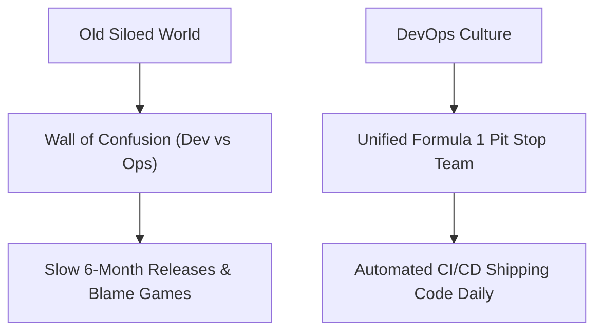

```ppt
# Slide 1: What is DevOps?
- **Full Form:** Development (Dev) + Operations (Ops).
- **Simple Definition:** Breaking the wall between software coders (builders) and server managers (maintenance).
- **Author:** Pankaj Kumar | Associate Architect & Tech Leadership
<!-- slide -->
# Slide 2: The Formula 1 Pit Stop Analogy
- **Old World (Silos):** Car designers build a car in Italy; pit stop mechanics in France try to fix it without instructions.
- **DevOps World:** Car designers work directly inside the pit stop crew, using automated tools to change tires in 2 seconds!
<!-- slide -->
# Slide 3: The Old Wall of Confusion
- **Developers (Dev):** Want to ship new features fast ("Change everything!").
- **Operations (Ops):** Want servers to remain stable ("Don't touch anything!").
- **Result:** Conflict, delayed releases, and production crashes.
<!-- slide -->
# Slide 4: The 3 Core Pillars of DevOps
- **1. CI/CD Pipelines:** Automated code testing and instant deployment tunnels.
- **2. Shared Responsibility:** Developers share on-call duty when production breaks.
- **3. Continuous Feedback:** Instant automated monitoring of app health.
<!-- slide -->
# Slide 5: Real-World Business Impact
- **Before DevOps:** Shipping 1 software update every 6 months with high risk of bugs.
- **After DevOps:** Shipping 50 small software updates every day with zero downtime!
<!-- slide -->
# Slide 6: Automation & Infrastructure as Code
- **IaC (Infrastructure as Code):** Launching 100 cloud servers using code scripts instead of clicking buttons manually.
- **Tools:** Terraform, Docker, Kubernetes, GitHub Actions.
<!-- slide -->
# Slide 7: Common Beginner Misconception
- **Myth:** "DevOps is just a software tool you buy."
- **Fact:** DevOps is a culture and workflow mindset of collaboration!
<!-- slide -->
# Slide 8: Summary for Beginners
- DevOps brings builders and operators together to ship code fast and safely!
```

# What is DevOps? Merging Builders and Maintenance Teams

In traditional software companies, a massive **"Wall of Confusion"** separated the people who built software from the people who ran software.

- **Developers (Dev):** Wanted to release new features as fast as possible.
- **Operations (Ops):** Wanted to keep cloud servers stable by preventing new changes.

This constant push-pull created friction, software crashes, and delayed releases. 

Enter **DevOps** (Development + Operations) — a modern culture and workflow framework that merges builders and maintenance teams into a single high-speed unit!

Let's break down DevOps using the **Formula 1 Racing Pit Stop Analogy**!

---

## 🏎️ The Formula 1 Pit Stop Analogy

Imagine running a championship-winning Formula 1 racing team:



- **The Old Siloed World:**  
  Car designers in Italy design a supercar, put it on a truck, and send it to a race track in France. The pit stop mechanics have never seen the engine blueprint, don't have the right wrenches, and take 15 minutes to change a tire while blaming the designers!
- **The DevOps World:**  
  The car designers work directly inside the pit stop crew. They build standardized automated tools (power drills, pneumatic jacks) that allow the crew to change all 4 tires in **1.8 seconds flat**!

---

## 🏗️ The 3 Core Pillars of DevOps Execution

1. **⚡ CI/CD Pipelines (Continuous Integration & Continuous Delivery):**  
   An automated wash tunnel for code. When a developer submits new code, automated scripts instantly test it, scan for security bugs, and deploy it to live cloud servers without human manual effort.
2. **🤝 Shared Accountability:**  
   In a DevOps culture, developers don't just "throw code over the wall." If a developer's code breaks in production at 2:00 AM, that developer gets alerted alongside the ops team to fix it!
3. **🤖 Infrastructure as Code (IaC):**  
   Instead of manually logging into AWS to click 50 buttons to set up a database server, engineers write a 10-line code script (Terraform) that provisions 100 identical servers automatically.

---

## 📊 Business Impact: Before vs. After DevOps

| Business Metric | Traditional IT (Pre-DevOps) | Modern DevOps Organization |
| :--- | :--- | :--- |
| **Deployment Speed** | Once every 3 to 6 Months | Multiple Times Per Day |
| **Lead Time for Changes** | Weeks or Months | Minutes or Hours |
| **Change Failure Rate** | High (20% – 40% releases break) | Low (< 5% failure rate) |
| **Recovery Speed (MTTR)** | Hours or Days to fix crashes | Minutes (Instant Automated Rollbacks) |

---

## 💡 Summary for Beginners

- **DevOps** = Development + Operations working as one team.
- **Goal** = Shipping software faster, safer, and with zero downtime.
- **The CTO's Job** = Fostering a DevOps culture of blameless collaboration and automation!

---

*Written by **Pankaj Kumar** | Associate Architect & Tech Leadership.*
