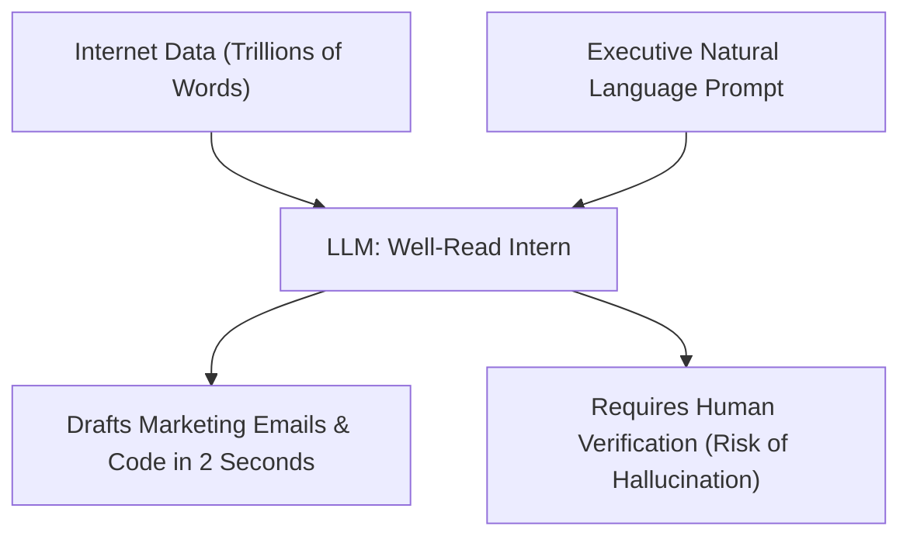

```ppt
# Slide 1: Generative AI & Large Language Models
- **Simple Definition:** AI systems that generate NEW text, images, code, and audio based on natural language prompts.
- **Key Examples:** ChatGPT, Google Gemini, Anthropic Claude, Midjourney.
- **Author:** Pankaj Kumar | Associate Architect & Tech Leadership
<!-- slide -->
# Slide 2: The World's Most Well-Read Intern Analogy
- **Imagine an Intern:** Read every book, blog post, and Wikipedia page published on Earth in 100 languages.
- **Superpower:** Synthesizes answers and writes code drafts in 2 seconds flat.
- **Weakness:** Hallucinates confident lies if asked about something it doesn't know!
<!-- slide -->
# Slide 3: How LLMs Actually Work (Next-Word Prediction)
- **Autocomplete on Steroids:** LLMs don't "think" in human terms; they calculate probabilities of the next mathematical word token.
- **Prompt Input:** *"The capital of France is..."*
- **LLM Probability Output:** 99.8% chance next token is *"Paris"*.
<!-- slide -->
# Slide 4: Real-World Business Impact in 2026
- **Customer Support:** Resolving 75% of customer queries instantly without human intervention.
- **Software Engineering:** AI pair programmers writing 40% of routine boilerplate code.
- **Executive Summaries:** Summarizing 100-page PDF financial reports into 5 key bullet points.
<!-- slide -->
# Slide 5: The Challenge of Hallucinations & Bias
- **Hallucinations:** When LLMs invent fake facts, false court cases, or nonexistent software APIs.
- **Solution (RAG Architecture):** Grounding LLMs with private company knowledge bases (Retrieval-Augmented Generation).
<!-- slide -->
# Slide 6: Prompt Engineering for Executives
- **Bad Prompt:** *"Write an email to sales."*
- **Great Executive Prompt:** *"Act as VP of Sales. Draft a 3-paragraph email pitching our AI security tool to a CFO, highlighting 20% ROI."*
<!-- slide -->
# Slide 7: Common Beginner Misconception
- **Myth:** "LLMs are search engines like Google."
- **Fact:** Google retrieves existing web links; LLMs generate brand new synthesized text responses!
<!-- slide -->
# Slide 8: Summary for Beginners
- Generative AI is your 24/7 hyper-productive executive assistant; verify its facts, but leverage its speed!
```

# What is Generative AI & LLMs? The World's Most Well-Read Intern

In 2022, the launch of **ChatGPT** sparked a global revolution in technology. Suddenly, computers weren't just calculating numbers — they were writing essays, drafting software code, creating oil paintings, and composing music!

This new wave of technology is called **Generative AI**, powered by **Large Language Models (LLMs)**.

For non-technical executives and beginners, LLMs can feel like magic. 

Let's break down Generative AI using the simple analogy of **The World's Most Well-Read Intern**!

---

## 👨‍🎓 The World's Most Well-Read Intern Analogy

Imagine hiring a brilliant 22-year-old intern for your company:



- **The Intern's Superpower:**  
  Over the past 5 years, this intern sat in a library and read **every single public book, blog post, scientific paper, code repository, and Wikipedia article** ever written on Earth in 100 languages.
  - Ask him: *"Draft a 3-paragraph agreement for a landlord,"* and he types a clean contract in 3 seconds!
  - Ask him: *"Explain quantum physics to a 5-year-old,"* and he writes a fun bedtime story!

- **The Intern's Weakness (Hallucinations):**  
  Because the intern is eager to impress, if you ask him a question he doesn't know (e.g. *"What did our company sell last Tuesday at 4:00 PM?"*), he won't admit he doesn't know — he will **confidentially invent a realistic-sounding lie**!

---

## ⚙️ How LLMs Work: Autocomplete on Steroids

At a mathematical level, Large Language Models do not possess human consciousness. They are ultra-advanced **probability engines**.

Think of the autocomplete feature on your smartphone keyboard:
- When you type: *"I am going to the..."*  
  Your phone suggests: `store`, `gym`, or `park`.
- An LLM does the exact same thing, but across **175 Billion parameters**! It calculates the statistically most likely next word token based on your prompt input.

---

## 🛡️ How CTOs Tame LLMs: RAG Architecture

To prevent LLMs from inventing fake information (hallucinating), CTOs use **RAG (Retrieval-Augmented Generation)**:

1. **Step 1:** The user asks a question.
2. **Step 2:** The system first searches the company's internal private PDF database for real facts.
3. **Step 3:** The real facts are passed to the LLM with an explicit instruction: *"Answer the user using ONLY these verified company documents!"*

---

## 💡 Summary for Beginners

- **Generative AI** = AI creating new text, code, images, and audio.
- **LLM** = Large Language Model (The probability engine trained on internet text).
- **The CTO's Job** = Integrating LLMs into business workflows safely while protecting company data privacy!

---

*Written by **Pankaj Kumar** | Associate Architect & Tech Leadership.*
