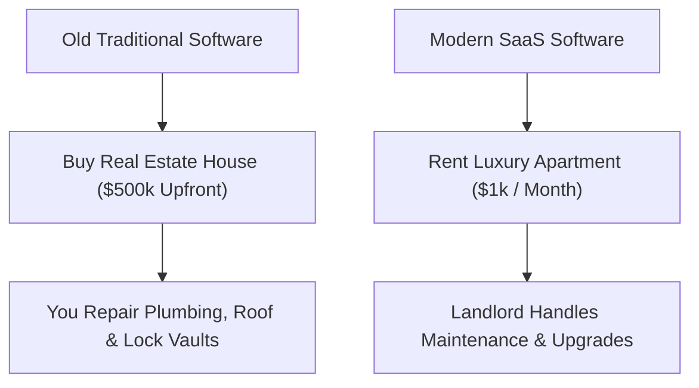

```ppt
# Slide 1: What is SaaS?
- **Full Form:** Software as a Service.
- **Simple Definition:** Renting ready-to-use software over the web on a monthly subscription instead of buying expensive CD-ROM boxes.
- **Author:** Pankaj Kumar | Associate Architect & Tech Leadership
<!-- slide -->
# Slide 2: Renting Apartments vs Buying Real Estate
- **Old Software (On-Premises):** Buying a house — high upfront cost, you pay for plumbing, roof repairs, and maintenance.
- **SaaS (Cloud Subscription):** Renting a luxury apartment — low monthly fee, landlord handles repairs, elevators, and security.
<!-- slide -->
# Slide 3: Famous Everyday SaaS Examples
- **Personal Life:** Netflix, Spotify, iCloud, Gmail.
- **Business Operations:** Salesforce, Zoom, Slack, Microsoft 365, HubSpot.
<!-- slide -->
# Slide 4: Real-World Business Story: Email Servers
- **Old World:** Company buys $20k email server, hires IT technician to fix spam filters.
- **SaaS World:** Subscribing to Google Workspace for $6/month per employee — zero maintenance headache.
<!-- slide -->
# Slide 5: The 3 Big Advantages of SaaS
- **1. Instant Setup:** Log in via web browser in 30 seconds.
- **2. Automatic Upgrades:** New features and security patches appear overnight for free.
- **3. Flexible Scaling:** Add 5 seats or remove 10 seats instantly based on team size.
<!-- slide -->
# Slide 6: Multi-Tenancy Architecture Explained
- **Apartment Complex Analogy:** Thousands of tenants live under one roof, sharing water mains, but having private locked front doors.
- **Data Security:** Your business data stays isolated inside your private customer vault.
<!-- slide -->
# Slide 7: Common Beginner Misconception
- **Myth:** "SaaS is software installed on your hard drive."
- **Fact:** SaaS runs on cloud servers accessed purely through a web browser or mobile app!
<!-- slide -->
# Slide 8: Summary for Beginners
- SaaS turned software from a heavy asset purchase into a simple monthly utility!
```

# What is SaaS? Renting Apartments vs Buying Real Estate

In the modern business landscape, almost every company relies on **SaaS** (Software as a Service) applications to run their business.

From **Zoom** for meetings to **Slack** for messaging and **Salesforce** for customer management, SaaS has completely revolutionized how software is delivered and paid for.

Let's break down SaaS using the simple analogy of **Renting an Apartment vs. Buying Real Estate**!

---

## 🏢 The Apartment Renting Analogy

Imagine moving into a new city for work:



- **The Old Traditional Software Model (Buying Real Estate):**  
  In the 1990s, you bought software in a cardboard box on CD-ROMs for $5,000 upfront. You installed it on your company's computer hard drives. If a bug happened or a new version came out next year, you had to buy a new CD-ROM and pay IT technicians to upgrade every laptop manually!
- **The Modern SaaS Model (Renting an Apartment):**  
  You pay a small monthly subscription fee ($10/user/month). You log in through your web browser. The software landlord (e.g. Salesforce or Microsoft) handles all server maintenance, bug fixes, and security upgrades automatically overnight!

---

## 🚀 Famous Everyday Examples of SaaS

You probably use SaaS apps every single day without realizing it:

- 🍿 **Entertainment:** Netflix, Spotify *(Renting movies & music instead of buying DVDs & CDs)*
- ✉️ **Productivity:** Gmail, Microsoft 365, Google Docs
- 💬 **Business Communication:** Slack, Zoom, Microsoft Teams
- 📊 **Sales & Finance:** Salesforce, QuickBooks, HubSpot

---

## 🔒 Multi-Tenancy: How SaaS Keeps Data Safe

How can millions of companies use the exact same SaaS app without seeing each other's data?

Think of a modern **Luxury Apartment Complex**:
- All 500 tenants share the same building foundation, roof, and main water pipe.
- However, every tenant has their **own private keycard** to unlock their personal apartment door.
- In SaaS architecture (Multi-Tenancy), all companies share the same cloud codebase, but your company's private data is locked inside an encrypted customer vault!

---

## 💡 Summary for Beginners

- **SaaS** = Software as a Service (Pay-as-you-go monthly software subscription).
- **Access** = Runs 100% in the cloud through any web browser or phone.
- **The CTO's Job** = Auditing company SaaS tools to prevent duplicate subscriptions and ensure data security!

---

*Written by **Pankaj Kumar** | Associate Architect & Tech Leadership.*
