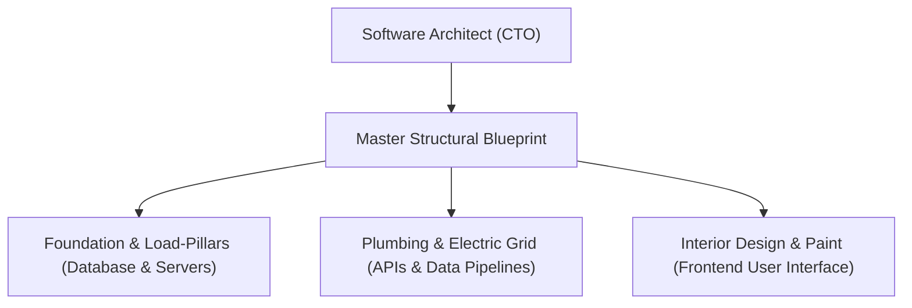

```ppt
# Slide 1: What is Software Architecture?
- **Definition:** The underlying structural framework of a software application.
- **Why It Matters:** Determines how fast, safe, and scalable an app runs under pressure.
- **Author:** Pankaj Kumar | Associate Architect & Tech Leadership
<!-- slide -->
# Slide 2: The House Construction Analogy
- **Interior Decorator:** Paints walls and picks furniture (Frontend UI).
- **Civil Architect:** Calculates load-bearing pillars, foundation depth, plumbing, and electrical grid (Software Architect).
<!-- slide -->
# Slide 3: 3 Pillars of Great Software Architecture
- **1. Scalability:** Can the house hold 100 guests or 1,000 guests without collapsing?
- **2. Security:** Are front doors, windows, and vaults locked against intruders?
- **3. Maintainability:** Can plumbers easily replace a broken pipe without knocking down the whole house?
<!-- slide -->
# Slide 4: Real-World Disaster: The Skyscraper Collapse
- **Without Architecture:** Coding fast without blueprints leads to software crashes during traffic surges.
- **With Architecture:** Solid foundation allows 500,000 users to checkout simultaneously without lag.
<!-- slide -->
# Slide 5: Core Architectural Decisions
- **Monolith vs Microservices:** Single huge castle vs network of independent specialized villas.
- **Cloud Infrastructure:** Renting electric grid power vs running personal diesel generators.
<!-- slide -->
# Slide 6: The Role of the CTO in Architecture
- **CTO Role:** Sets structural guidelines, reviews blueprints, and ensures non-functional requirements (security, performance, budget) are met.
<!-- slide -->
# Slide 7: Common Beginner Misconception
- **Myth:** "Software Architecture is just writing code."
- **Fact:** Software Architecture is deciding **how components talk to each other** before code is written.
<!-- slide -->
# Slide 8: Summary for Beginners
- Code is the bricks & mortar; Architecture is the master structural blueprint!
```

# What is Software Architecture? Houses vs Software Systems

When non-technical executives or beginners hear developers talk about **"Software Architecture"**, it sounds like high-level computer science magic. 

In reality, **software architecture** is simple to understand. It is the art and engineering of designing the master structural framework of an application before building it.

Let's break down software architecture using the simple analogy of building a modern residential house!

---

## 🏠 The House Construction Analogy

Imagine building a 3-story luxury home:



- **The Interior Designer = Frontend Developers:** Decorates room walls, selects cabinet colors, and positions furniture so guests feel comfortable (the app screens you tap on your phone).
- **The Plumber & Electrician = Backend Engineers:** Installs hidden water pipes, electrical wiring, and AC ducts behind walls (database connections & APIs).
- **The Civil Architect = Software Architect / CTO:** Calculates load-bearing pillars, soil foundation depth, and earthquake safety rules so the entire 3-story house stays standing for 50 years without collapsing!

---

## 🏗️ Why Software Architecture Matters

If you build a small 1-room doghouse, you don't need an architect — you just nail a few wooden boards together. But if you are building a **50-story skyscraper** expecting 100,000 occupants, skipping architectural blueprints guarantees catastrophic disaster!

### 🏥 Real-World Example: The E-Commerce Black Friday Surge
- **Bad Architecture:** An online store built like a flimsy wooden shed. When 50,000 shoppers enter at 12:00 AM, the server foundation collapses, taking the website offline for 6 hours.
- **Good Architecture:** Designed with automated load-balancing and cloud expansion. When traffic spikes 10x, extra virtual floors are added automatically, keeping checkout speed under 1 second.

---

## 🏛️ The 3 Non-Negotiable Pillars of Architecture

1. **⚡ Scalability (Growth):** Can your system handle 1,000 users today and 1,000,000 users next year without rewriting everything?
2. **🔒 Security (Protection):** Are user passwords, credit cards, and private data locked inside digital vaults protected from cyber hackers?
3. **🛠️ Maintainability (Ease of Repair):** Can developers upgrade a single feature without accidentally breaking the entire app?

---

## 💡 Summary for Beginners

- **Code** = Bricks, wood, and mortar.
- **Software Architecture** = The master structural blueprint.
- **The CTO's Job** = Ensuring the system foundation is safe, scalable, and built to last!

---

*Written by **Pankaj Kumar** | Associate Architect & Tech Leadership.*
