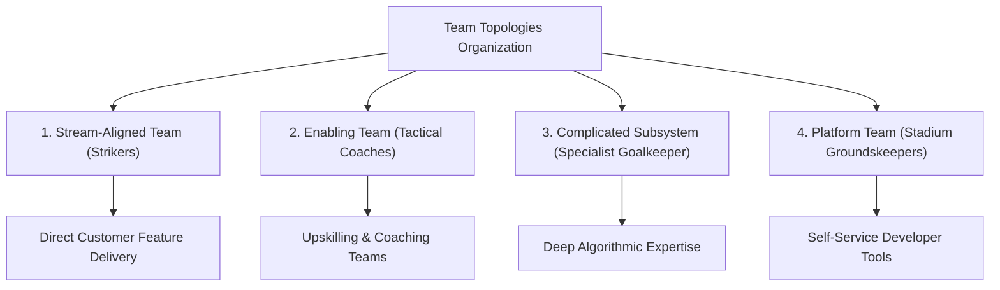

```ppt
# Slide 1: What is Team Topologies?
- **The Core Problem:** As engineering organizations grow past 20 developers, team communication breaks down, creating bottlenecks and friction.
- **The Solution:** Team Topologies — A modern organizational framework designed for fast flow and clear team boundaries.
- **Author:** Pankaj Kumar | Associate Architect & Tech Leadership
<!-- slide -->
# Slide 2: The Professional Football Team Analogy
- **Stream-Aligned Team (Strikers/Forward):** Scores goals directly (Delivers customer features).
- **Enabling Team (Specialized Coaches):** Teaches new tactics (Upskills developers on AI/Cloud).
- **Complicated-Subsystem Team (Goalkeeper/Specialist):** Handles complex deep math/physics algorithms.
- **Platform Team (Stadium Infrastructure):** Maintains the pitch, lighting, and locker rooms.
<!-- slide -->
# Slide 3: The 4 Fundamental Team Types
- **1. Stream-Aligned Team:** Cross-functional team focused on a continuous stream of customer value.
- **2. Enabling Team:** Specialized experts who coach other teams to adopt new tools and practices.
- **3. Complicated-Subsystem Team:** Deep domain specialists (e.g. video codec engine).
- **4. Platform Team:** Provides internal self-service developer tools so teams move fast.
<!-- slide -->
# Slide 4: The 3 Team Interaction Modes
- **Collaboration Mode:** Working together for a short period to solve a shared problem.
- **X-as-a-Service Mode:** Consuming internal APIs or tools with minimal friction.
- **Facilitating Mode:** One team coaching another to build internal capability.
<!-- slide -->
# Slide 5: Cognitive Load Management
- **Cognitive Load:** The amount of mental energy required for a developer to perform their job.
- **Goal:** Reducing unnecessary administrative overhead so engineers spend energy building great products!
<!-- slide -->
# Slide 6: Real-World Engineering Impact
- **Before Team Topologies:** Every developer manages servers, databases, security, UI, and customer support (Burnout ❌).
- **After Team Topologies:** Stream-aligned teams build features while Platform teams handle infrastructure (Fast Flow ✅)!
<!-- slide -->
# Slide 7: Common Beginner Misconception
- **Myth:** "Team Topologies is just creating traditional department silos with new names."
- **Fact:** Team Topologies focuses on explicit interaction modes and reducing developer cognitive load!
<!-- slide -->
# Slide 8: Summary for Beginners
- Structure engineering teams around value streams and self-service platforms for rapid software delivery!
```

# What is Team Topologies? Structuring Stream-Aligned vs Enabling Teams

When a software company grows from a small team of 5 developers to an enterprise of 100+ engineers, something unexpected happens: **software development slows down!**

In a 5-person team, everyone talks to everyone. But in a 100-person organization, developers spend all day in meetings, waiting for other teams to approve database changes or configure server access.

To fix this bottleneck, modern technology leaders use a framework called **Team Topologies**.

Let's demystify **Team Topologies** using **The Professional Football Team Analogy**!

---

## ⚽ The Professional Football Team Analogy

Imagine structuring a championship football team:



- **Stream-Aligned Team (The Strikers):** They are on the pitch every matchday, dribbling past defenders to score goals directly.  
  - *Engineering Equivalent:* A team dedicated 100% to building the customer checkout experience.
- **Enabling Team (The Specialized Tactical Coaches):** They don't play full matches. Instead, they drop in to teach the strikers new penalty techniques, then step back so the strikers excel independently!  
  - *Engineering Equivalent:* Cloud security experts who coach feature teams on zero-trust security.
- **Complicated-Subsystem Team (The Specialist Goalkeeper):** They focus on one highly complex, specialized job that requires deep expertise.  
  - *Engineering Equivalent:* Engineers building a proprietary 3D rendering algorithm or AI model.
- **Platform Team (The Stadium Groundskeepers):** They maintain the pitch, lights, and locker rooms so players focus entirely on playing the game without worrying about field maintenance!  
  - *Engineering Equivalent:* DevOps engineers building self-service cloud deployment tools.

---

## 📊 The 4 Team Types & 3 Interaction Modes

| Team Type | Main Focus | Success Metric |
| :--- | :--- | :--- |
| **Stream-Aligned** | Fast continuous delivery of business value | Feature velocity & customer satisfaction |
| **Enabling** | Upskilling and researching modern practices | Team autonomy & skill adoption rate |
| **Complicated-Subsystem** | Deep domain specialized engineering | System stability & mathematical precision |
| **Platform** | Internal self-service developer platform | Internal developer satisfaction & adoption |

---

## 💡 Summary for Beginners

- **Team Topologies** = Structuring engineering teams to minimize cognitive load and maximize software flow.
- **Cognitive Load** = The total amount of mental energy required for an engineer to build software.
- **The CTO's Org Goal** = Empowering stream-aligned teams with self-service internal platforms!

---

*Written by **Pankaj Kumar** | Associate Architect & Tech Leadership.*
