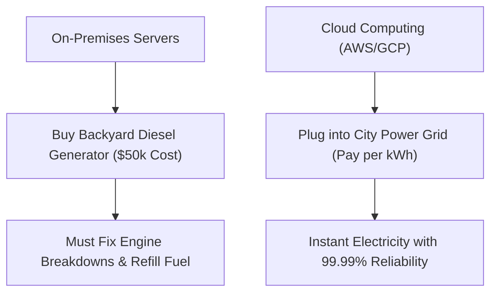

```ppt
# Slide 1: What is the Cloud?
- **Simple Definition:** Renting someone else's super-secure computers over the internet instead of buying physical servers.
- **Top 3 Providers:** Amazon Web Services (AWS), Google Cloud (GCP), Microsoft Azure.
- **Author:** Pankaj Kumar | Associate Architect & Tech Leadership
<!-- slide -->
# Slide 2: The Power Grid vs Backyard Generator Analogy
- **Old World (On-Premises):** Buying your own diesel generator, maintaining fuel, and fixing breakdowns in your backyard.
- **Cloud World (AWS/GCP):** Plugging your toaster into the city electric power wall socket and paying only for the electricity consumed.
<!-- slide -->
# Slide 3: 3 Core Types of Cloud Services
- **1. IaaS (Infrastructure as a Service):** Renting virtual servers & disks (AWS EC2).
- **2. PaaS (Platform as a Service):** Renting pre-configured app engines (Heroku).
- **3. SaaS (Software as a Service):** Renting ready-to-use software apps (Gmail, Netflix).
<!-- slide -->
# Slide 4: Real-World Example: Netflix & AWS
- **The Challenge:** Hundreds of millions of users streaming 4K movies simultaneously.
- **Cloud Solution:** Netflix uses AWS cloud servers to auto-scale capacity during peak evening hours.
<!-- slide -->
# Slide 5: The 3 Big Benefits of Cloud Computing
- **1. Zero Upfront Hardware Cost:** No buying $50,000 physical server racks.
- **2. Global Instant Scale:** Click a button to launch servers in London, Tokyo, or Mumbai in 60 seconds.
- **3. Built-in Security:** Protected by multi-billion dollar datacenter security teams.
<!-- slide -->
# Slide 6: What Has Changed in the AI Era?
- **AI Cloud Compute:** Training AI models requires thousands of specialized GPU cloud chips.
- **CTO Role:** Managing Cloud FinOps to prevent accidental $100,000 monthly cloud bill surprises.
<!-- slide -->
# Slide 7: Common Beginner Misconception
- **Myth:** "The Cloud is an invisible magic cloud floating in the sky."
- **Fact:** The Cloud consists of massive, physical, high-security computer datacenters on Earth!
<!-- slide -->
# Slide 8: Summary for Beginners
- The Cloud is utility power for software apps — pay for what you use, scale instantly!
```

# What is the Cloud? Electric Power Grid vs Backyard Generator

When non-technical executives or beginners hear terms like **"Cloud Computing"**, **"AWS"**, or **"Cloud Storage"**, it can sound like software floating in the sky.

In reality, **the Cloud is simply a network of massive physical datacenters housing millions of powerful computers that you rent over the internet.**

Let's break down Cloud Computing using the simple analogy of the **City Electric Power Grid**!

---

## ⚡ The Electric Power Grid Analogy

Imagine opening a new coffee shop in your neighborhood:



- **The Old World (On-Premises Physical Servers):** You buy a $50,000 heavy diesel generator, put it in your backyard, hire a mechanic to maintain it, buy fuel every week, and panic if it breaks down during business hours.
- **The Cloud World (AWS / Google Cloud / Azure):** You plug your coffee machines and lights directly into the city electric wall socket. You don't care where the power plant is located; you just flip the switch and pay a monthly bill for the exact kilowatt-hours of electricity you consume!

---

## 🏬 Real-World Example: Netflix & AWS Cloud

Have you ever wondered how **Netflix** streams movies to 260 million households simultaneously at 8:00 PM without crashing?

- Netflix does **not** own giant warehouses filled with personal server boxes.
- Instead, Netflix runs its entire streaming platform on **Amazon Web Services (AWS)**.
- When millions of users log in on Friday evening, Netflix automatically spins up 10,000 extra virtual servers in AWS. When users go to sleep at 2:00 AM, those extra servers automatically turn off to save money.

---

## ☁️ The 3 Layers of Cloud Services

1. **IaaS (Infrastructure as a Service):** Renting raw virtual computers and hard drives. *(Example: AWS EC2, Google Compute Engine)*
2. **PaaS (Platform as a Service):** Renting pre-built software environments so developers just upload code. *(Example: Heroku, Vercel)*
3. **SaaS (Software as a Service):** Renting ready-to-use finished applications over the web. *(Example: Google Workspace, Salesforce, Netflix)*

---

## 💡 Summary for Beginners

- **The Cloud** = Renting high-speed datacenter computers over the internet.
- **Pay-As-You-Go** = Paying only for the server minutes and storage space you use.
- **The CTO's Job** = Selecting the right cloud provider and keeping cloud server costs optimized (FinOps)!

---

*Written by **Pankaj Kumar** | Associate Architect & Tech Leadership.*
