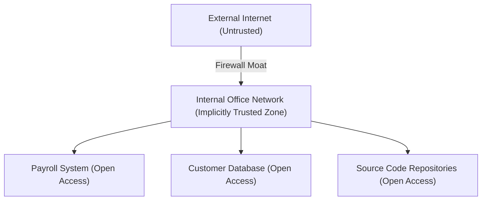
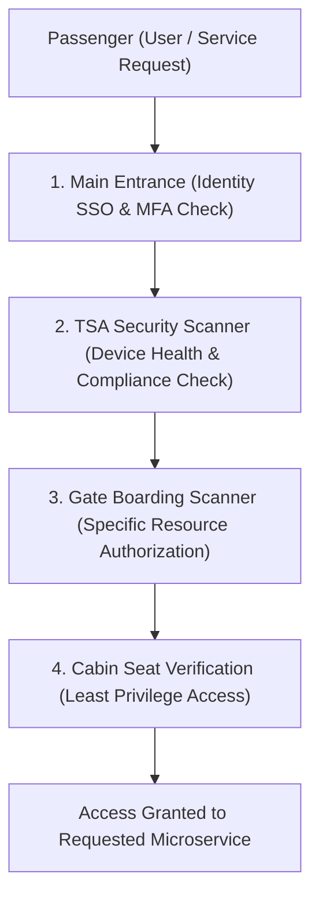
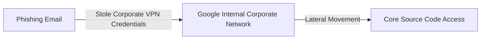

```ppt
# Slide 1: Zero Trust Architecture (ZTA)


- **The Core Security Paradigm:** Assuming that every network request, user identity, and service connection is untrusted until continuously authenticated and authorized.
- **Executive Security Motto:** Never Trust, Always Verify!
- **Author:** Pankaj Kumar | Associate Architect & Tech Leadership
<!-- slide -->
# Slide 2: The Airport Security Checkpoint Analogy
- **Perimeter Castle Security (Traditional Firewall):** A guard standing at the moat drawbridge inspects visitors once. Once inside the castle walls, anyone can freely roam into royal bedrooms, vault rooms, and weapons armories without showing ID!
- **Zero Trust Security (Airport Security Gates):** TSA agents verify your passport and boarding pass at the airport entrance, rescan your ID at the security scanner, check your ticket again at the boarding gate, and verify your seat assignment inside the aircraft cabin!
<!-- slide -->
# Slide 3: The 3 Core Pillars of Zero Trust
- **1. Explicit Verification:** Always authenticate and authorize based on all available data points (identity, location, device health, service context).
- **2. Least Privilege Access:** Granting users and services the absolute minimum access required for their task (*Just-In-Time access*).
- **3. Assume Breach:** Minimizing blast radius by microsegmenting networks and encrypting all internal data communications.
<!-- slide -->
# Slide 4: Real-World Case Study: Google BeyondCorp
- **The Aurora Hack (2009):** Cyber attackers breached Google's internal corporate network perimeter.
- **Google's Response (BeyondCorp):** Google dismantled their VPN perimeter entirely, shifting every employee and application to Zero Trust.
- **Result:** Employees connect securely from anywhere without a traditional VPN!
<!-- slide -->
# Slide 5: The Technical Architecture Components
- **Policy Enforcement Point (PEP):** Intercepts and blocks unauthorized network requests.
- **Policy Decision Point (PDP):** Evaluates risk rules and issues access tokens.
- **Identity Provider (IdP) & MFA:** Hardware-backed authentication (YubiKey).
- **Microsegmentation:** Isolating database clusters into isolated security enclaves.
<!-- slide -->
# Slide 6: Migrating from Legacy VPN to Zero Trust
- **Step 1:** Inventory all digital assets, APIs, and data stores.
- **Step 2:** Implement Central Identity SSO with Multi-Factor Authentication.
- **Step 3:** Deploy Zero Trust Network Access (ZTNA) proxies (Cloudflare Access / Zscaler).
- **Step 4:** Enforce Least Privilege IAM roles across AWS/GCP cloud environments.
<!-- slide -->
# Slide 7: Common Misconception
- **Myth:** "Zero Trust slows down developer productivity and creates friction."
- **Fact:** Zero Trust eliminates sluggish corporate VPNs and enables developers to code securely from anywhere in the world!
<!-- slide -->
# Slide 8: Summary for Beginners
- Adopt Zero Trust: verify every request explicitly, enforce least-privilege access, and eliminate trusted network perimeters!
```

# Zero Trust Architecture: Trust No One, Verify Everything

For over 30 years, computer security relied on **Perimeter Defense (The Castle and Moat Model)**.

Companies built thick firewalls around their corporate offices. If an employee was inside the office building—or connected via a corporate Virtual Private Network (VPN)—the network trusted them implicitly!



This model was disastrous. **Once a hacker breached the perimeter firewall (via a phishing email or stolen VPN password), they could move laterally across the internal network and steal everything!**

Modern CTOs replace this broken model with **Zero Trust Architecture (ZTA).**

Let's understand Zero Trust using **The International Airport Security Analogy**!

---

## ✈️ The International Airport Security Analogy

Imagine traveling through a modern international airport:



- **The Castle Moat (Traditional Perimeter Security):**  
  A guard at the castle drawbridge inspects your pass once. After you step inside the castle walls, you are trusted completely! You can walk into the king's bedroom, open the gold vault, and enter the armory without ever showing ID again.

- **The International Airport (Zero Trust Architecture):**  
  Security officers check your passport and boarding pass at the main terminal entrance (**Identity Authentication**), rescan your bags at the TSA checkpoint (**Device Compliance**), verify your boarding pass again at the gate (**Resource Authorization**), and check your seat assignment inside the plane (**Least Privilege Access**)!

---

## 📊 Real-World Case Study: Google BeyondCorp

In 2009, sophisticated nation-state hackers breached Google's internal corporate network in an attack known as *Operation Aurora*. 



Google realized that relying on a corporate VPN perimeter was unsafe. In response, Google completely reinvented enterprise security by building **BeyondCorp** — the world's first large-scale **Zero Trust Architecture**:

1. **Dismantled Corporate VPNs:** Google eliminated internal network trust entirely.
2. **Every Device Verified:** Every laptop and smartphone was assigned an encrypted device certificate.
3. **Context-Aware Access:** Access to internal applications was granted based on user identity, device health, and physical location — regardless of whether the employee was at Google headquarters or a coffee shop in Tokyo.

Today, Google employees work securely worldwide without ever connecting to a traditional VPN!

---

## 📊 Perimeter Security vs. Zero Trust Architecture

| Security Dimension | Traditional Perimeter Security (Castle & Moat) | Zero Trust Architecture (Never Trust, Always Verify) |
| :--- | :--- | :--- |
| **Trust Model** | Trust anyone inside the internal network / VPN | Trust no one; verify identity & device for every request |
| **Network Perimeter** | Single hard outer firewall perimeter | Microsegmented perimeters around every individual microservice |
| **Lateral Movement** | High Risk (Hackers roam freely inside network) | Zero Risk (Microsegmentation prevents lateral movement) |
| **Remote Access** | Sluggish, fragile corporate VPN connections | Fast, secure Zero Trust Network Access (ZTNA) proxies |
| **Access Principle** | Broad network access granted upon login | Least-Privilege & Just-In-Time (JIT) access grants |

---

## 💡 Summary for Beginners

- **Zero Trust Architecture (ZTA)** = A security model requiring strict identity verification and device checks for every single network request.
- **Microsegmentation** = Dividing cloud networks into small, isolated security zones to prevent hackers from moving laterally.
- **CTO Golden Rule** = **"Never trust, always verify — eliminate corporate VPNs and enforce identity-based access control for every microservice!"**

---

*Written by **Pankaj Kumar** | Associate Architect & Tech Leadership.*
